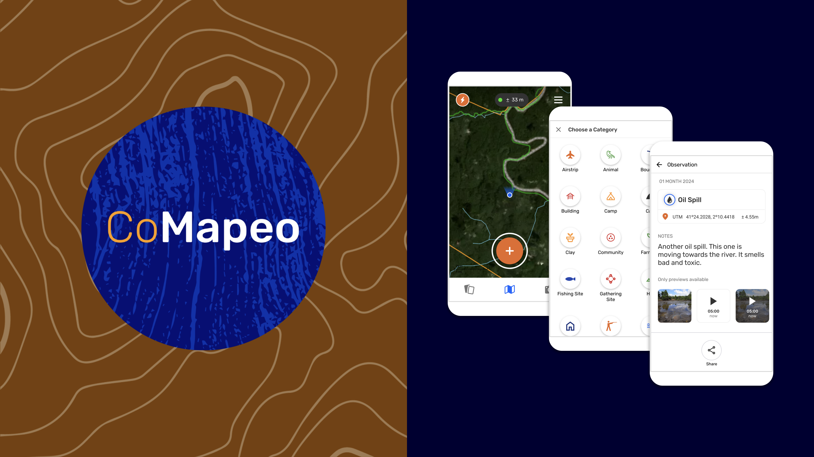

## What is CoMapeo?

CoMapeo is a collaborative mapping and monitoring tool co-designed with Indigenous communities to easily document environmental and human rights information and to collect data about their land. It was designed to work in entirely offline environments and built on a decentralized peer-to-peer database that allows communities to own their own data.

It is a free, open-source, easy-to-learn tool and that is co-designed with communities facing environmental impacts and territorial threats such as deforestation, contaminated ecosystems, and reduction in biodiversity.  CoMapeo's key features have enabled people to use it across diverse geographies, languages, ecosystems, threats, community needs and aims, and it has been used to report key information to authorities, file lawsuits, launch media campaigns, create maps for land claims and support community-led biodiversity monitoring.

At its core, CoMapeo is a tool for frontline communities to document what is important to them and protect what they love with autonomy and self-determination.

## Key features of CoMapeo

- **Simple to use and learn
**People who have never used a mapping tool or a GPS device before can learn to collect data, GPS points, photos, audio recordings and tracks with **CoMapeo Mobile** in a few hours. **CoMapeo Desktop **has a simple interface with a several similar features as the mobile app, only requiring basic computer skills to use. For more complex analysis or mapping work you can export your data to more specialized tools. The simplicity of the tools helps support wide community involvement and ownership of projects.

- **Works in completely offline environments**
All observations and tracks gathered with CoMapeo are stored directly on the device in CoMapeo's embedded database, without the need for an internet connection or centralized server. CoMapeo is designed to use a local Wi-Fi network to exchange information in a peer-to-peer database with no need of an internet connection.

- **Local and decentralized data storage****
**All the mapping data gathered using CoMapeo Mobile is stored locally on the same smartphone used to collect it. When working with a team of people or multiple devices including smartphones and computers, information flows in a decentralized network of peers that are invited to a project. Each device is a backup for the data collected, and can display all the aggregated information using Exchange. Whether this happens in face to face using a Wi-Fi router, or private server setup as a Remove Archive, all devices will eventually have the same collected data as their peers.

- **Optional Remote Archive 
**There are many contexts where meeting face to face to use this innovative technology is simply not possible, accessible, or safe. For that, we have developed a new server-based solution that allows data to be archived to a remote location from one device and read by another device on the same project using an internet connection. We have put extra care into including the security considerations for teams using this option in offline and online contexts.

- **Supports simultaneous collaborative mapping projects**
You can map on your own, or map collectively with other devices. The Projects feature in CoMapeo, allows you to share and organize data among devices that participate in the same mapping project. Through different roles of "Coordinator" and "Participant" devices can receive an invite and join new projects, or invite others to join their project. You can also have multiple projects in one device, and move from one to the other without losing any data.

- **Highly customizable**
CoMapeo Settings gives options to select from different available languages and other features to meet local needs. For those with more technical capacity, there are options for creating customized background maps, and project specific category sets with custom icons and detailed question in almost any language to maximize relevance and accessibility to the people using CoMapeo.

- **Secure, unfalsifiable data**
All data collected with CoMapeo has encrypted logs that can be verified for authenticity. Similar to a blockchain, data is secured by cryptographic proofs, so you can verify that no record in the log has been changed or tampered with. This technical feature has been relevant for communities to use CoMapeo data as legal evidence. 

## What is possible when mapping as a team?

When maps are made by communities they can be used as tool to represent their lands from their point of view. These require community-led mapping processes that often involve the participation of community members with diverse knowledge and relationships to place. For this reason, CoMapeo is designed for teams of people to work together to collect data while walking their territory. 

Successful processes require the participation of people from every part of a community. For example, when Elders work with youth to record this knowledge, history and a deep connection to the land is passed down to the next generation and the fabric of the whole community is strengthened. Also, community-led mapping processes that involve, or are led by, women are stronger because they incorporate women’s knowledge, perspectives, experiences, and concerns which often differ greatly from men’s due to differences in culturally determined gender roles. 

Participatory mapping projects not only lead to stronger mapping outcomes, but because they involve conversations about the land or water, they can help restart or strengthen community processes. At the same time, maps can help outsiders understand the importance of the land from a local point of view, by representing things in a format legible to them. 

Indigenous partners have used CoMapeo data in landmark legal victories, to backup testimonies and create map based evidence to prove their ancestral relationship to the land against evictions or diverse threats against the territory. In other cases CoMapeo has proven a powerful tool for biodiversity monitoring and for Indigenous communities to prove the efficacy of community-based territorial management in order to secure their land rights.

:::note 💪🏽
Learn about the impacts that communities can have when mapping as a team in our impact report: [Ten years of Mapeo](https://awana.digital/blog/ten-years-of-mapeo-a-report-to-celebrate-the-exceptional-work-of-mapeo-users-around-the-world)
:::

## What are CoMapeo’s core concepts and functions?

- **Observations** are the main way to collect information in CoMapeo. Besides the location, timestamp and category, they can also include photos, audio recordings, notes, and form-filled details.

- **Tracks** let you record paths or boundaries as you move across the land. They are useful for documenting trails, patrol routes, rivers, or territory borders.

- **Projects** organize your mapping work, either individually or with collaborators. They define the categories, team members, and settings for how data is collected and managed.

- **Exchange** is how devices share and synchronize project data. It allows collaborators to keep their observations up to date, even without internet access.

---

---

### Functional Differences between Mobile and Desktop 

The mobile app can be used to gather evidence in the field, take photographs, voice recordings, document tracks or boundaries, and GPS points of significant places. The desktop app is used to organize data collected on mobile or GPS, and to visualize, edit and export data, and create reports.

| Topic | User Actions | Mobile | Desktop |
| --- | --- | --- | --- |
| Collaboration | Create a new project | ✔️ | ✔️ |
| Collaboration | Invite User to a project (Coordinator Only) | ✔️ | ✔️ |
| Collaboration | Assign a role to a device before sending invite (Coordinator Only) | ✔️ | ✔️ |
| Collaboration | After invite, edit user roles (change from participant to coordinator, or vice versa) | ❌ | ❌ |
| Collaboration | Leave a project | ✔️ | ✔️ |
| Collaboration | Remove user from project (Coordinator Only) | ✔️ (new) | ✔️ (new) |
| Collaboration | See the list of devices in a project | ✔️ | ✔️ |
| Collaboration | Rename project (Coordinator Only) | ✔️ | ✔️ |
| Collaboration | Delete project | ❌ | ❌ |
| Collaboration | Exchange | ✔️ | ✔️ |
| Create Observations & Tracks | Collect observations  | ✔️ | ❌ |
| Create Observations & Tracks | Record Tracks | ✔️ | ❌ |
| Review Collected Data | Review own observations and tracks | ✔️ | ✔️ |
| Review Collected Data | Review others’ observations and tracks | ✔️ | ✔️ |
| Editing Collected Data | Edit own observations on and tracks | ✔️ | ✔️ |
| Editing Collected Data | Edit others observations and tracks (Coordinator Only) | ✔️ | ✔️ |
| Editing Collected Data | Add media (photos and audio) to a saved observation (only with edit access) | ✔️ | ❌ |
| Editing Collected Data | Delete media (photos and audio) from a saved observation | ❌ | ❌ |
| Editing Collected Data | Delete own observation and track | ✔️ | ✔️ |
| Editing Collected Data | Delete others observations (Coordinator Only) | ✔️ | ✔️ |
| Customizing the CoMapeo experience | CoMapeo Settings (App language, Coordinate system, security options)  | ✔️ | ✔️ |
| Customizing the CoMapeo experience | Change Categories | ✔️ | ✔️ |
| Customizing the CoMapeo experience | Upload Background Map | ✔️ | ✔️ |
| Customizing the CoMapeo experience | Remove Background Map | ✔️ | ✔️ |
| Customizing the CoMapeo experience | Share Background Map | ✔️ | ✔️ |
| Customizing the CoMapeo experience | Receive Shared Background Map | ✔️ | ✔️ |
| Output |  Share outside of CoMapeo - Single Observation | ✔️ | ❌ |
| Output |  Share outside of CoMapeo - Observation Metadata | ✔️ | ❌ |
| Output |  Share outside of CoMapeo - photo Metadata | ✔️ | ❌ |
| Output | Download Observations and Tracks (GeoJSON, Zip with Media) | ✔️ | ✔️ (new) |
| Security & Privacy | Diagnostic Information Collection options | ✔️ | ✔️ |
| Security & Privacy | App Usage Collection options | ✔️ | ✔️ |
| Security & Privacy | Secure Passcode | ✔️ | ❌ |
| Security & Privacy | Obscure Passcode | ✔️ | ❌ |

## **Relevant Content**

[Blog](https://awana.digital/blog/stability-co-design-our-comapeo-release-strategy)[ | Stability & Co-Design: Our CoMapeo Release Strategy](https://awana.digital/blog/stability-co-design-our-comapeo-release-strategy)

Go to 🔗 [Getting Started](/docs/category/getting-started---essentials)

Go to 🔗 [Encryption & Security](/docs/encryption-and-security)

### Having Problems?

Go to 🔗 [Troubleshooting ](/docs/category/troubleshooting/)

## Coming Soon

While we continue to improve CoMapeo there will be new releases, technical summaries and announcements to share

---
