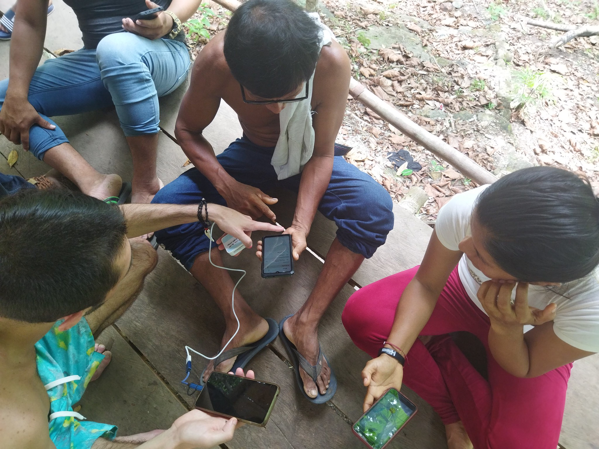
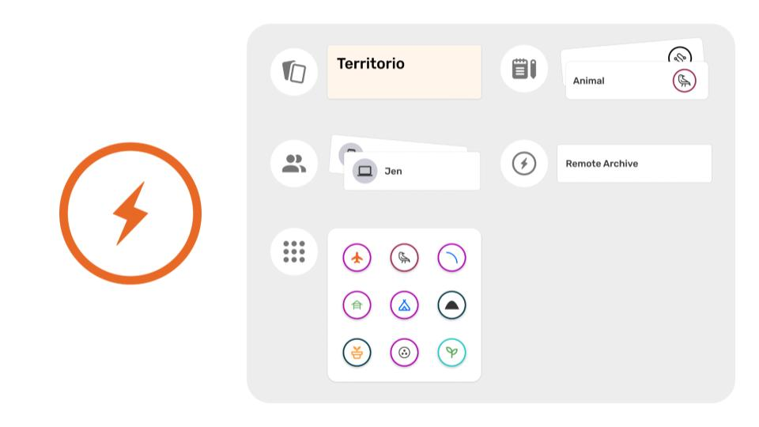
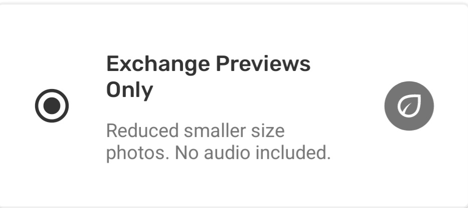
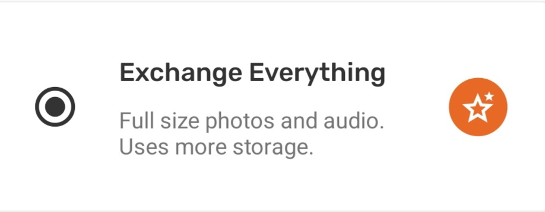
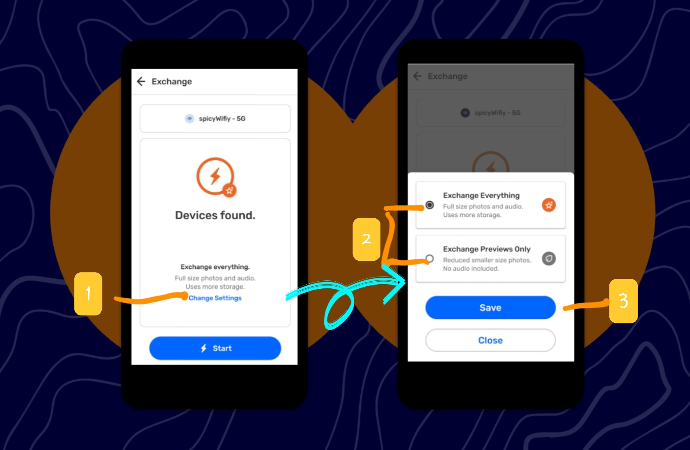
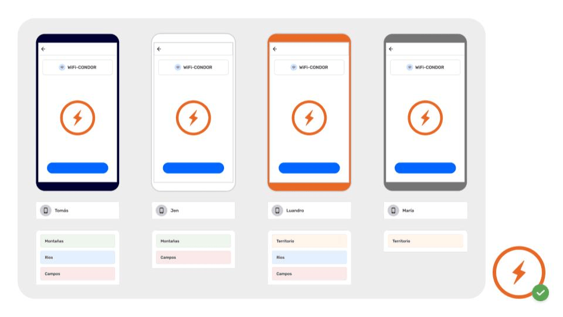

## What is Exchange on CoMapeo?

**Exchange** is the signature feature of CoMapeo that allows for data to securely travel to all connected devices that are part of the same project. This helps ensure everyone in a project has the same information.

- This allows for edits of observations and tracks to be updated with teammates.

- Updated project information including the newest Category Set will be exchanged with teammates so all are are using the same categories and details templates. 

**What data is exchanged?**

- Project information (exchanged passively)
  - Name and description
  - Team (Device names and roles)
  - Current category sets
  - Remote archive settings (if used)

- Collected information (exchanged actively)
  - Observations (with associated media and metadata)
  - Tracks

### **What if there is a data conflict?**

A data conflict is when two or more teammates make an edit to the same observation or track. For example, one person changes the category on an observation or track, the other person answers an additional question from the observation details. 
It can also happen if two different project coordinators import different custom categories. In the **unusual and rare** case that this occurs, the edit made last will be the change that seen after exchanging. 

:::note ⚠️ Warning
The earlier edit will be lost.
:::

### What connections does CoMapeo use?

**Offline connections are possible with a router that provides over local Wi-Fi. **

This functionality was designed for people in remote areas where internet connection is limited or not available. This means teammates can exchange data when they are together, no matter where in the world they are.

:::note 💡
A router serves as a wireless bridge between devices connected to it even when it is not connected to the internet.
:::

Go to 🔗 [Using Exchange offline](/docs/using-exchange-offline) 

**Online connections are possible with the setup of a remote server **

For those projects that require Exchange more frequently than in person activities are possible, we have introduced *Remote Archiving* that allows a server address to be added to specific project settings in CoMapeo

Go to 🔗 [Using a Remote Archive](/docs/using-a-remote-archive)** **

### Understanding How Exchange Works

Exchange works by detecting peer devices that are connected to the same network and are part of same  projects in CoMapeo It allows the project data to transfer between numerous devices, once an user taps “start”. At the end of the process all those who exchanged data will be able to see new observations and tracks collected by their teammates on the map screen and in the observation list. 
If anyone makes an edit to an observation or track (for example they change the category, or add some additional details), or a project coordinator changes the project name or updates the categories and icons, this data will also appear on everyone's devices after exchange is complete.

:::note 💡 Tip
Data collected with CoMapeo only travels to devices that are members of respective projects.
:::

:::note 👉🏽 More
Learn about  how membership to projects is managed
Go to 🔗 [Selecting Device Roles and Teams](/docs/selecting-device-roles-and-teams)
:::

There is no central server hosted by Awana Digital or 3rd parties used to upload nor download CoMapeo collected data nor other Project data. 

 See 🔗 [CoMapeo Data Privacy Policy](https://digidem.notion.site/CoMapeo-Data-Privacy-d8f413bbbf374a2092655b89b9ceb2b0)  to learn more

Instead, project data is distributed to every teammate that uses the Exchange feature. What this means is that data collected as part of a team is collective data visible to all who are members of the same project, along with any updated project settings. This kind of decentralized data distribution in a team provides the benefit of having a backup of information on all devices that exchange regularly. 

:::note 💡 Tip
There are exchange settings that allow for selecting between the receipt of full size images or preview sized images to manage the amount of media stored on a device.
Go to 🔗 [Adjusting Exchange Settings](#adjusting-exchange-settings)for instructions 
:::

Exchange allows for collaborators to transfer data securely with each other as long as they are part of the same project. 

Go to 🔗 [Encryption & Security](/docs/encryption-and-security)**  t**o learn more about the technical mechanisms the make Exchange secure on CoMapeo

## Adjusting Exchange Settings

Exchange in CoMapeo creates intentional redundancy of information by cloning the data collected onto all devices participating in Exchange. A device will receive always thumbnails and preview sized images with the observations they are associated with to view them in app. The **Exchange Setting** determines if the full size images are included in the “request” when Exchange begins.

**Exchange Previews Only**

Storage of media can be a concern for individuals with limited device storage, or for everyone in projects where a team is collecting a high volume of observations. In these cases keeping exchange settings as “previews only” will help reduce the amount of storage CoMapeo uses on individual devices.

:::note 👁️

:::

**Exchange Everything** 

However in some cases it may be essential for some devices to have access to the full resolution images. This is important for people with roles that involve submitting evidence or reporting back to their communities or local authorities.

Thumbnails and Previews of photos in observations are still exchanged when this setting selected

:::note 👁️

:::

:::note 👣
### Step by step

***Step 1: ***From the Exchange screen, tap **Change Settings**

---

***Step 2: ***Select from **Exchange Everything** or **Exchange Previews Only**

---

***Step 3: ***Tap **Save** to return to Exchange screen

---
:::

## Multiple Projects & Exchange

**Exchange works securely with Multiple Projects.**

CoMapeo is engineered to keep data safe and organized, even when using a single device for more than one project

Data does not transfer between projects, and will not get mixed or modified if multiple projects are being used on any devices. 

Go to 🔗 [Understanding Projects → Multiple projects](/docs/understanding-projects/#multiple-projects) 

---

## Related Content

Go to 🔗 [Using Exchange offline](/docs/using-exchange-offline) 

Go to 🔗 [Using a Remote Archive](/docs/using-a-remote-archive)** **

Go to 🔗 [Encryption & Security](/docs/encryption-and-security)**  **

### **Having problems?**

Go to 🔗 [Troubleshooting: Mapping with Collaborators](/docs/troubleshooting-mapping-with-collaborators)**  **

Go to 🔗 [Troubleshooting: Mapping with Collaborators -> Exchange Problems](/docs/troubleshooting-mapping-with-collaborators#exchange-problems)** **

