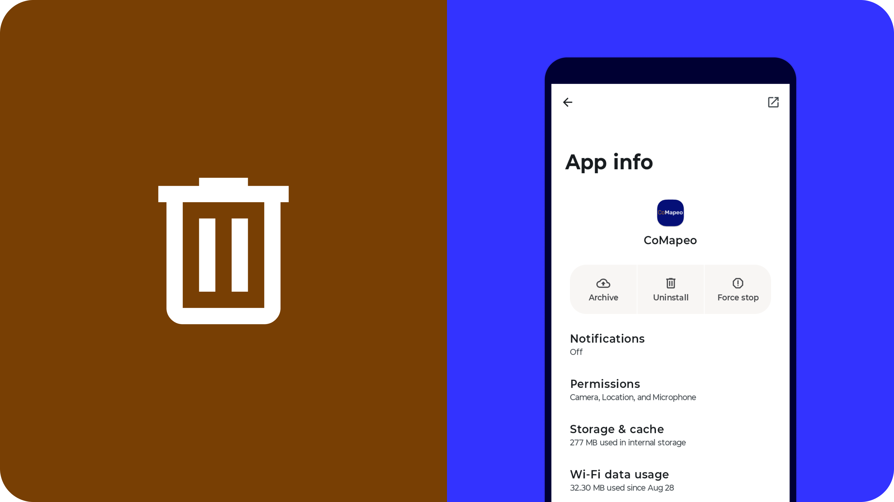

## **Reasons for Uninstalling CoMapeo**

You might want to uninstall CoMapeo for a number of reasons, for example:

- You have decided that the tool isn’t the right one for you

- You are no longer part of certain projects

- You want to give your phone away to someone else

- You think your device and the data are not secure

However, there are irreversible consequences to uninstalling CoMapeo, so make sure you are sure about your reasons, and look at the checklist below before completing the uninstallation.

## **Before Uninstalling CoMapeo**

When you uninstall CoMapeo all the data within the app will be deleted and will not be recoverable. You will also lose access to any projects you are part of, even if you are a coordinator. Therefore please follow these steps before uninstalling CoMapeo.

- If you are not part of any team projects, but are only using CoMapeo on your own, make sure you export any data from within all solo projects you have, or share any individual observation data that you consider important via Whatsapp / email etc.
Go to 🔗 [Exporting all Observations](/docs/exporting-all-observations) 

---

- If you are part of one or more projects, make sure that you are up to date with your data exchange, so that any data you have collected can be part of the team data.
Go to 🔗 [Understanding How Exchange Works](/docs/understanding-how-exchange-works)

---

- If you are a coordinator on a project, make sure that you set up at least one other device as a coordinator device for the project. If you fail to do this then the project will only have participants, and certain actions will not be possible.
Go to 🔗 [Selecting Device Roles and Teams](/docs/selecting-device-roles-and-teams)** **

---

## **Uninstalling CoMapeo**

[VIDEO WALKTHROUGH](https://drive.google.com/file/d/1heo-81t9Z9aQAp5vP3sYATVcwp6kAHzk/view?usp=drive_link)

:::note 👣
### Step by Step

***Step 1*****: Find CoMapeo**

Locate CoMapeo in your list of apps, or on your homescreen.

---

***Step 2*****: Uninstall CoMapeo**

Long-press on the icon of CoMapeo will give you these options, including to uninstall CoMapeo.

---

***Step 3*****: Confirm uninstall**

---

***Step 4:***** Uninstall successful**

CoMapeo is no longer on your phone, you will not find it in your app list or homescreen. All the data held within CoMapeo has been deleted from your phone.

:::

---

## **Deleting your app data**

You might want to delete your app data without deleting CoMapeo off your phone. This might be useful if you have come across bugs or want to start fresh with CoMapeo. Clearing data deletes all the contents of the app, and resets it back to its default state, like when it was first installed. If you have limited or no internet access this might be useful, as you can start from scratch by deleting app data, without having to re-download CoMapeo from the playstore.

:::note 👣
### Step by Step

Steps might vary slightly depending on Android version, but will be similar to:

***Step 1:***** **Go to **Settings** and then **Apps & notifications** (or just **Apps**)

***Step 2:***** Search the list and select CoMapeo**

***Step 3:***** T**ap **Storage** or **Storage & cache** 

***Step 4:***** ** **Clear storage** (make sure you clear data and not just cache)

:::note 💡 Tip
On Android 11 and lower, “Clear Storage” is written as  “Clear data”. Some older Android versions may also have a Clear data button directly on the app info screen.
:::

***Step 5:***** Confirm** that you want to clear the data
:::

## Related Content

### Having Problems?

Go to 🔗 [Troubleshooting: Setup and Customization](/docs/troubleshooting-setup-and-customization)** **

