

CoMapeo Mobile is available for  Android on the Google play store and as an APK

CoMapeo Desktop is available for Windows, Linux and Mac

Go to 🔗** **[Get CoMapeo](https://comapeo.app/download)

---

## Installing CoMapeo Mobile

Go to 🔗 [Get CoMapeo](https://comapeo.app/download)

:::note 💡 Tip
Before installing CoMapeo make sure the device battery is charged, and there is a stable internet connection for easy downloading.
Consider doing a maintenance check of your device before installing new apps
:::

### **CoMapeo on Google Playstore**

Installing this way is recommended because Google Playstore makes [app updates](#update-comapeo) easy. 

---

:::note 👣
**Step by Step**

***Step 1:*** Search for CoMapeo, created by Awana Digital, on Google Playstore,

***Step 2: ***Select Install 

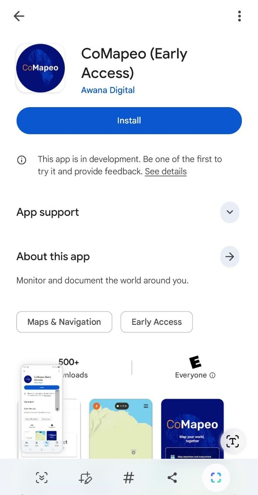

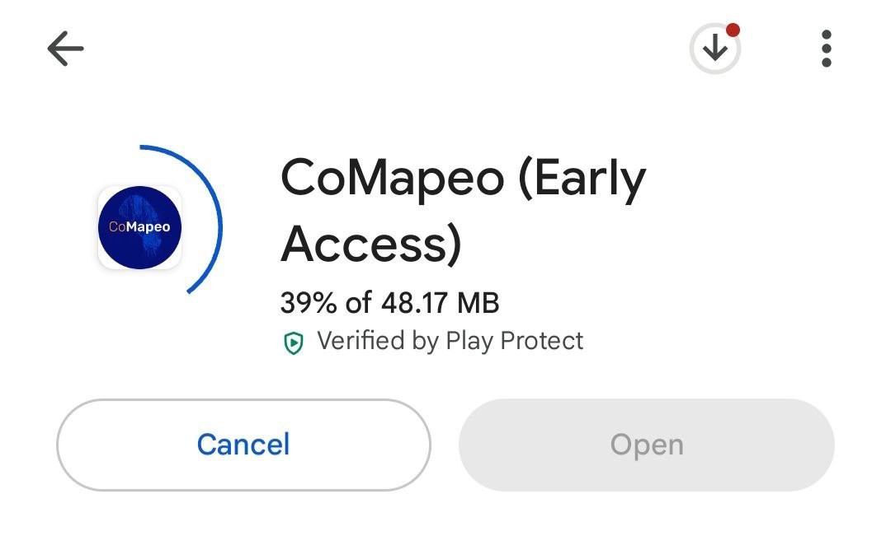

***Step 3:***  Wait for CoMapeo Mobile to download, then install

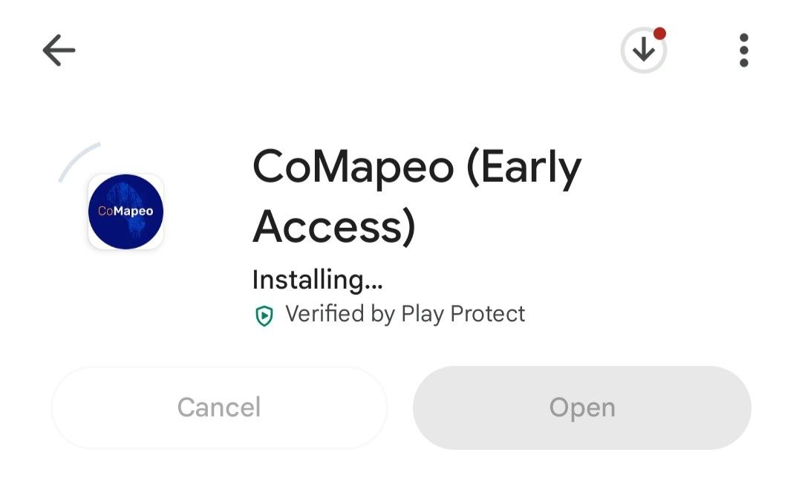

📼 [VIDEO WALKTHROUGH](https://drive.google.com/file/d/1QWKYMfgGk2Qh8jGez_ZrwWhck8n_gn26/view?usp=drive_link)
:::

---

:::note 👉🏽 More
An alternative option is to download the  **Android APK** for CoMapeo from our website. There are **no automatic updates available** if CoMapeo is installed this way.
Go to 🔗** **[Get CoMapeo](https://comapeo.app/download)
:::

## App Startup

Look for the CoMapeo icon wherever downloaded apps go on you device

CoMapeo Mobile, like all new apps, will appear at the end of the apps screen of  Android devices

:::note 💡 Tip
CoMapeo can be opened directly from Google Play Store after installation is complete
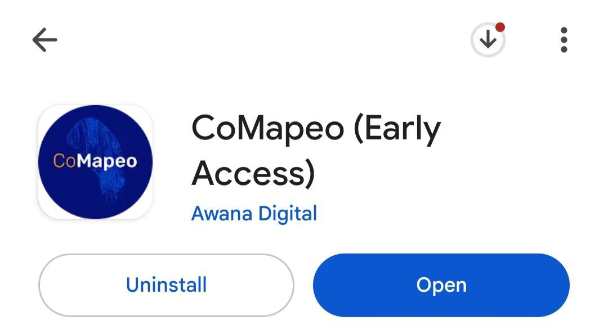
:::

## Installing CoMapeo Desktop

:::note 👣
**Step by Step**

***Step 1: ***Go to 🔗** **[Get CoMapeo](https://comapeo.app/download)** **and scroll down to “CoMapeo Desktop” 

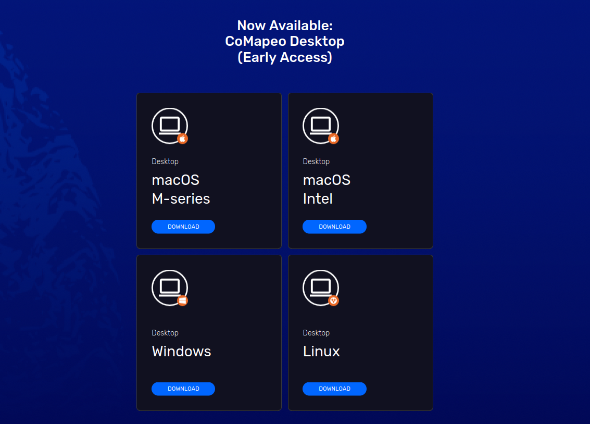

***Step 2:***** **Click on **Download.** A download of the installation file for your operating system should start automatically.

:::note 💡 Tip
It is important to select and use the correct installation file for your operating system:
- Windows:`.exe`

- macOS: `.dmg` or `.zip`

- Linux: `.AppImage`
:::

***Step 3: ***Install CoMapeo Desktop. 
:::

---

## Onboarding

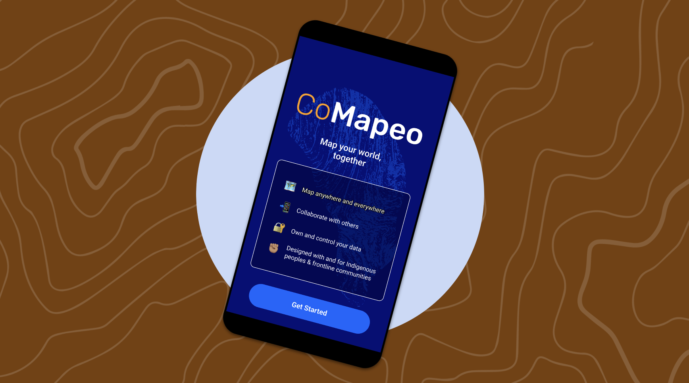

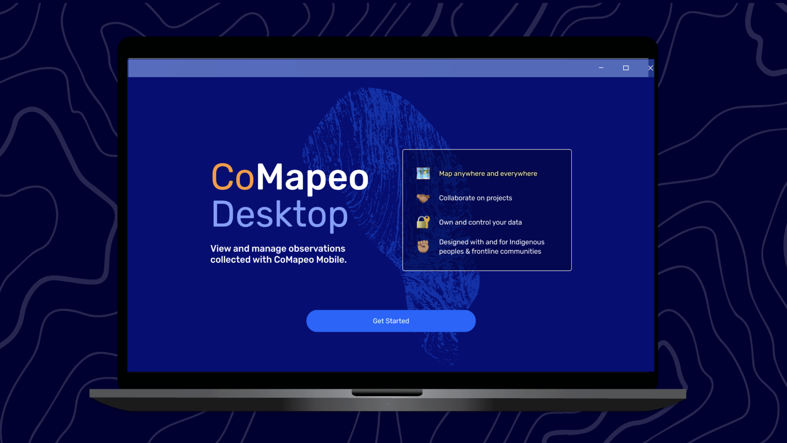

This is a required step to help configure devices to allow CoMapeo to use available features including storage and in the case of CoMapeo Mobile, essential sensors like the camera and GPS. To keep this a easy experience, CoMapeo will request permission for additional sensor access the first time using specific features like tracks and audio. Included in onboarding are:

**Welcome Screen
**You will be invited to [Get Started] and asked for device permissions upon startup.

**Data & Privacy Policy
**The app will present the data it collects, and you can choose to [opt in] or [opt out]. This can also be changed later via **Settings > Data Privacy**.

See Privacy Policy in English : [CoMapeo Data & Privacy](https://digidem.notion.site/CoMapeo-Data-Privacy-d8f413bbbf374a2092655b89b9ceb2b0)

**Device Naming
**You must enter a name for the device. This is the name other devices will see when inviting you to project, and will display in the list of project members.

:::note 👣
### **Step by Step: Mobile and Desktop**

---

**For CoMapeo Mobile**

***Step 1:***** Grant permission to take photos.
**The** **CoMapeo camera is one of the main features of the app. Without this permission CoMapeo camera will show a black screen. Other parts of the app will still work. 

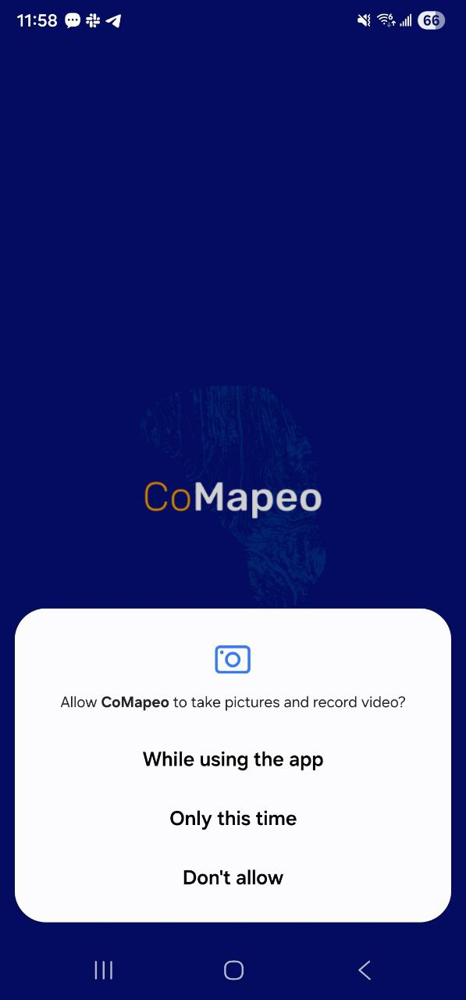

---

***Step 2:***** Grant permission to access location**

CoMapeo needs to access a device’s location in order to collect GPS coordinates to save in Observations. Without this permission CoMapeo will still be able to used to a limited degree. Observations may still be saved with an option enter GPS coordinates manually.

Newer Android versions offer an option of precise or approximate location data. **Choose precise** for the most accurate data collection results.

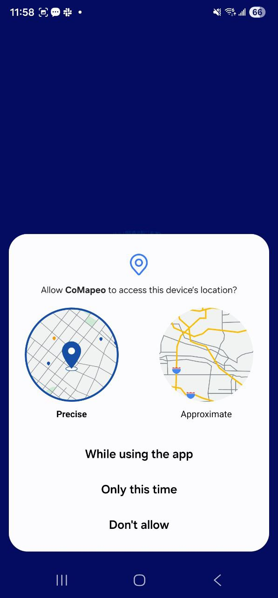

---

**For CoMapeo Mobile and Desktop**

***Step 3:***** **Select** Get Started **on the CoMapeo Welcome screen. For CoMapeo Desktop, this will be the first thing you see when you run the program.

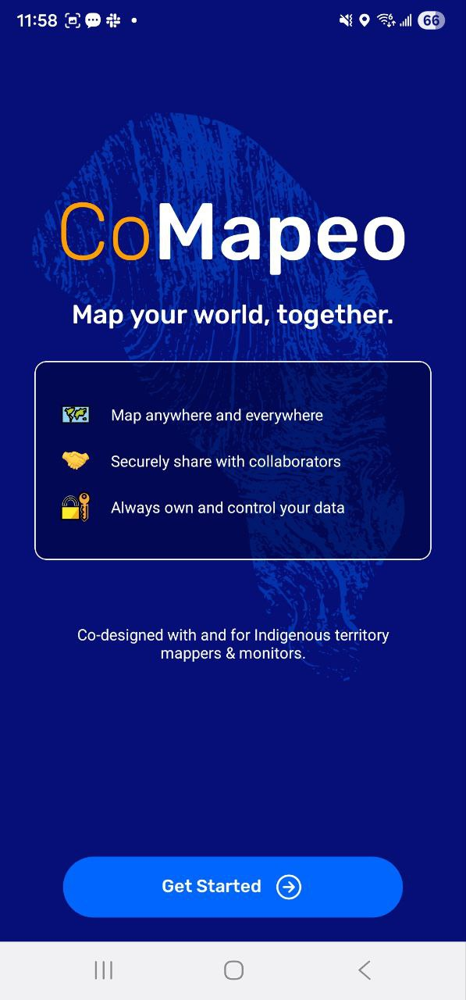

---

***Step 4:***** Learn more about Data and Privacy**

Find out more about how Awana Digital has built CoMapeo to keep your data safe and secure.

Click on Learn More for further details on data privacy and what data is sent to Awana Digital to help us improve the app.

Here you can also choose to **opt in** or **opt out** of sharing diagnostic data. This can also be changed later via  Settings →  Data Privacy.

Go to 🔗[CoMapeo Data & Privacy](https://digidem.notion.site/CoMapeo-Data-Privacy-d8f413bbbf374a2092655b89b9ceb2b0) to review the Privacy Policy in English

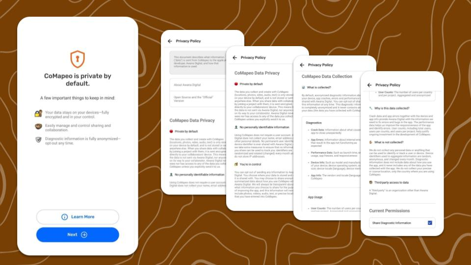

---

***Step 5*****: Name your device**

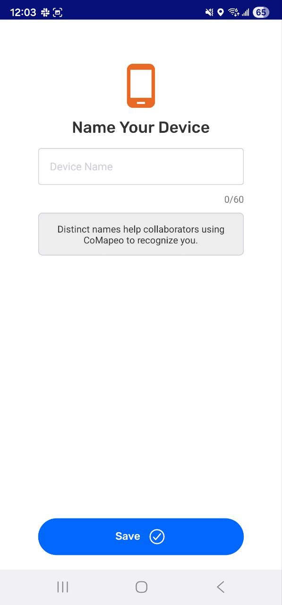

- Names are required for all devices in CoMapeo. 

- Device names are displayed in CoMapeo collaboration features like inviting teammates to join a project and viewing teammates in a project. 

- Names can be change with ease.

- Naming devices in a team project may need to follow protocols or agreements made with the people on the team. 

- Options for names include, the name of the person who owns the device, a nickname for the device, or a codename used in your team for security reasons. 

:::note 💡 Tip
Use something anonymous for contexts where safety issues are a concern.  Put a sticker on each phone with its name if they are being used by multiple people.
:::

---

***Step 6:***** CoMapeo is ready for use! **

**For CoMapeo Mobile **

Choose to  **Join a Project **or  **Map On Your Own**

To explore CoMapeo and set up a project, select  **Map On Your Own**. 

:::note 💡 Tip
To join a project, a different CoMapeo user must have a project setup and must invite devices to create a team on CoMapeo
Go to 🔗 [Inviting Collaborators](/docs/inviting-collaborators) for instructions 
:::

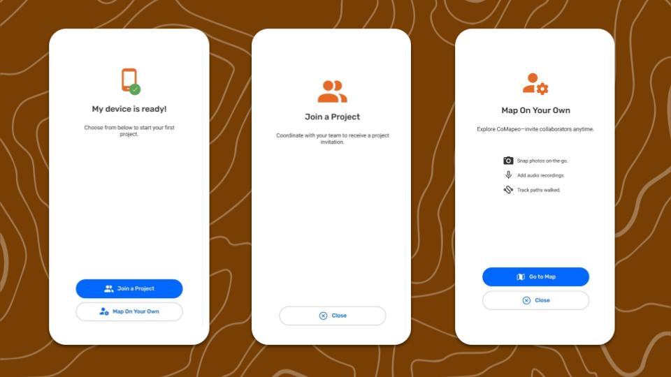

Next time CoMapeo is started, it will be on the  

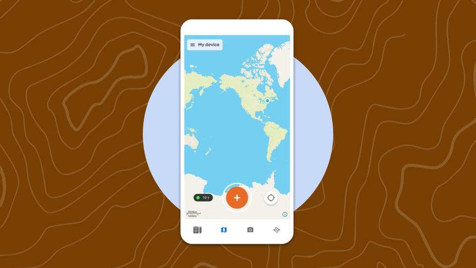

**For CoMapeo Desktop**

Choose to  **Join a Project **or  **Create a Project**

 **Join a Project **

At this step, you can ask a Coordinator team member to invite you to their project. It is the only state when you can receive a project invite.

 **Create a Project**

You can create a project. Enter your project name, you can edit it later on. Once successfully creating a project, you are invited to upload your category set or invite collaborators.

After completing the above steps, CoMapeo is ready to use on your device.K

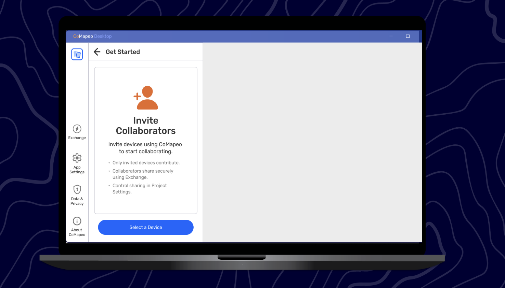

---

Go to 🔗 [Initial Use and CoMapeo Settings](/docs/initial-use-and-comapeo-settings)  
:::

## Update CoMapeo

The most up to date versions of CoMapeo are available on the [CoMapeo Website](http://comapeo.app/) and for CoMapeo Mobile in the [Google play store](https://play.google.com/store/apps/details?id=com.comapeo&pcampaignid=web_share&pli=1)

Google Play will display an update button when a new release is available with bug fixes and, sometimes, new features.

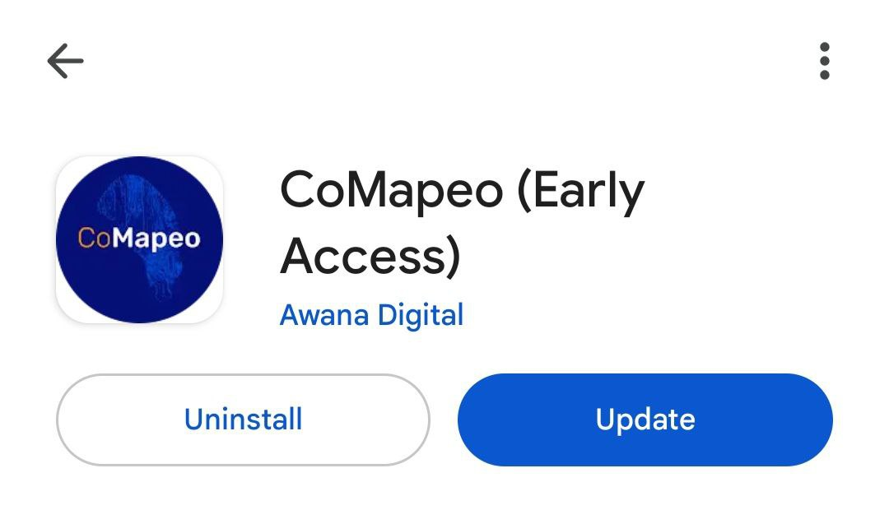

Go to 🔗** **[Get CoMapeo](https://comapeo.app/download)

:::note 💡 Tip
CoMapeo Mobile can be set to auto update in the options available in the Play store app
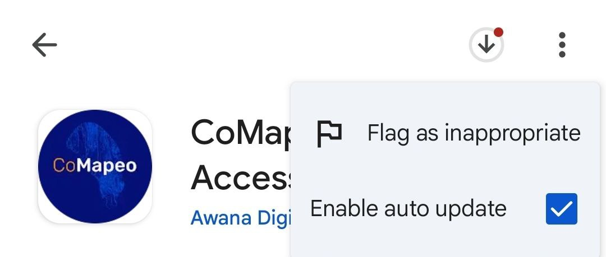
:::

---

## Related Content

Go to 🔗 [Getting Familiar with CoMapeo: Map Screen, Menu & Settings ](/docs/getting-familiar-with-CoMapeo) 

Go to 🔗 [Uninstalling CoMapeo](/docs/installing-comapeo-and-onboarding/)** **

### Having Problems?

Go to 🔗 [Troubleshooting: Setup and Customization](/docs/troubleshooting-setup-and-customization)** **

