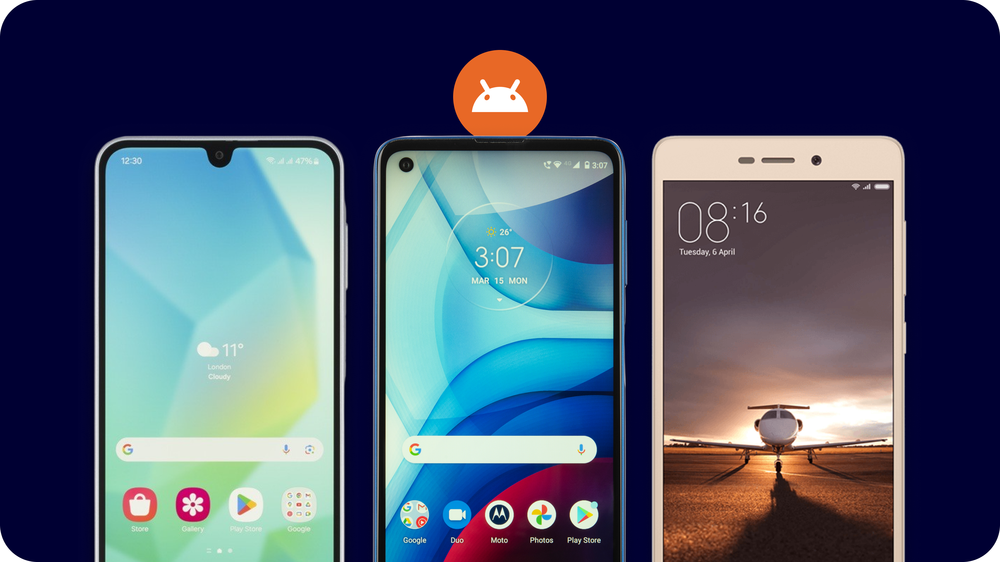
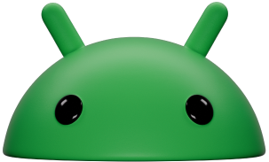

## Why is gathering the right equipment for CoMapeo important?

CoMapeo Mobile is designed to work on a variety of Android devices. of diverse models, It uses the basic hardware that is included in most smartphones today/nowadays: a camera, GPS, battery, and memory. However, if you are planning to use CoMapeo on/in long journeys, offline environments, and diverse weather conditions on the land, then there are important aspects to look for in a phone that can improve your experience with CoMapeo throughout your journey.

---

## Equipment for CoMapeo Mobile

CoMapeo Mobile is currently built for  **Android** smartphones.  It will not work with iPhones.

**Features to keep in mind what selecting a device**

- Battery Life 

- Memory 

- Robustness

- Waterproof rating (or get a good case) 

- Camera Quality 

- GPS sensitivity 

### Equipment for CoMapeo Collaboration Features

CoMapeo Mobile uses Wi-Fi connections to share project information and between devices, without the need for internet connection.

The features that require a Wi-Fi connection are all for collaborating with a team or adding a back-up device:

- Inviting new collaborators to a project

- Exchange  of Observations, Tracks and Project information

- Sending notification to a device that has been removed from a project

**There are three options to choose from**

  **Conventional router **installed in an office or communications center

  **Portable router**

 **Additional smartphone** capable of creating a local network offline or hotspot.

---

## Related Content

Go to 🔗 [Device Setup & Maintenance for CoMapeo](/docs/device-setup-and-maintenance-for-comapeo)** **

## Having Problems?

Go to 🔗 [Troubleshooting: Setup and Customization](/docs/troubleshooting-setup-and-customization)** **

