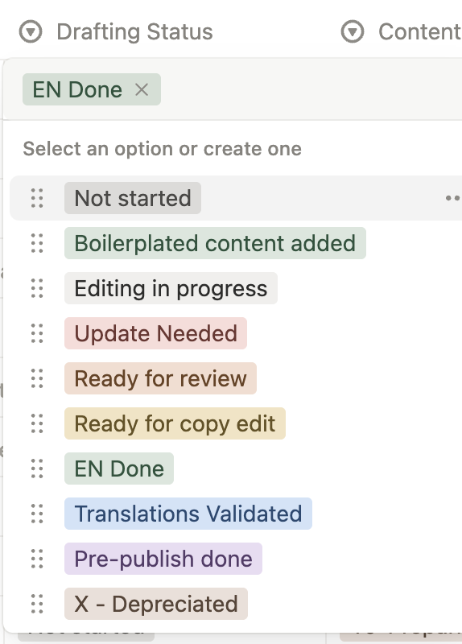

- [ ] Assignment prepared with relevance content references listed above

- [x] Content drafted

- [ ] Formatting and Icons applied

- [ ] Reviewer checks content for accuracy and edits where needed.

- [ ] Images  are added where indicated

- [ ] Copy editing complete

- [ ] Translations generated using AI tool

- [ ] Translations validated

- [ ] Formatting in ES page matches EN version

- [ ] Formatting in PT page matches EN version

- [ ] Mark as 

