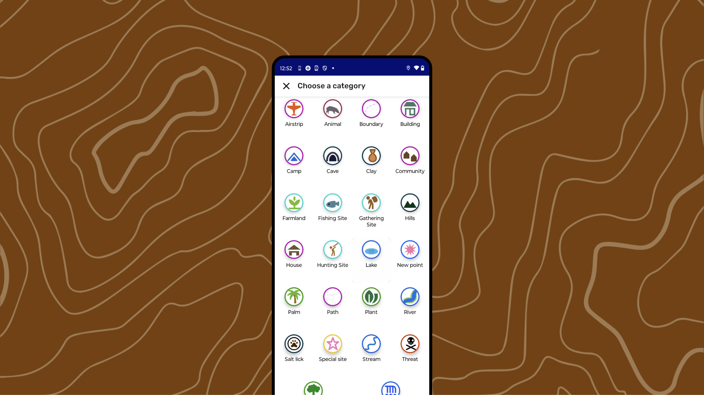

# Building a Custom Category Set

---

## Why Customize Category Sets?

When the included Categories in CoMapeo are not meeting needs of the mapping project, it is time to consider exploring customization.

**Reasons for customizing CoMapeo Category Sets**

- Custom Categories are a powerful tool for customization in CoMapeo, allowing users to define specific icons, and questionnaires for their projects.

- Text can be written in any language that can be typed, ensuring that key parts of the data collection interface can appear in the native language of the groups using it.

**Reflect and organize information you will need**

Initial planning and consultation with project participants is essential to designing effective ways of organizing your data. To start the customization process, project participants should reflect on the project goals, what kind of data will be needed, and what properties might be required for data outputs.

You will need to think through what to include for each of the **key customizable areas of CoMapeo.**

| Categories component | Description | Format |
| --- | --- | --- |
| **Category Name** | When collecting or creating data with CoMapeo, users assign a top-level category to each observation or element on the map | text (recommended less than x characters for best display |
| **Icon** | Each Category you include must have an icon or a small graphic to display to users when selecting a category. | png, (max 100px) |
| **Color** | Color appears as observations on  map view and in the Category selection screen. It helps to use thematic groups when defining colors functioning like a map legend. | [Hex colour code](https://htmlcolorcodes.com/color-picker/) |
| **Details fields** | For each Category in your Category Set, you can include one or more structured data fields (like a mini form or questionnaire) that users can optionally fill out when creating a new observation or map element with that category. | Text prompt and with fields that can be filled with values that are typed text, single select, or multiple select. The values can be text. Note that single select options may be preferred for data processing when organizing or doing analysis |

## Using the **CoMapeo Category Generator Spreadsheet**

The CoMapeo Category Generator Spreadsheet is a tool in active development that is meant for advanced tech user, or at minimum someone very comfortable with spreadsheet tools willing to learn about using Google Sheets plug-ins. 

It is expected that we learn about technical issues you encounter while using it, to help us improve it.

This tool will allow you to create and edit Categories, icons, details fields and language, and export all this information into a **.comapeocat** file to use in CoMapeo. All of this is done by filling out a set of spreadsheets with the necessary information

:::note 👉🏽 Go to 🔗[https
//lab.digital-democracy.org/comapeo-category-spreadsheet-plugin/](https://lab.digital-democracy.org/comapeo-category-spreadsheet-plugin/) for full instructions
:::

## **Testing out new categories**

An important part of the process is to test out the custom categories set created in CoMapeo Mobile. It can be helpful to include a couple teammates to help catch any improvements needed. 

Go to 🔗 [Changing Categories Set](/docs/changing-categories-set)** ** for instructions on importing .comapeocat files

Revisions must be made in the **CoMapeo Category Generator. **Repeat the export steps again, and test as needed.

## Related Content

Go to 🔗 [CoMapeo Categories](/docs/comapeo-categories)** **

Go to 🔗 [Planning and Preparing for a Project](/docs/planning-and-preparing%20for-a-project) 

Go to 🔗 [New Tool: Mapeo Icons Generator](https://www.earthdefenderstoolkit.com/new-tool-mapeo-icons-generator/)** **blogpost by Luandro Vieira.

Go to 🔗 [Welcome to CoMapeo Cateogries Library](https://www.earthdefenderstoolkit.com/welcome-to-the-comapeo-categories-library/)** **blogpost by María Alvarez

---

### Having Problems?

Go to 🔗 [Troubleshooting: Setup and Customization → Custom Categories Set Problems](/docs/troubleshooting-setup-and-customization/#custom-category-set-problems)** **

---
