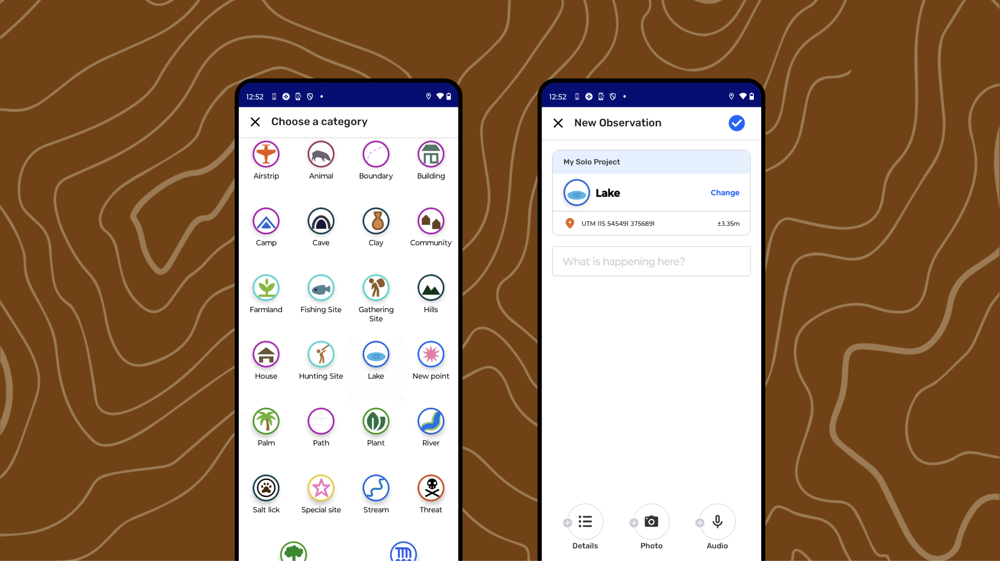

For CoMapeo Mobile v8

# Creating a New Observation

## What are Observations?

Observations are the heart of CoMapeo. Observations are data points saved as GPS coordinates  with a defined category and date and time.  The GPS sensors of a mobile device are used to record coordinates and accuracy and save it to an observation. Observations can also have text notes, photos and audio recordings. 

---

## Create a New Observation

:::note 👣
### Step by step

***Step 1:*** From the  map view or the  camera view, tap the  add observation button to start creating a new Observation.

---

***Step 2: ***Choose a category.
Scroll down to explore the full list of  category options. Tap the icon of the category that best represents what is being documented with the **Observation**.  

---

:::note 👉🏽 MORE
Learn about category sets in CoMapeo
🔗 Go to [CoMapeo Categories](/docs/comapeo-categories)** **to learn more
:::

---

***Step 3:***** **The observation editor appears displaying the data to be saved including  GPS coordinates. These may change if GPS sensor data changes.  Waiting for good precision before saving is recommended.

---

***Step 4:***** **Add a description,  [details](#adding-details),  [photos](#adding-photos), and  [audio](#adding-photos) as needed.

---

***Step 5:*** Tap  **Save** to save your observation.  It will now appear on the  map and in the  observation list. 

🔗 Go to [Saving an Observation](#saving-an-observation)** **for detailed information

:::note ⚠️ Warning
If observation is not saved in the location intended, there is no way to edit this information. Be sure to select  **Save** to complete the creation of the observation, or  Close to exit without saving.
:::
:::

---

Video: @[document_4997224092760278339_trimmed.mp4](https://drive.google.com/file/d/14l9AjdANFSzhtCC94h0DHw2Xolt11_Yq/view?usp=drive_link)

---

## Adding Details

Details are extra questions that are associated to each category. The specific information entered increases the quality data to help with reporting and evidence collection. Answering these questions is not required in order to save an observation. Follow your project protocol and data collection methodology to make sure data is gathered in the most useful way for the project needs. 

Details can also be completed after saving using  the  **Edit **tool

Go to 🔗 [Editing Observations](/docs/editing-observations)** **

:::note 👣
### Step by step

***Step 1****:* In the New Observation Editor, tap ** ****Details **at the bottom 

---

***Step 2: ***Read prompt and respond to the first questions. Responses have 3 predefined formats.  Select one,  Select multiple, or text.

---

***Step 3: ***Tap **Next **to move to the next questions and complete them as needed.  The progress through the questions is displayed on the top. Unanswered questions will be left blank. 

---

***Step 4****:* Move through all the questions using **Next** until the last one is reached. 

---

***Step 5:*** Tap **Done** to close the details form. 

:::note ⚠️ Warning
Selecting **Done** does not save the observation. It only closes the form.
:::

:::note 💡 *Tip
* After details are closed the Observation editor returns. Continue adding to the observation  by entering descriptive notes in the open text area.
Remember to tap  **Save** as a final step.
:::
:::

---

## Adding Photos

Photos added to an observation are associated with the notes and GPS coordinates and other information collected.  Photos can only be added to an observation when taken with CoMapeo camera. It is **not possible** to attach photos taken from other apps or in a device image gallery. Similarly, photos taken in CoMapeo are **not visible in your device image gallery**.  

See 🔗** **[Using Observations outside of CoMapeo](/doc/using-observations-outside-of-comapeo)** **to learn about options to share photos outside of a project. 

:::note 👣
### Step by step

***Step 1****: *When in the New Observation  or Editor, tap on the  **Add Photo** button in the lower task bar  to open the camera

***Step 2****:* Compose the photo and tap  **capture** to take a photo. 

To return to the editor **without adding a photo** tap ❌ **Cancel** .
There is no limit to the number of photos included in an observation, but each photo uses device storage. 
:::

:::note 💡 Tip
Photos can be added white creating an observation as well as while editing observations. Photo metadata is saved with each photo to support validation
Go to 🔗 [Reviewing an Observation](/docs/reviewing-an-observation)** **
:::

## Delete a photo

Removing photos can only happen at the time they are being added to an observation

:::note ⚠️ Warning
Photos cannot be removed once an observation has been saved. Delete photos that are poor quality or not useful before saving.
:::

:::note 💡 Tip
To remove a photo from a draft observation, tap on the thumbnail of the image. The photo is displayed together with photo metadata and options.
:::

:::note 👣
### Step by Step

***Step 1****:* Tap the photo thumbnail to view the photo details

***Step 2****: *Tap the  **DELETE PHOTO** button, 

***Step 3****:* Confirm deletion with  **Delete Photo**. 

:::note ⚠️ Warning
Once deleted, photos cannot be recovered. To abort the photo deletion tap **CANCEL. ** Return to the Observation Editor with the  **back** arrow.
:::

:::

---

## Adding Audio

Adding audio recordings to **Observations** can provide context, serve as oral testimony, be evidence or data for monitoring purposes, or serve as an alternate manner to collect information on occasions when writing notes in CoMapeo is difficult or dangerous. 

Audio recordings will be associated with the notes, photos and GPS coordinates of the observation, and can later be exported or shared together with the other data. You can only add audio taken from within the CoMapeo app at the time you gather the observation, you can not add audio from other sources. 

Each audio recording can be up to 5 minutes long. You can add multiple audio recordings to a single observation. 

:::note 👉🏽 CoMapeo in Action
Learn how [this feature is used to document biodiversity](https://awana.digital/blog/sound-as-language-biodiversity-monitoring-and-comapeos-new-audio-recording-feature)
:::

:::note 👣
### Step by Step

***Step 1:***** **Select  **add audio**

Recording will begin immediately.

---

:::note 👉🏽 Note
If this is your first time recording audio with CoMapeo, you will need to grant permission to use this feature. **Allow** CoMapeo to record audio **while using the app**

:::

---

***Step 2*****: **Select ⏹️ **Stop** when done recording.

---

***Step 3*****: **Choose and option after recording is complete. 

→  ▶️ Listen to the recorded audio.

→ Continue to the observation editor by selecting **BACK TO EDITING** 

→  **DELETE** the audio. 

:::

---

:::note 💡 Tip
Audio recordings will stop automatically if the screen changes, if you navigate away from the recording screen or start using another app during recording, or if the phone screen times out and goes to sleep. To avoid this audio recording issue change your SCREEN TIMEOUT to at least 5 minutes in your device display  settings.

:::

### Deleting Audio

Deleting audio is irreversible. However there is good reason to delete audio if it is not valuable to the observation or project. Audio recordings can take up a substantially higher amount of device storage compared to photos. 

Once an observation is saved the audio cannot be deleted.

:::note 👣
### Step by Step

***Step 1****:* Tap the audio thumbnail to preview the audio recording

***Step 2****: *Tap the  **DELETE** button. 

:::note ⚠️ Warning
Once deleted, audio recording cannot be recovered.
:::

:::

:::note 💡 Tip
In order to prevent media files from taking up device storage when working in a team, adjust Exchange settings.
Go to 🔗** **[Understanding How Exchange Works → Adjusting Exchange Settings](/docs/understanding-how-exchange-works/#adjusting-exchange-settings)  to learn more.
:::

---

## Saving an Observation

Save an observation by tapping the  blue checkmark at the top of the screen. Once an observation has been saved it will appear in the observation list and on the map screen. 

Information that is saved and cannot be changed is:

- GPS coordinates

- Date and time

- Observation metadata

- Photos taken when observation is saved

There are several other kinds of data that can be edited after an observation is saved. This is helpful for situations that require quick data collection, and thorough completion of descriptions and details.

🔗 Go to [Editing Observations](/docs/editing-observations) for more information. 

## Saving when GPS accuracy is low

**GPS accuracy **is a metadata property calculated by the GPS sensor in a device. It is based on information provided by satellites. This information is displayed in CoMapeo Mobile on the map screen and camera screen, left of the capture button  . It is also displayed in the coordinated on the **Create Observation** screen and will update until the observation is saved.

If the coordinates have an accuracy of worse than ±10m or if there is no GPS signal at the time of saving the observation, CoMapeo offers three options. 

- **Continue waiting** until the GPS signal improves to get better accuracy. Time and slight maneuvers usually help. Checking the coordinates until accuracy is better than ±10m, and tapping  then, will prevent the GPS warning from appearing again.

- **Save **to use the current GPS coordinates, even if accuracy is worse than ±10m.  Consider if this is satisfactory for the purpose of the data.
:::note 💡 Tip
If you save an observation without GPS coordinates, it will not appear on your map, but it will still appear in your observation list.
:::

- **Manual entry of coordinates **is a practical option only if you have access to another GPS device with better sensors and accuracy.  Alternative measures should be taken if data validation is important for the observation.

---

## Manual entry of coordinates

Manual entry of coordinates is never an ideal situation but sometimes needed if a phone’s GPS sensor is not adequately reaching GPS satellites. This can happen in remote regions, under dense canopies, in buildings or when cloud cover is heavy.

:::note ⚠️ Warning
CoMapeo cannot validate observations where coordinates have been manually entered. CoMapeo validated observations by including GPS metadata from sensors and attaching relevant data as Observation Metadata.  Observations without these details will display as unvalidated by CoMapeo.
:::

:::note 💡 Tip
An alternative for validating data is to  **add photo** to the observation of the coordinates and precision displayed on a device with a better GPS signal. Do this *before* entering coordinates manually.
When submitting these observations for legal or scientific scrutiny, send the observation together with observation metadata and photo metadata.
:::

:::note 👣
### Step by Step

***Step 1:***** **Select** MANUAL COORDS** to open the **Enter Coordinates** screen.

💡 **Tip:  **To return to the options tap the  Back button

**Step 2:** Choose your **Coordinate Format**, to match the format of the other device.
Options include Decimal Degrees, Degrees/Minutes/Seconds or Universal Transverse Mercator. 

***Step 3:*** Carefully read and copy coordinate details from the other device. **Enter required values** completing all fields. 

:::note ⚠️ Warning
There is no way to edit the coordinate information entered after it is  saved .
:::

***Step 4:***** **Tap** ** **Save. ** The observation is saved with the coordinates at the same time. 
:::

---

## Related Content

Go to 🔗 [Exploring the Observation List ](/docs/exploring-the-observations-list)   

[Exploring the Observations List](https://app.notion.com/p/2331b08162d58049a796f00ff29c3e7f) 

Go to 🔗 [Reviewing an Observation](/docs/reviewing-an-observation)  

### **Having problems?**

Go to 🔗 [Troubleshooting: Observations & Tracks](/docs/troubleshooting-observations-and-tracks)** **

