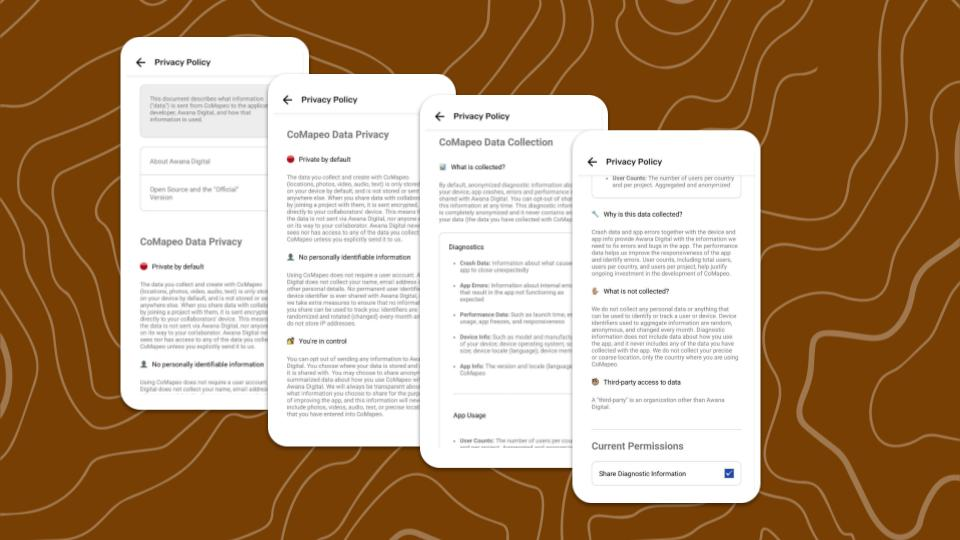
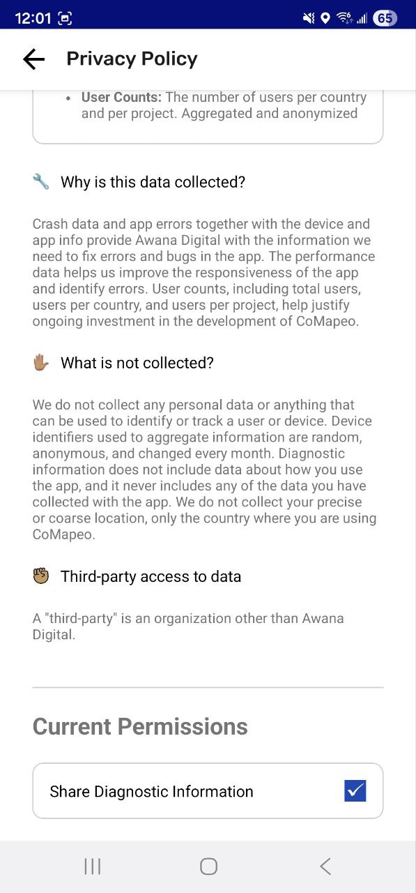
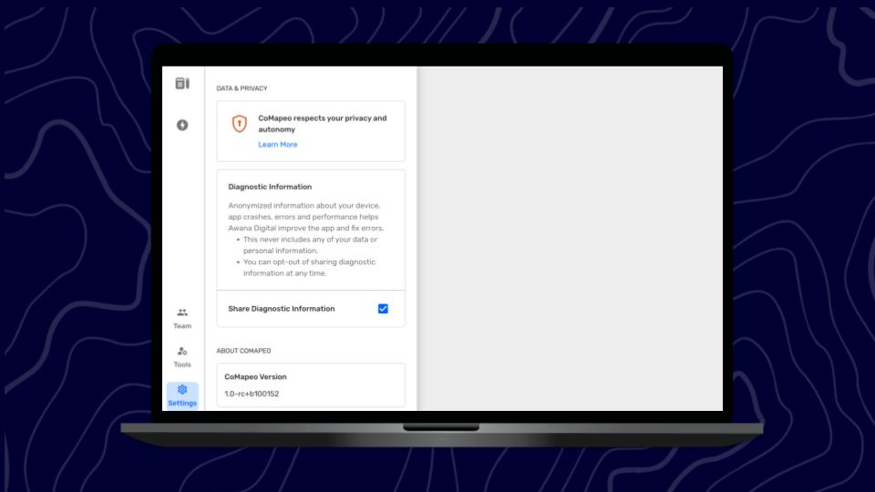

## What Data Sharing & Privacy

**Data Sharing** is a passive function of CoMapeo that works when a device is connected to the internet. Most apps use this function to gain information about app use to improve functionality. Some apps use data sharing for other purposes including surveillance, targeted advertising  and profit. 

**Data privacy** is the way in which an app, and platform host will protect your privacy. This this may include anonymization or storage maintenance procedures.

:::note 💡 Tip
It is always recommended to be familiar with data sharing and privacy policies for any app you download
:::

### CoMapeo Data Privacy

- **Private by default. **The choice to opt in is offered during onboarding

- **No personally identifiable information** is gathered at any time

- **You’re in control. **Change the setting any time

Review CoMapeo Privacy Policy to clarify doubts at any time. Choose to **opt in** or **opt out** of sharing diagnostic data.

Go to 🔗[CoMapeo Data & Privacy](https://digidem.notion.site/CoMapeo-Data-Privacy-d8f413bbbf374a2092655b89b9ceb2b0) to review the Privacy Policy in English

:::note 👣
### Step by Step

***Step 1: ***Open the  Main Menu

***Step 2: ***Select  CoMapeo Settings

***Step 3: ***Tap** ** **Data & Privacy**

***Step 4: ***Scroll to see current permission

***Step 5: ***Tap check box to toggle selection

:::

## Related Content

### Having Problems?

Go to 🔗 [Troubleshooting: Data Privacy and Security ](/docs/troubleshooting-data-privacy-and-security)** **

