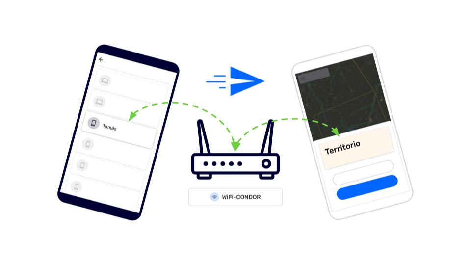

Collaborators are people who work as a team to gather and share information together. CoMapeo does not recognize people, but it does recognizes devices through a unique **Device ID. **To make it easier to associate a Device ID with a person, CoMapeo will display the associated **Device Name** as shown in CoMapeo Settings. **

**Only  **Coordinators**  can invite collaborators to a CoMapeo Project by ** Inviting Devices** either when setting up a project, or when reviewing the  **Team** list. 

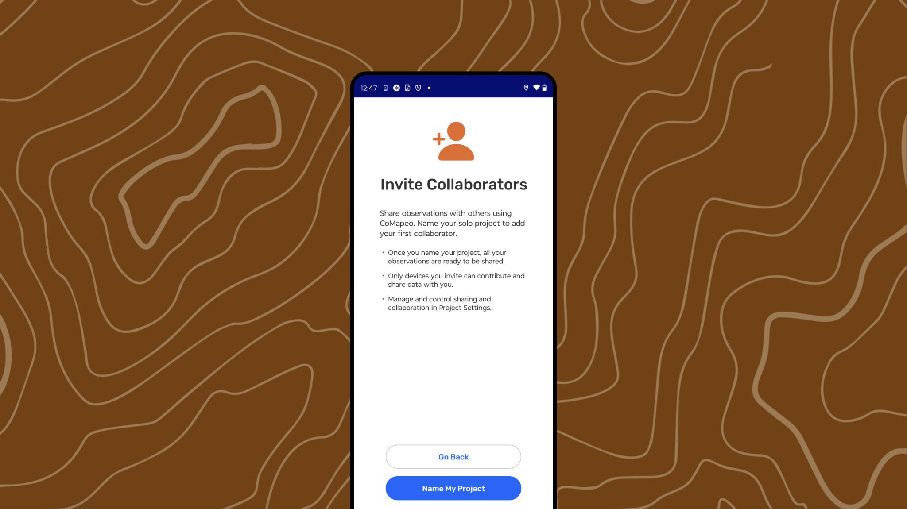

## Why invite collaborators to your projects?

Mapping with others makes the work more powerful. When people collect information together, more ground can be covered to create shared mapping data. CoMapeo is designed to support  the exchange of mapping information as a team with, even when offline. 

 **Exchange cannot be used without collaborators.**

When gathering information with CoMapeo, there are three ways to start collaborating with others.

- Starting a New Project
Go to 🔗 [Creating a New Project](/docs/creating-a-new-project)**  **for full details

- Inviting a Collaborator to My Solo Project

- Inviting a Collaborator to an existing Project

- Joining an Existing Project

:::note 💡 Tip:  M
ake sure any devices being invited have CoMapeo Installed and a name added.
Go to 🔗 [Installing CoMapeo & Onboarding](/docs/installing-comapeo-and-onboarding) to learn more
:::

## Inviting a Collaborator to a Solo Project

A solo project needs to be converted into a collaboration before a teammate can be invited to join the work started on CoMapeo Mobile.

:::note 👣
### Step by Step - Mobile

***Step 1: ***Go to the **Menu**.

---

***Step 2:*** Tap on  **Collaborate**.

---

***Step 3:*** Select  **Invite Devices**

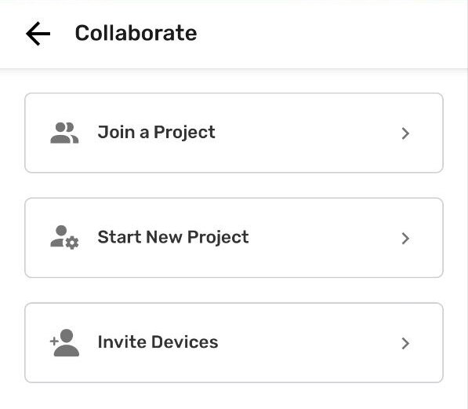

---

***Step 4:*** Add a **project name** and continue

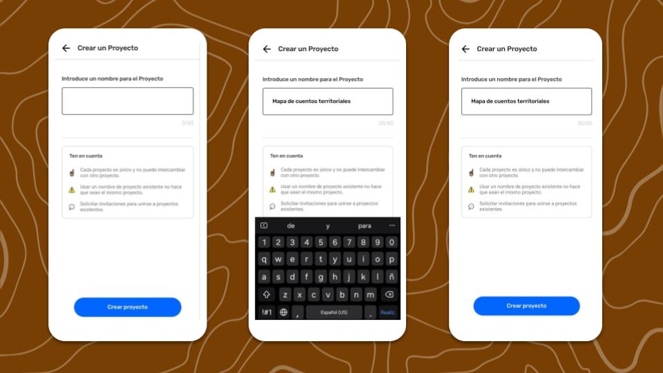

---

***Step 5:*** Select a  **Project Statistics **option. This can be changed in Coordinator Tools

---

***Step 6:*** The project is now ready to invite collaborators

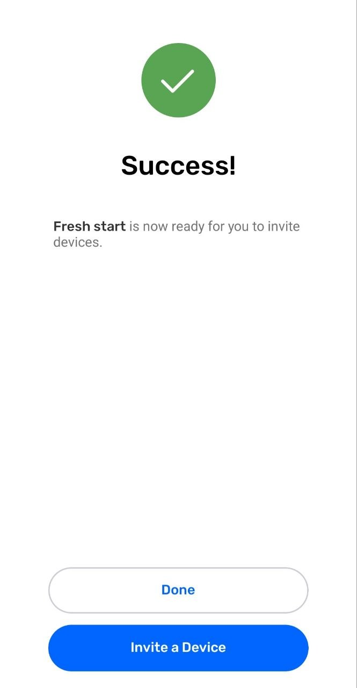
:::

## Inviting a Collaborator and Existing Project

A device with a coordinator role can invite other devices to respective projects.

:::note 👣
### Step by Step

***Step 1: ***Go to the **Menu**.

---

***Step 2:*** Review the project card to confirm it is the project that other devices are to be added to.  If not, tap **Change Project **to see options and select the correct project. 

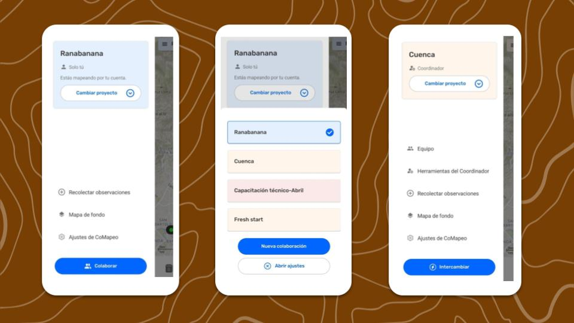

---

***Step 3:*** Tap on  Team

---

***Step 4:*** Tap  Invite device

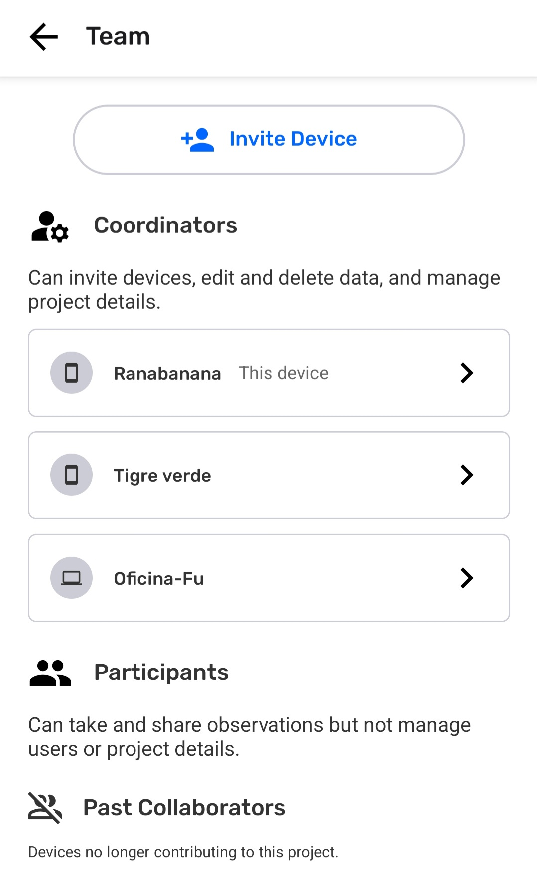

---

***Step 5:*** Connect both devices to the same  Wi-Fi-Router and keep CoMapeo open

---

***Step 6:***  CoMapeo will display any device with CoMapeo open and using the same Wi-Fi not already in the project.  In addition to the **Device Name** and part of the **Device ID** it will also display if it is a  desktop or  mobile device. 
Select the device to be Invited.

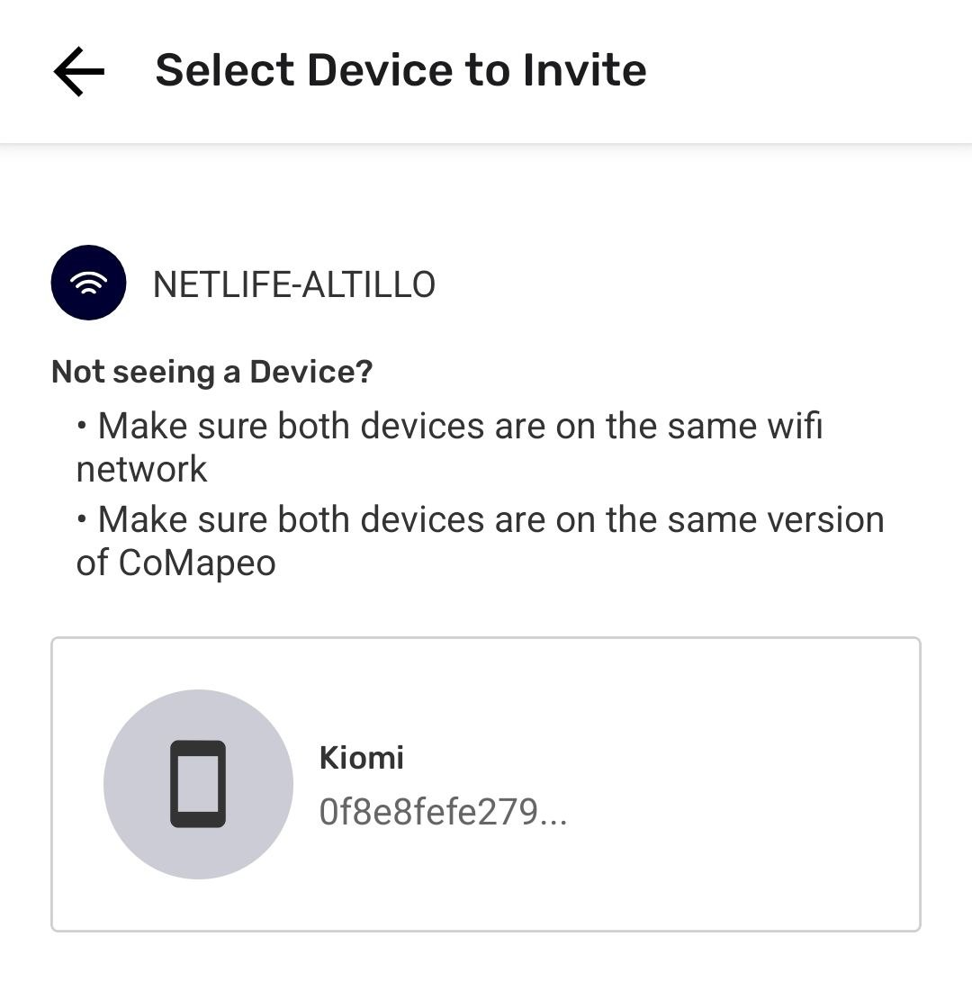

:::note 💡 Tip
Disconnection happens if the device being invited is not open and active. If the screen saver was activated, wake up the device and open CoMapeo again to reconnect.
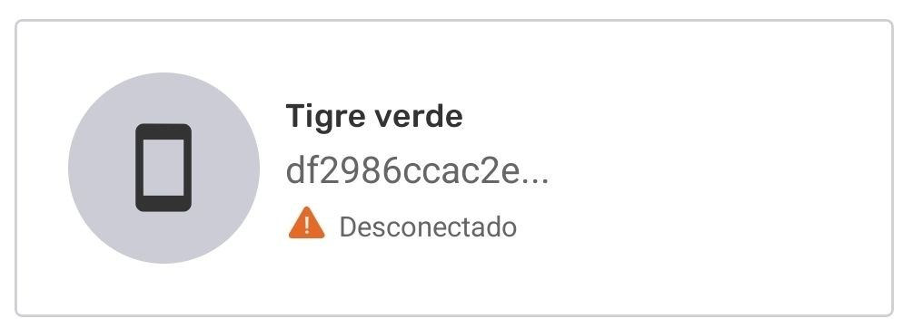
:::

---

:::note 🚧 Warning
CoMapeo Desktop is Early Access at the moment with ongoing improvements to make. It may take several minutes for a device with CoMapeo Desktop to appear in the list. Once it appears, proceed with Invite as usual.
:::

---

***Step 7:*** Select role for the device to be invited. 
Go to 🔗 [Selecting Device Roles and Teams](/docs/selecting-device-roles-and-teams)** **to learn more

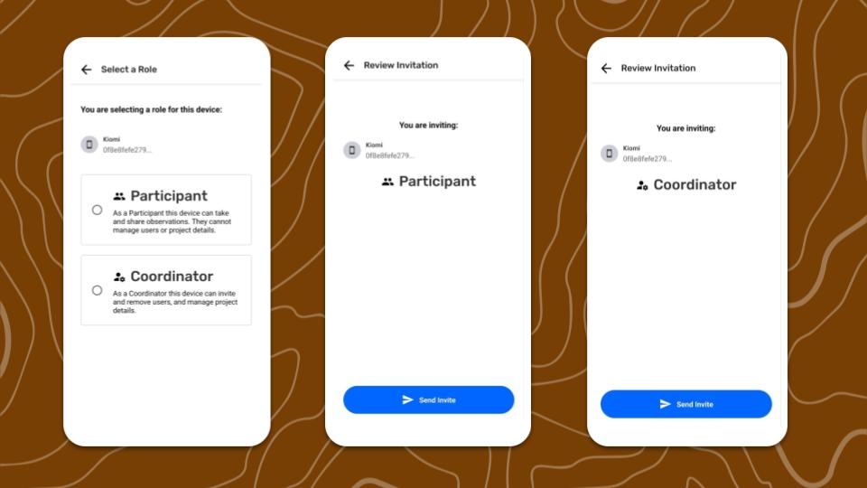

---

***Step 8:*** Tap  **Send Invite** the device to be invited. 

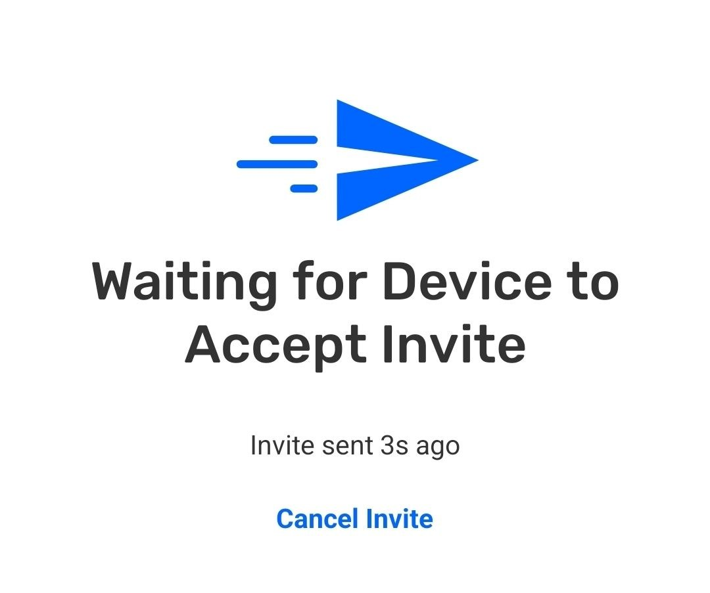

:::note 💡 Tip
Communicate with the person with the device being invited, with instruction to wait until they receive the invitation, and accept it
:::

---

***Step 9:*** After the invited device accepts the invitation, a confirmation will appear. 

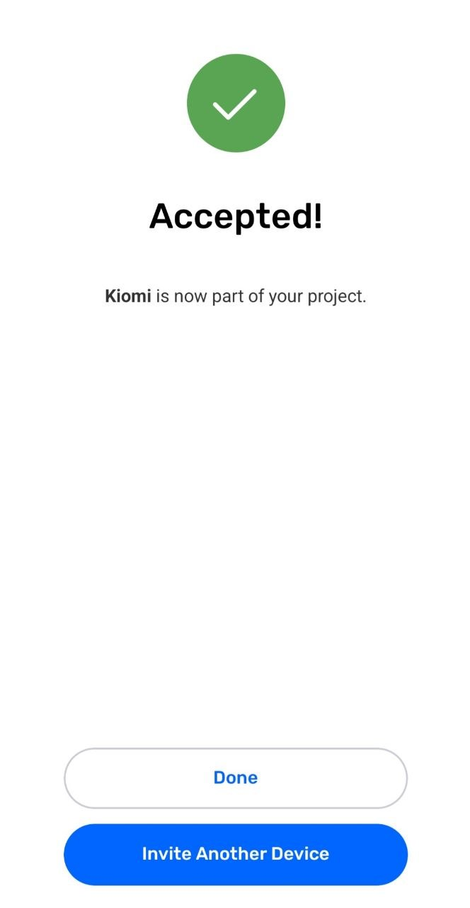

:::note 💡 Tip
It can take a few moments for projects to be setup on newly invited devices. There is no need for a Coordinator to wait before inviting another device.
:::
:::

## Joining an Existing Project

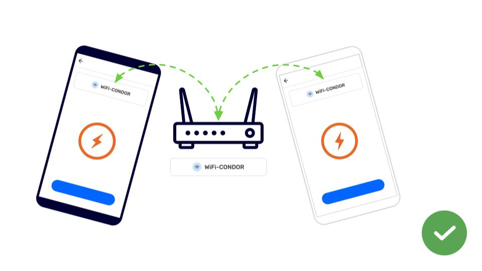

Joining a project is the second half of the process to adding a device to a project. 

---

---

:::note 👣
### Step by Step - Mobile

***Step 1: ***Connect to the same Wi-Fi router as the device sending the invitation, and wait for the invitation to appear.

---

***Step 2:*** Select **Join Project**

---

***Step 3:*** CoMapeo will take a few moments to setup the newly joined project.  Once the confirmation of success appears, this device is now part of the project.

---

:::note 💡 Tip
Look at the project card in the  **Menu** to confirm information is being gathered in the correct project.
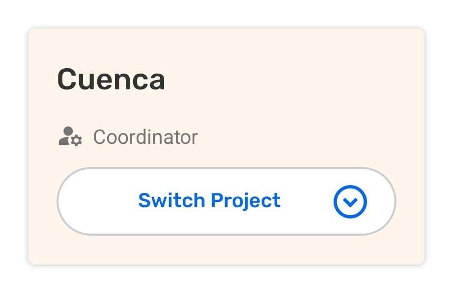

:::
:::

:::note 👣
### Step by Step -  Desktop

***Step 1: ***Connect to the same Wi-Fi router as the device sending the invitation, and wait for the invitation to appear.

---

***Step 2:***  Review the name of the project, and role assignment for the invitation. If correct, select **Accept**

---

***Step 3:*** This device is now part of the project

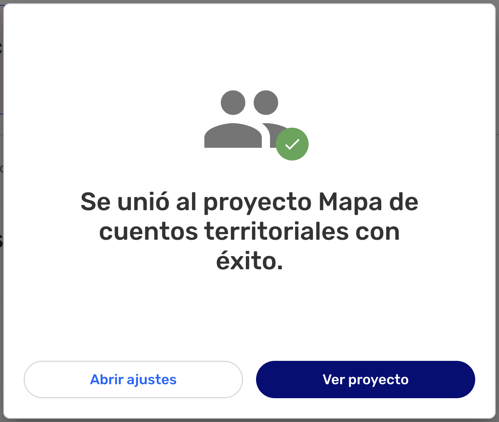

---

:::note 💡 Tip
Look at the project cart in the  **Menu** to confirm information is being gathered in the correct project.
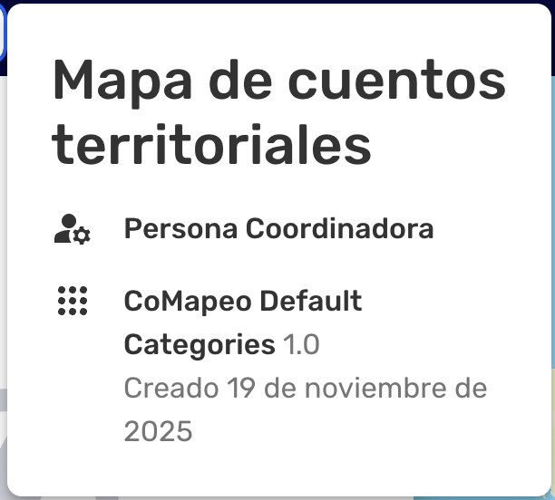
:::
:::

## Related Content

Go to 🔗 [Selecting Device Roles and Teams](/docs/selecting-device-roles-and-teams) to learn about making your project collaborative 

### Having Trouble?

Go to 🔗 [Troubleshooting: Mapping with Collaborators](/docs/troubleshooting-mapping-with-collaborators)

