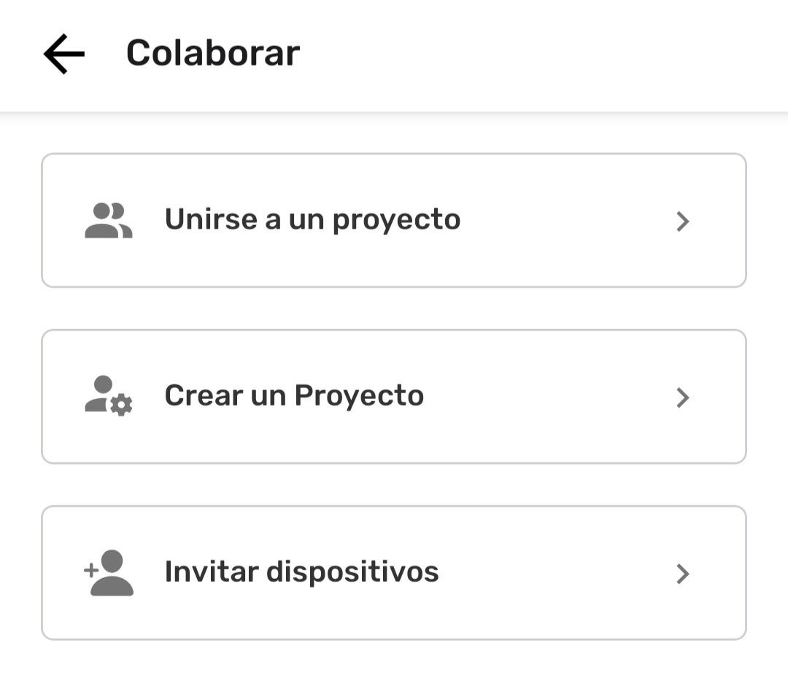
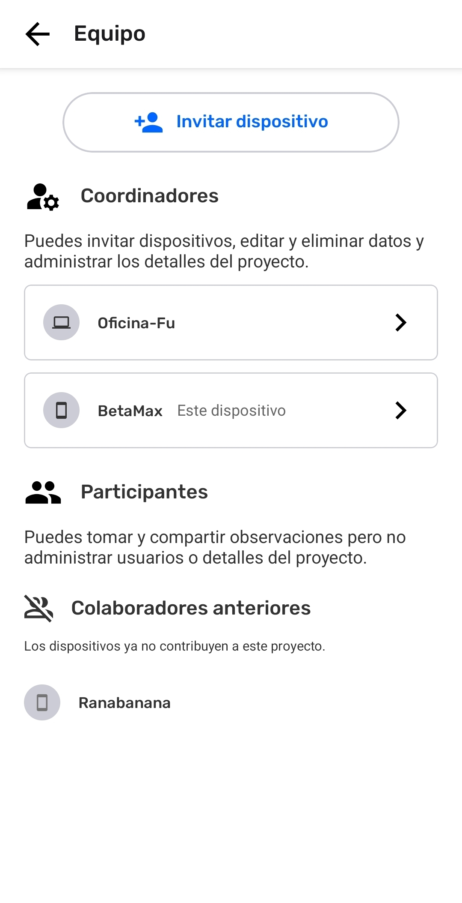
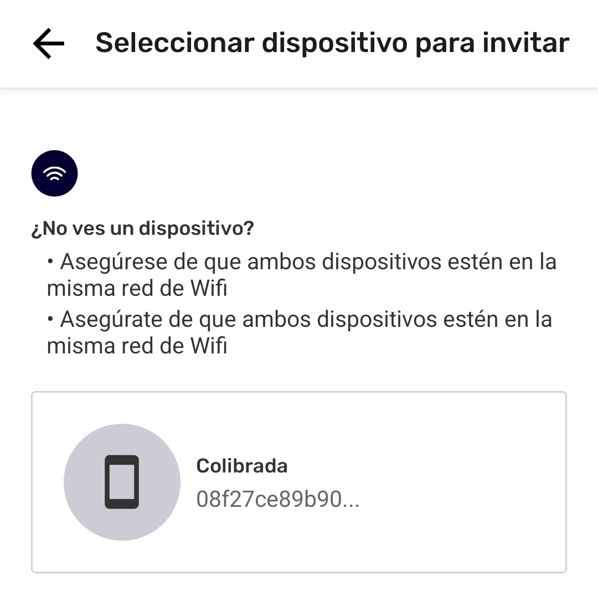

---

# Invitar Colaboradores

Los colaboradores son personas que trabajan en equipo para recolectar y compartir información. CoMapeo no reconoce personas, pero sí identifica dispositivos mediante un **ID de Dispositivo** único. Para facilitar la asociación de un ID de Dispositivo con una persona, la aplicación utiliza el **Nombre del Dispositivo** configurado por el usuario. 

Solo los  **Coordinadores** pueden invitar colaboradores a un Proyecto de CoMapeo, a través de la opción  **Invitar dispositivos** ya sea al configurar un proyecto, o al revisar la lista del  **Equipo**.

## ¿Por qué invitar colaboradores a tus proyectos?

El trabajo es más poderoso cuando se mapea con otros. Cuando las personas recolectan información juntas, se puede cubrir más terreno para crear datos de mapeo compartidos. CoMapeo está diseñado para apoyar el intercambio de información como equipo, incluso cuando no está conectado a internet. 

 **No se puede realizar el Intercambio sin colaboradores.**

Cuando se recolecta información con CoMapeo, hay varias formas de empezar a colaborar con otros.

- Inicia un Nuevo Proyecto
Ir a 🔗 [Crea un Nuevo Proyecto](/docs/crea-un-nuevo-proyecto)** **para detalles completos

- Invita un Colaborador a mi proyecto individual

- Invita un Colaborador a un proyecto existente

- Únete a un proyecto existente

:::note 💡 Consejo
Asegúrate de que cualquier dispositivo que sea invitado tenga instalado CoMapeo y cuente con un nombre.
Ir a 🔗 [Instalación de CoMapeo e Inducción](/docs/instalacion-de-comapeo-e-induccion) para aprender más
:::

## Invitar un Colaborador a un proyecto individual

Un proyecto individual debe convertirse en una colaboración antes de invitar a un compañero de equipo, a unirse al trabajo iniciado en CoMapeo Móvil.

:::note 👣
### **Paso a Paso - :comapeo-mobile: **** Móvil**

***Paso 1:*** Ir al **Menú**.

---

***Paso 2:*** Toca  **Colaborar**.

---

***Paso 3:*** Selecciona  **Invitar Dispositivos**

---

***Paso 4:*** Agrega un **nombre de proyecto** y continúa 

---

***Paso 5:*** Selecciona una opción de :-app-icon-comapeo-project-stats: **Estadísticas del Proyecto**. Esto puede cambiarse luego en Herramientas de coordinador

---

***Paso 6:*** El proyecto ahora está listo para invitar colaboradores 

:::

## Invitar un Colaborador a un proyecto existente

Un dispositivo con rol de coordinador puede invitar a otros dispositivos a diversos proyectos.

:::note 👣 Paso a Paso
***Paso 1:*** Ir al **Menú**.
---

***Paso 2:*** Revisa la tarjeta del proyecto para confirmar que es el correcto y al que se agregarán otros dispositivos. Si no es, toca **Cambiar Proyecto** para ver las opciones y seleccionar el proyecto correcto.

---

***Paso 3:*** Toca en  Equipo 

---

***Paso 4:*** Toca  Invitar dispositivo 

---

***Paso 5:*** Conecta ambos dispositivos al mismo  Router Wi-Fi y mantén CoMapeo abierto

---

***Paso 6:*** CoMapeo mostrará los dispositivo que tengan CoMapeo abierto, que utilicen el mismo Wi-Fi y que no estén aún en el proyecto. Además del **Nombre del dispositivo** y parte del **ID del Dispositivo,** también mostrará si es un dispositivo  desktop o  móvil.
Selecciona el dispositivo que deseas invitar.

:::note ⚠️ Consejo
La conexión se interrumpe si el dispositivo al que se invita no está abierto y activo. Si se activó el protector de pantalla, activa el dispositivo y vuelve a abrir CoMapeo para conectarte nuevamente.

:::

---

:::note ⚠️
🚧 **Advertencia:** CoMapeo Desktop se encuentra actualmente en face de acceso temprano y se están realizando mejoras continuas. Puede tomar varios minutos para que un dispositivo con CoMapeo Desktop aparezca en la lista. Una vez que aparezca, procede con la Invitación como de costumbre.
:::

---

***Paso 7:*** Selecciona el rol del dispositivo a ser invitado.
Ir a 🔗 [Selección de Roles de Dispositivo y Equipos](/docs/seleccion-de-roles-de-dispositivo-y-equipos) para aprender más.

---

***Paso 8:*** Toca  **Enviar Invitación** al dispositivo a ser invitado.

:::note 💡 Consejo
 Comunícate con la persona que tiene el dispositivo al que se le está enviando la invitación, y pídele que es espere hasta recibirla y la acepte.
:::

---

***Paso 9:*** Después de que el dispositivo invitado acepte la invitación, aparecerá una confirmación. 

:::note 💡 Consejo
La configuración de los proyectos en los dispositivos recién invitados puede tardar unos minutos. No es necesario que el coordinador espere antes de invitar a otro dispositivo.
:::
:::

## Unirse a un proyecto existente

Unirse a un proyecto es el paso final para añadir un dispositivo a un proyecto. A continuación, se explica cómo aceptar la invitación para comenzar a colaborar y compartir datos. 

---

---

:::note 👣
### **Paso a Paso - **** Móvil**

***Paso 1:*** Conéctate al mismo router Wi-Fi que utiliza el dispositivo que envió la invitación, y espera a que aparezca el mensaje.

---

***Paso 2:*** Selecciona **Unirse a proyecto**

---

***Paso 3:*** CoMapeo tardará unos instantes en configurar el proyecto al que te acabas de sumar. Una vez que aparezca el mensaje de confirmación, este dispositivo ya es parte del proyecto.

---

:::note 💡 Consejo
Consulta la tarjeta del proyecto en el  **Menú** para confirmar que la información se  está recopilando en el proyecto correcto.

:::
:::

:::note 👣
### **Paso a Paso - **** Desktop**

***Paso 1:*** Conéctate al mismo router Wi-Fi que utiliza el dispositivo que envió la invitación y espera a que aparezca el mensaje.

---

***Paso 2:*** Revisa el nombre del proyecto y el rol asignado de la invitación. Si es correcto, selecciona **Aceptar**

---

***Paso 3:*** Este dispositivo ahora es parte del proyecto.

---

:::note 💡 Consejo
Mira la tarjeta del proyecto en el  **Menú** para confirmar que la información se está recopilando en el proyecto correcto.

:::
:::

## Contenido Relacionado

Ir a 🔗 [Selección de roles y equipos de dispositivos](/docs/seleccion-de-roles-y-equipos-de-dispositivos) para hacer tu proyecto colaborativo.

### ¿Tienes Problemas?

Ir a 🔗 [Solución de Problemas: Mapeo con Colaboradores](/docs/solucion-de-problemas-mapeo-con-colaboradores)

---

