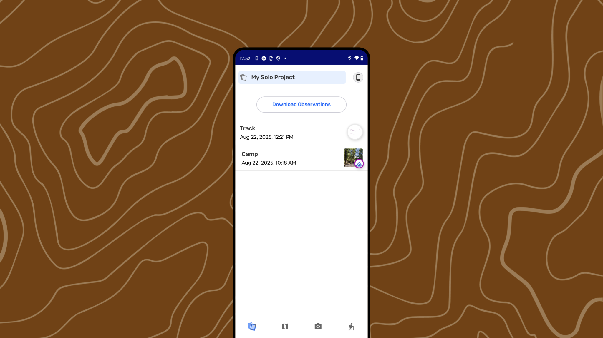
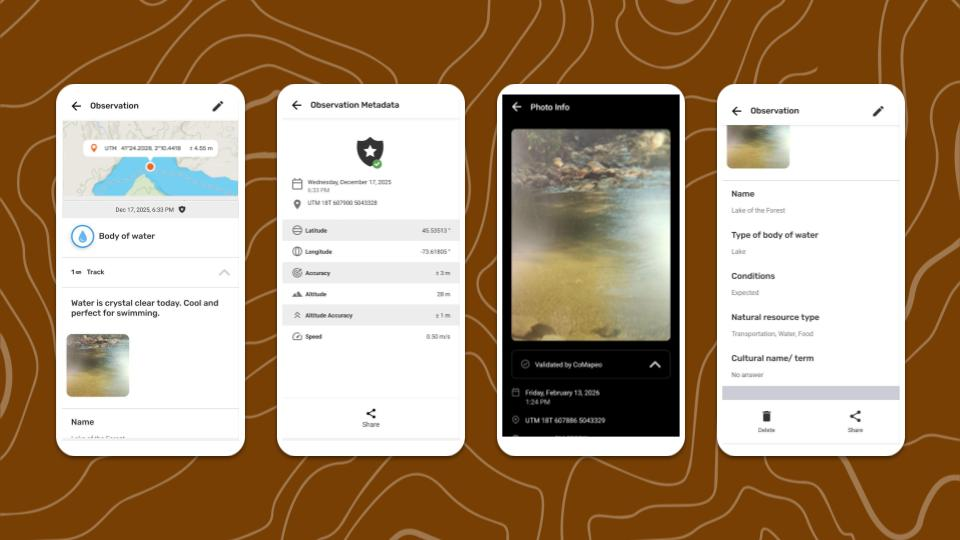
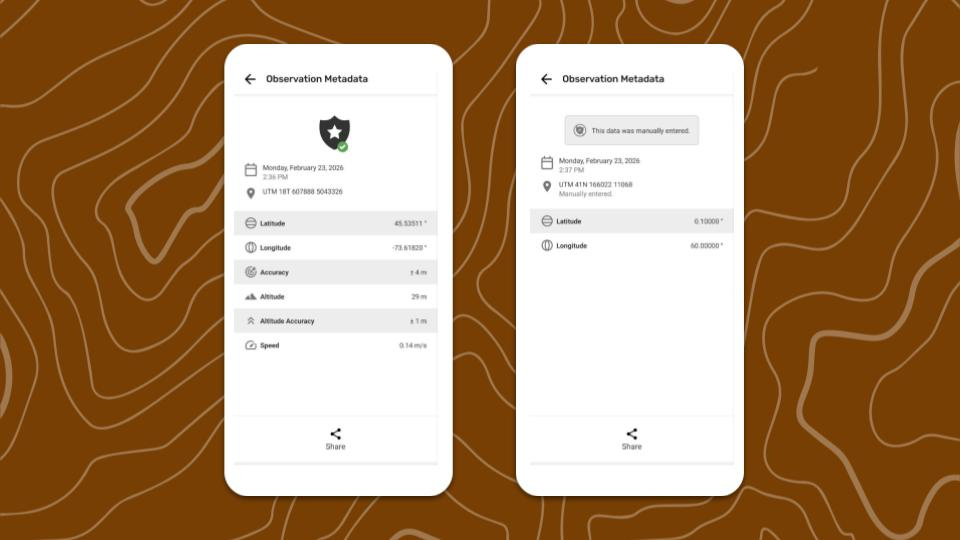
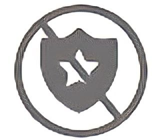
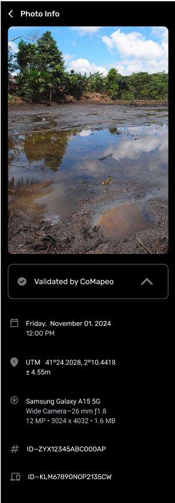
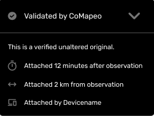
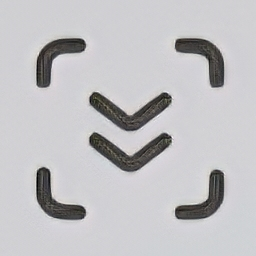
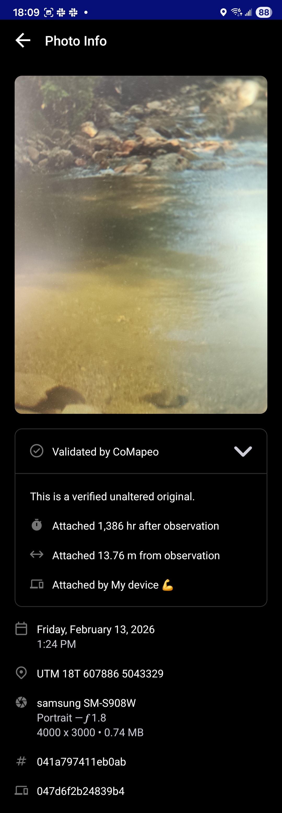
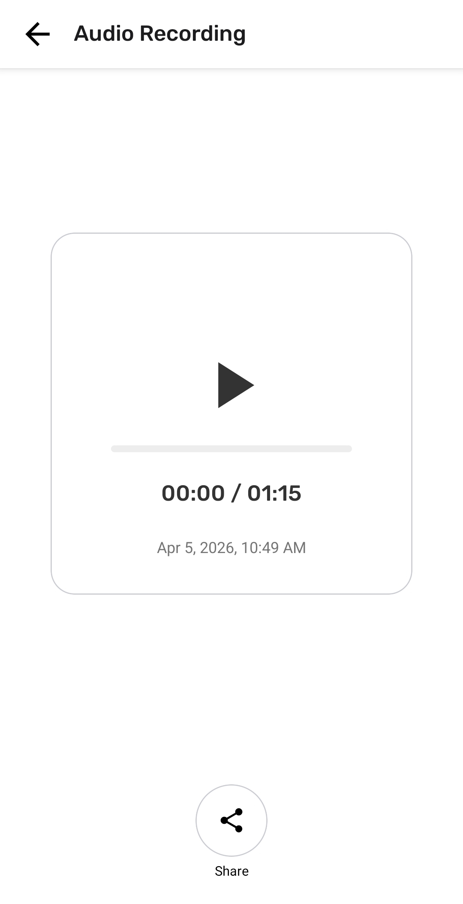
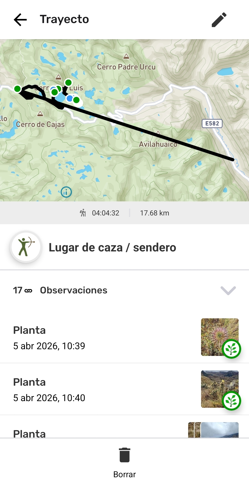

---

# **Reviewing Individual Observations & Tracks**

## Reviewing an Observation

An **Observation **is data attached to a category and associated with a single set of coordinates, representing a point on a map. It can contain a diverse selection of information to help tell a story or serve as evidence. Observations are collected on CoMapeo and serve as the main data sources, alongside tracks.

:::note 💡 Tip
An observation can be opened for review by selecting it from the  Map or from the Observation list.
:::

### Why review an observation?

Review an observation to see all the information that was saved with it. Reviewing can help confirm details, check evidence, and ensure the data is complete and accurate.

### What information is within an Observation?

> [!NOTE]
> Unsupported Notion block: `heading_4`

This information comes from device sensors, device settings, and application usage, and can not be modified.

 **Coordinates and accuracy
**The observation location is displayed on a map preview. This is often the most important detail to include when talking about or sharing an observation, especially with authorities and GIS specialists.

**Date and Timestamp
**This information comes from the device’s system settings, at the time the observation was collected. 

**Observation Metadata
**This is metadata associated with the recorded coordinates. When the GPS is on, this metadata is captured directly from the sensors, and adds technical information that may be of interest for anyone doing forensic analysis of an observation.** **There is a dedicated screen to display this information.

**Corresponding track
**If the Observation was collected while a track was being recorded, the track label will also appear.

> [!NOTE]
> Unsupported Notion block: `heading_4`

**Category
**Category name and icon display together

**Description
**Notes added to the text area

**Details
**Answers from the **Details** form (if completed) which includes text fields or structured questions associated with the chosen category.

:::note 💡 Tip
Confirm that the information added correctly describes what was observed. If anything needs to be revised or clarified, it can be edited.
Go to 🔗 [Editing Observations & Tracks → Edit an Observation](/docs/editing-observations-and-tracks/#Edit-an-observation)**  **
:::

### Media

If photos or audio are added to an observation, they are automatically attached to it.

**Photo thumbnails and Previews
**All thumbnails of photos taken will display on a horizontal carousel. 

**Photo metadata
**A screen that displays metadata associated with a photo taken with CoMapeo. 

**Audio thumbnails and playback
**An audio thumbnail will display for every recording. Audio files can be played back or shared from CoMapeo Mobile, and downloaded from CoMapeo Desktop.

## Data Validation in CoMapeo

Being able to rely on data, where it came from, and that it has not been tampered with is important in order to build trust in the tools and data collection methodologies. It can also be critical if data is to be admitted within legal cases, in which case evidence must be traceable and verifiable, meaning you should be able to confirm how, when and where the data was collected.

An observation that is **validated by CoMapeo **has GPS coordinates and photos recorded using CoMapeo used as a means to strengthen its proof of evidence. For this CoMapeo requires permissions related to locating your device, and using the camera on the device.  Without both these permissions, CoMapeo is still able to gather data through manual entry options, but they marked as **unvalidated observations**, as CoMapeo can not guarantee that these were entered correctly.

**Observation Metadata** displayed in CoMapeo will always include Date and time, GPS coordinates, Latitude & Longitude

 **Validated** metadata will also display Accuracy, Altitude, Altitude accuracy, Speed.

 **Un-validated **metadata will display, *“This data was manually entered”*, to ensure it is clear that the coordinates come from manual entry, and not the automatic and verifiable GPS of the phone. 

:::note 👉🏽 More
If manual entry of coordinates was used when saving, most of the GPS metadata will not be available and there will be an indication that the observation is not validated
:::

:::note 👉🏽 Tip
To share the Observation Metadata with someone assisting your team use  **Share.  **Select between Email and WhatsApp to open a formatted draft message, ready to send.
:::

**Photo metadata** is information captured by a smartphone and is specific to each photo taken. It is displayed underneath the photo.

 If there is doubt about the validity of a photo in an observation, the photo metadata can be included in evidence. This metadata includes:

- Date and timestamp

- GPS coordinates of the photograph

- Device metadata: device type, camera details including aperture, and photo size

- Observation ID

- Device ID

Open **Validated by CoMapeo** to view additional details that establish how near, in time and distance, the photo was taken from the moment the observation was saved. 

:::note 💡 Tip
To capture all available information in one image, use the option,   scroll down, which temporarily appears after taking a screen capture.

:::

## Reviewing Audio

Audio recordings can be reviewed in CoMapeo Mobile by selecting the thumbnail and pressing _12.57.02_p.m..png) **Play.**

## Reviewing a Track

Review a **Track** to see the information that was saved with it. Tracks appear chronologically along with observations in the **Observation List** with a category icon.  They can also contain additional notes, and associations with Observations that are collected between the start and end point.

:::note 💡 Tip
You can open a Track for review by selecting it from the  Map or from the  Observation list.
:::

### What Information is within a Track?

> [!NOTE]
> Unsupported Notion block: `heading_4`

This information comes from device sensors, device settings, and application usage, and can not be modified.

**Polyline
**The combination of connected line segments that form a dynamically recorded line on a Map as recorded by the device sensors during a specific timeframe. In mapmaking, Polylines are commonly used to draw linear features on a map like paths, boundaries or rivers. 

**Date and Timestamp
**This information comes from the device’s system settings, at the time the Track is saved. 

**Corresponding observations
**Any Observation collected while a Track is being recorded will also appear under a dropdown list on the track screen. The view of corresponding Observations is very useful for understanding what happened over the course of a trip.  

> [!NOTE]
> Unsupported Notion block: `heading_4`

**Category
**Category name and icon display together

**Description
**Notes added to the text area to give context about the why the track is important or the intended use of the information. 

:::note 👉🏽 More
The only way to view the track description on mobile is in the  Edit screen.
Go to 🔗 [Editing Observations & Tracks → Edit a Track](/docs/editing-observations-and-tracks/#Edit-a-track)**  **
:::

## More Actions available

 Editing an Observation or Track

 Delete an Observation or Track

 Share an observation

## Related Content

Go to 🔗 [Editing Observations & Tracks](/docs/editing-observations-and-tracks)** **

Go to 🔗 [Deleting Observations & Tracks]([Deleting%20Observations%20&%20Tracks](/docs/editing-observations-and-tracks)%20%20/docs/deleting-observations-and-tracks)** **

Go to 🔗 [Sharing a Single Observation and Metadata](/docs/sharing-a-single-observation-and-metadata)** **

Go to 🔗 [Troubleshooting: Observations & Tracks](/docs/troubleshooting-observations-and-tracks)** **

Go to 🔗 [Solution: Check app permissions](/26a1b08162d58074948dd100af9095aa)** **

### **Having problems? **

Go to 🔗 [Troubleshooting: Observations & Tracks](/docs/troubleshooting-observations-and-tracks)** **

