For CoMapeo Mobile v8

# Creating a New Track

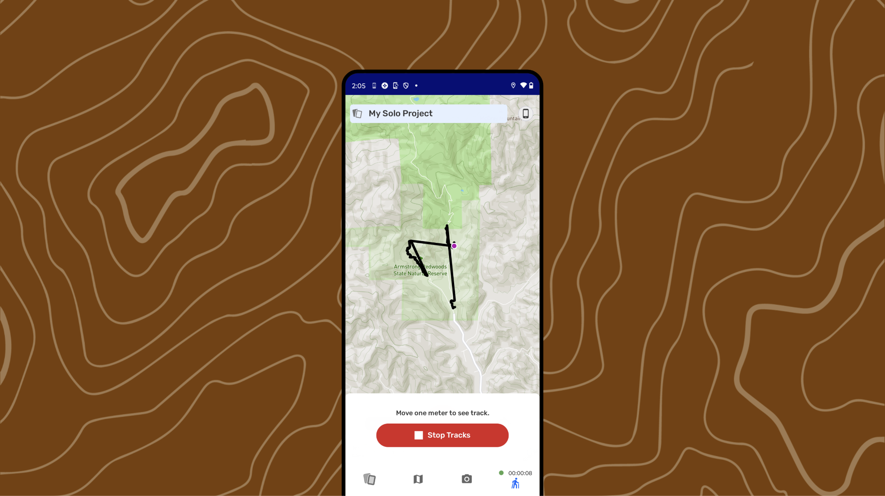

## What is a Track?

A **Track** records your movement on the map as a line. Tracks are useful for documenting patrols, trails, monitoring routes, or any path you want to save and review later. Tracks let you record paths or boundaries while moving through the landscape. They are useful for mapping trails, rivers, borders, or patrol routes.

Similarly to observations, tracks are associated with the project they are created in.

## What is expected when creating a track?

CoMapeo records this with device permission to access location information **all the time. **

While recording at track additional information is displayed

- Track in progress is indicated buy a blue dashed line on the map.

- Recording indicator with elapsed time and distance label attached to your position on the map.

- Recording indicator with elapsed time is added to the tracks tab.

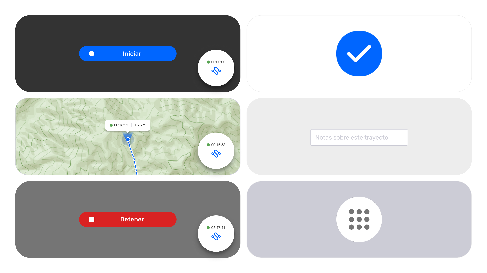

---

:::note 👣
### Step by step

***Step 1:*** Open the Tracks tab

:::note 👉🏽 More
The first time this feature is used, Android will request a change of location permission to use the feature. The app may ask for GPS permission.
Go to 🔗 [Common Solutions - Device permission for CoMapeo Mobile](/docs/common-solutions/#solution-check-app-permissions)** **to learn more**.**
:::

---

***Step 2:*** Tap **Start Track** to begin recording your path.

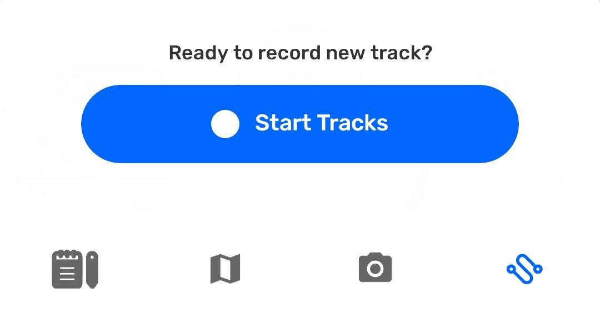

---

***Step 3:*** As you move, CoMapeo will draw a line on the map along the way. 
The track will continue to be recorded while you use other features simultaneously on CoMapeo, use other apps, and even blocking screen to conserve battery.

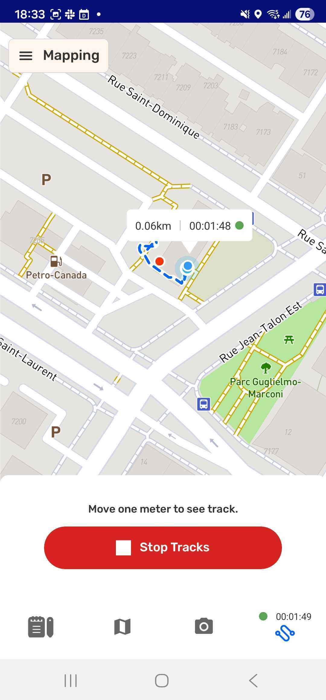

:::note 💡 Tip
Use the tab on the bottom to navigate between tools to create or review observations while recording a track.
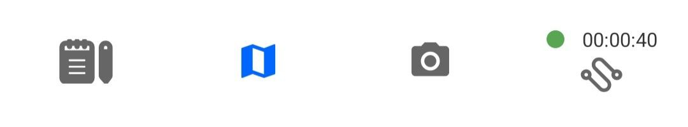

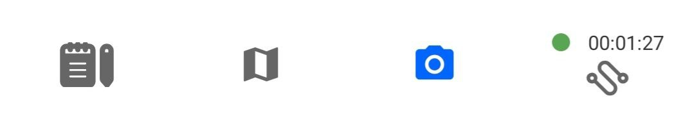

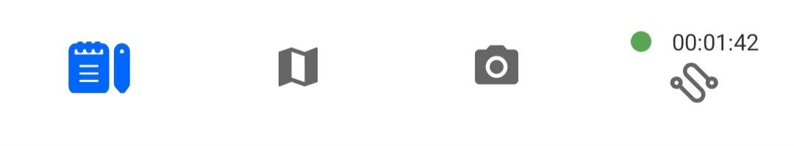
:::

---

:::note 👉🏽 More
All observations collected while a track is being recorded will be linked to the track for easy identification when reviewing .
:::

---

***Step 4:*** When complete, reopen the 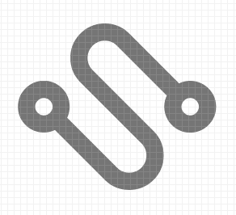Tracks tab and tap 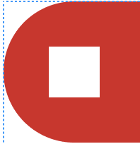 **Stop Track**. 

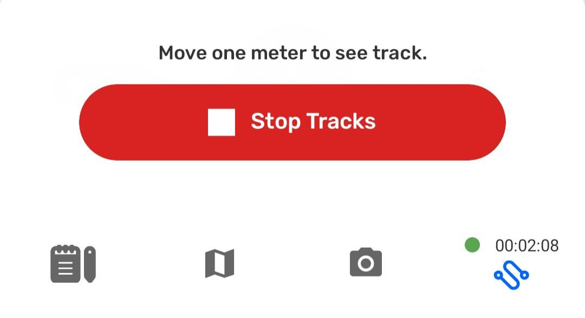

---

***Step 5:*** Select a the category that best describes the what the track represents ** 
**🔗 Go to [CoMapeo Categories → Categories for Tracks ](/docs/comapeo-categories#categories-for-tracks) to learn more

***Step 6:*** Add a helpful description and  **Save**

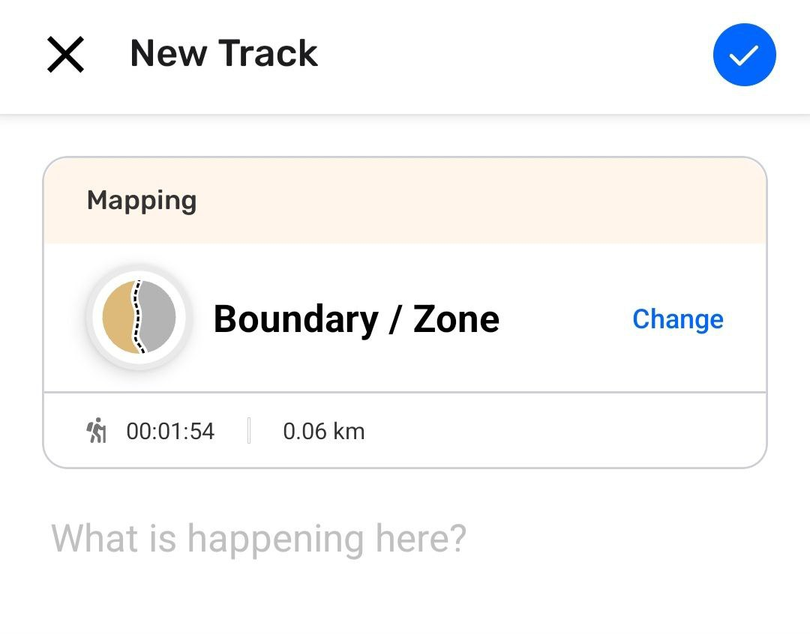
:::

---

## Interrupting a Track

The expected way to finish recording a track is by selecting  Stop and  Save. However, there are two situations which will trigger an interruption to recording a track.  

- Accepting a Project Invite while track recording is active
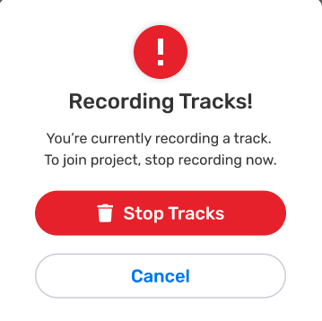

- Changing projects while track recording is active
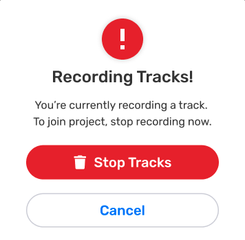

In both cases there is a prompt to with two options

 **Cancel **to stay on the project where the track is being recorded, ignoring the interruption.  

  **Stop tracks** without saving to proceed with changing projects or accepting an invitation.

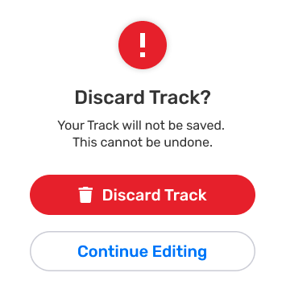

---

## Related Content

Go to 🔗 [Exploring the Observation List ](/docs/exploring-the-observations-list)   

## **Having problems?**

🔗 Go to [Troubleshooting: Observations & Tracks](/docs/troubleshooting-observations-and-tracks)** **

