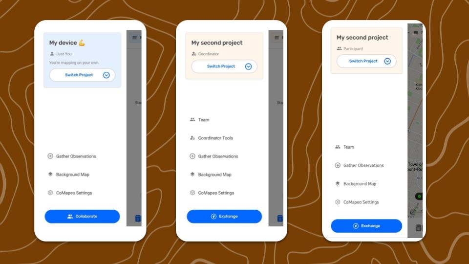
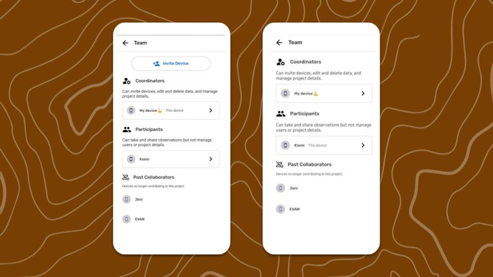

---

## ¿Qué es “Mapea por tu cuenta”?

Cuando se instala CoMapeo por primera vez en un dispositivo nuevo, se configura para empezar a recopilar datos en un proyecto del que es el único miembro, sin colaborar con ningún otro dispositivo ni equipo. Esto puede resultar ideal para personas que trabajan de forma independiente y no necesitan categorías personalizadas. 

:::note 👉🏾 Nota
Para modificar los conjuntos de categorías se necesitan las  Herramientas de Coordinador, que se activan luego de que se configura el proyecto. No es necesario invitar dispositivos para que un proyecto tenga conjuntos de categorías personalizados.
Ve a 🔗 [Modificar conjuntos de categorías](/docs/cambia-el-conjunto-de-categorías)** **para seguir los pasos necesarios
:::

En algunos casos, es posible que se quiera hacer una copia de seguridad y consultar la información que se recopiló en una computadora. Para ello, instala CoMapeo Desktop en el ordenador e invítalo al mismo proyecto. Este proceso funciona igual que cuando se invita a un dispositivo móvil diferente a un proyecto: en ambos casos, el dispositivo original debe invitarlos a colaborar.

## Recopilación de datos en equipo y en un proyecto

Una de las fortalezas de CoMapeo es que permite a los usuarios no solo recopilar datos por su cuenta, sino también colaborar con otros como parte de un equipo. Para ello, los usuarios crean nuevos proyectos, de los que se convierten en Coordinadores. Luego, pueden invitar a otros miembros como Coordinadores o Participantes. Estos dos roles tienen permisos diferentes, que se describen a continuación. Todos los usuarios de un mismo proyecto pueden intercambiar datos entre ellos y tendrán acceso al mismo conjunto de categorías para recopilar datos. También pueden intercambiar datos con un archivo remoto, si se ha configurado.

**¿Qué es un equipo en CoMapeo?**

Un  **Equipo** contiene la lista de dispositivos que incluidos en un proyecto y los roles que se asignaron a cada uno de ellos. Los equipos pueden estar formado por dos o más dispositivos. 
Cada dispositivo del proyecto puede ver la información del equipo y saber qué otros dispositivos forman parte del mismo. Cada dispositivo puede ver todas las observaciones y trayectos que se intercambiaron.

## Roles disponibles en CoMapeo

Los  **Participantes** pueden crear   Observaciones, registrar  Trayectos y  **editar** sus propias observaciones, así como distribuir información mediante el  **Intercambio** o  **Compartir** o **Descargar observaciones.**

Los ** Coordinadores** pueden hacer todo lo anterior. Adicionalmente, pueden editar las observaciones recopiladas por otros usuarios y utilizar las  **herramientas de coordinador** :app-icon-comapeo-coordinator:, que incluyen invitar a colaboradores, añadir categorías personalizadas y habilitar funciones como el Archivo remoto.

El coordinador que invita a los dispositivos asigna los roles durante el proceso de invitación. Los roles se muestran en el menú y son visibles para todos los miembros del proyecto en la pantalla del equipo.

:::note 👉🏾 Nota
Si asignaste un rol incorrecto, cancela la invitación en es posible. Si la invitación ya ha sido aceptada, sigue los pasos para eliminar el dispositivo. Luego, repite el proceso de invitación del dispositivo, asegurándote de seleccionar el rol correcto.
Consulta 🔗 [Eliminar un dispositivo de un proyecto](/docs/eliminar-un-dispositivo-de-un-proyecto)
:::

### Permisos de los roles en detalle

| Tema | Acciones del usuario | Coordinador | Participante |
| --- | --- | --- | --- |
| Colaboración | Crea un nuevo proyecto | ✔️ | ✔️ |
| Colaboración | Invita un dispositivo a un proyecto | ✔️ | ❌ |
| Colaboración | Asigna un rol a un dispositivo antes de enviar la invitación | ✔️ | ❌ |
| Colaboración | Después de enviar la invitación, edita los roles de los usuarios (cambia de participante a coordinador, o viceversa) | ❌ | ❌ |
| Colaboración | Deja un proyecto | ✔️ | ✔️ |
| Colaboración | Elimina a un usuario del proyecto | ✔️ | ❌ |
| Colaboración | Ve la lista de dispositivos de un proyecto | ✔️ | ✔️ |
| Colaboración | Cambia el nombre del proyecto | ✔️ | ❌ |
| Colaboración | Elimina un proyecto | ❌ | ❌ |
| Colaboración | Intercambia | ✔️ | ✔️ |
| Crear Observaciones y Trayectos | Recopila observaciones (solo en móviles) | ✔️ | ✔️ |
| Crear Observaciones y Trayectos | Graba trayectos (solo para móviles) | ✔️ | ✔️ |
| Revisar los datos recopilados | Revisa sus observaciones y trayectos | ✔️ | ✔️ |
| Revisar los datos recopilados | Revisa las observaciones y los trayectos de los demás | ✔️ | ✔️ |
| Revisar los datos recopilados | Edita sus  observaciones y trayectos | ✔️ | ✔️ |
| Editar los datos recopilados | Edita las observaciones y los trayectos de otros usuarios | ✔️ | ❌ |
| Editar los datos recopilados | Añade archivos multimedia (fotos y audio) a una observación guardada (solo con acceso de edición) (solo en móviles) | ✔️ | ✔️ |
| Editar los datos recopilados | Eliminar observaciones y trayectos propios | ✔️ | ✔️ |
| Editar los datos recopilados | Elimina archivos multimedia (fotos y audio) de una observación guardada | ❌ | ❌ |
| Editar los datos recopilados | Eliminar las observaciones y los trayectos de otros usuarios | ✔️ | ❌ |
| Personalizar la experiencia de CoMapeo | Configuración de CoMapeo (idioma, sistema de coordenadas, opciones de seguridad) | ✔️ | ✔️ |
| Personalizar la experiencia de CoMapeo | Modifica el conjunto de categorías de un proyecto (vía herramientas del coordinador) | ✔️ | ❌ |
| Personalizar la experiencia de CoMapeo | Sube mapa de fondo | ✔️ | ✔️ |
| Personalizar la experiencia de CoMapeo | Elimina el mapa de fondo | ✔️ | ✔️ |
| Personalizar la experiencia de CoMapeo | Comparte mapa de fondo | ✔️ | ✔️ |
| Personalizar la experiencia de CoMapeo | Recibe mapa de fondo compartido | ✔️ | ✔️ |
| Personalizar la experiencia de CoMapeo | Actualizar el mapa sin conexión a internet | ✔️ | ✔️ |
| Resultado |  Comparte - Observación individual | ✔️ | ✔️ |
| Resultado |  Comparte - Metadatos de la Observación | ✔️ | ✔️ |
| Resultado |  Comparte - Metadatos de la foto | ❌ | ❌ |
| Resultado | Descarga observaciones y trayectos (GeoJSON, ZIP con archivos multimedia) | ✔️ | ✔️ |
| Seguridad y privacidad | Opciones de recopilación de información de diagnóstico | ✔️ | ✔️ |
| Seguridad y privacidad | Opciones de recopilación de datos de uso de la aplicación | ✔️ | ✔️ |
| Seguridad y privacidad | Contraseña segura (solo para móviles) | ✔️ | ✔️ |
| Seguridad y privacidad | Contraseña oculta (solo para móviles) | ✔️ | ✔️ |

## Contenido relacionado

Ir a 🔗** **[Crea un Nuevo Proyecto](/docs/crea-un-nuevo-proyecto)

Ir a 🔗 [Invita Colaboradores](/docs/invita-colaboradores) para obtener instrucciones

Ir a 🔗 [Entiende cómo funciona el Intercambio](/docs/entiende-como-funciona-el-intercambio) para una explicación más detallada

### ¿Tienes problemas?

Ir a 🔗 [Solución de Problemas: Mapeo con Colaboradores](/docs/solucion-de-problemas-mapeo-con-colaboradores)

---

