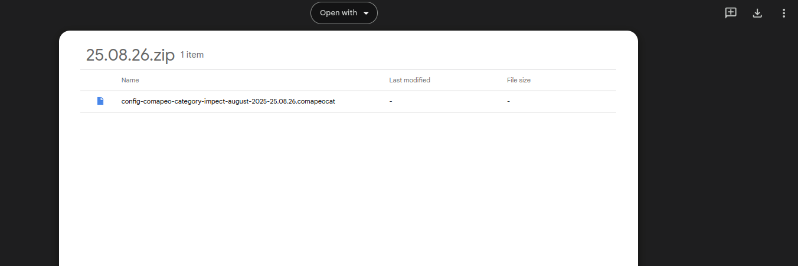
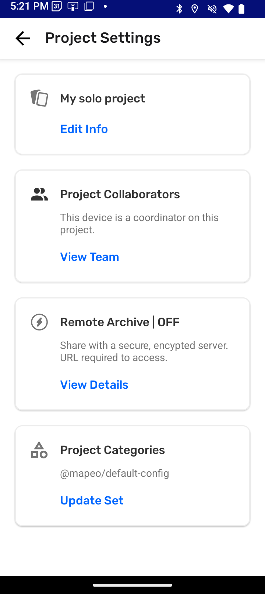
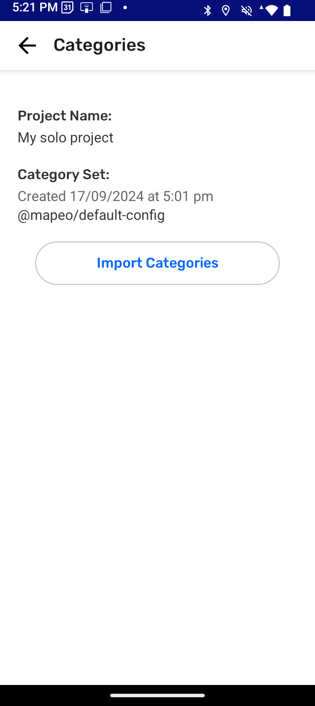

## What is required for changing a categories set 

✔️ Customized categories set file: .comapeocat.

✔️  The  Coordinator tools are visible.

✔️  The device has a  Coordinator role.

### Accessing Coordinator tools

When mapping on your own, coordinator tools are revealed after follow steps to **start a new project**. 

Go to 🔗 [Creating a New Project](/docs/creating-a-new-project)** **

### Loading a new categories set file 

The file type **.comapeocat** is proprietary to CoMapeo. It cannot be opened by any other app not can be opened by Android. Use CoMapeo to load the category set file to a selected project. This ability is limited to those who are coordinators of projects.

:::note 👣
### **Step by Step: Mobile**

***Step 1: ***Look for the file in your downloads folder and transfer it to the Mobile phone you are using CoMapeo on. You can use an email, Google Drive, WhatsApp or the tool that works best for you to get files to your phone.

***Step 2: ***Open  CoMapeo and, in the main menu, **select the project** where the new category set in needed.

***Step 3: ****Open**** Coordinator Tools. ***

:::note ⚠️ Warning
This is not visible to Participants of a project
:::

***Step ******4: ****Select* **Project Categories**. 

***Step 5******:****** ****Tap* **Import Categories** to open the file picker of your operating system

***Step 6: ***Find the category set file (.comapeocat) and select it. CoMapeo will attempt import the file selected. If successful, information on the Categories screen will be updated 

---
:::

:::note 💡 Tip
Category sets are included in project data. Category sets are shared with with new teammates after invitation to projects are complete. They are also included when doing Exchange with teammates to help keep projects up do date
Go to 🔗 [Understanding How Exchange Works](/docs/understanding-how-exchange-works) for full explanation 
:::

---

## Reviewing a Category Set

To review CoMapeo’s included Category Set within the app itself follow steps for [creating an observation](/docs/creating-a-new-observation), [adding details](/docs/creating-a-new-observation#adding-details) and delete the observations saved as part of the exploration. 

If this is the first time setting up a project and changing the categories set, it is likely your next step will be inviting collaborators  to gather data as a team. 

Go to 🔗 [Inviting Collaborators](/docs/inviting-collaborators) for instructions 

## Relevant Content

Go to 🔗 [Creating a Custom Categories Set](/docs/creating-a-custom-categories-set)** **

Go to 🔗 [Welcome to CoMapeo Categories Library](https://www.earthdefenderstoolkit.com/welcome-to-the-comapeo-categories-library/)** **blogpost by María Alvarez

---

### Having trouble?

Go to 🔗 [Troubleshooting → changing categories set](/docs/troubleshooting-mapping-with-collaborators#project-setting-problems)** **

