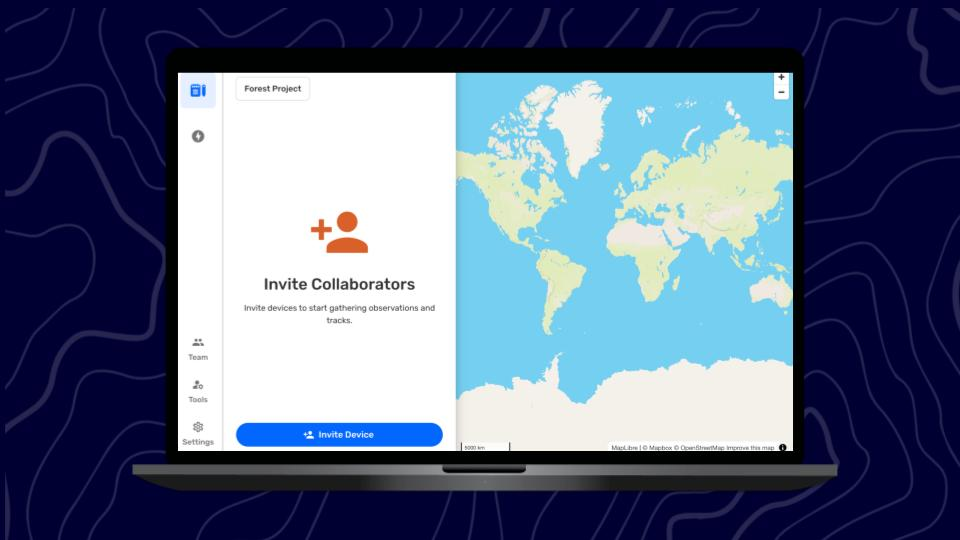
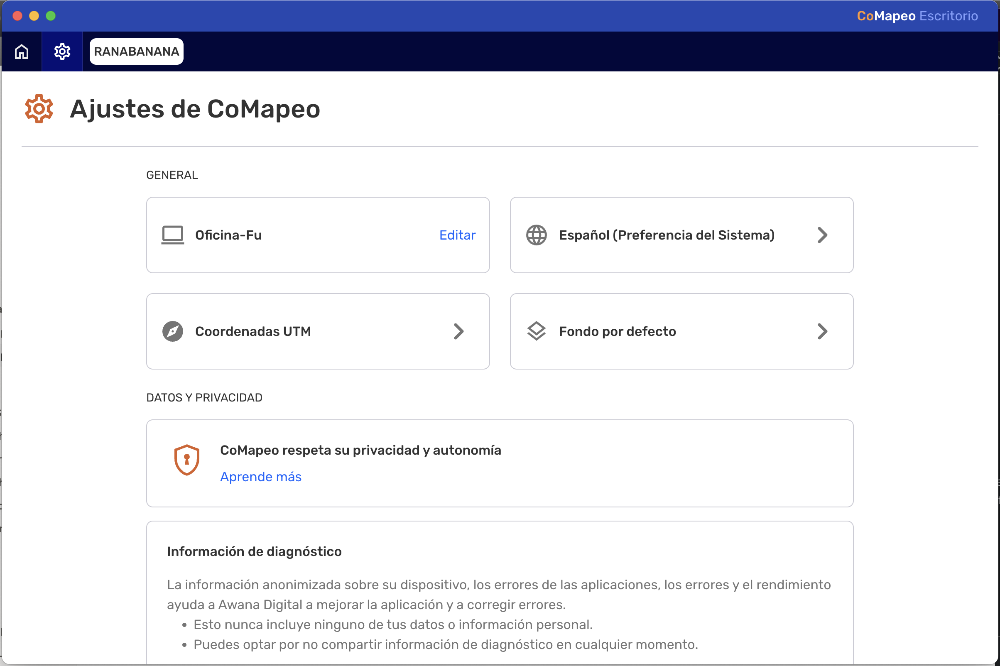

## **CoMapeo Mobile at First Glance**

The primary view of CoMapeo is the  Map view with access to mapping features and the main menu. This is serves as the home screen when restarting CoMapeo onboarding is complete. 

The map controls include recenter,  slide-to-pan, and pinch-to-zoom with a dynamic scale. Real time GPS sensor information can be viewed in  GPS Details.

### Features to Explore First

✔️  Map screen

✔️  Camera screen (Mobile only)

✔️  Main Menu

✔️  CoMapeo Settings

### Features and Resources to Explore Next

✔️ Go to 🔗 [Creating a New Observation](/docs/creating-a-new-observation) 

✔️ Go to 🔗 [Exploring the Observations List ](/docs/exploring-the-observations-list)

✔️ Go to 🔗 [Creating a New Track](/docs/creating-a-new-track)** **

✔️ Go to 🔗 [Planning & Preparing for a Project](/docs/planning-and-preparing-for-a-project)

✔️ Go to 🔗 [Inviting Collaborators](/docs/inviting-collaborators) 

## **CoMapeo Desktop at First Glance**

The map controls include zoom in (+) and zoom out (-) buttons. Pan around the map by clicking and dragging mouse in any direction.  

### Features to Explore First

✔️  Map screen

✔️  Main Menu (on the left)

✔️  CoMapeo Settings

### Features and Resources to Explore Next

✔️ Go to 🔗 [Inviting Collaborators](/docs/inviting-collaborators) 

✔️ Go to 🔗 [Exploring the Observations List ](/docs/exploring-the-observations-list)

✔️ Go to 🔗 [Organizing Key Materials for Projects](/docs/organizing-key-materials-for-projects)**  **

## CoMapeo Settings

### ** Device Name**

The device is named as part of the onboarding process. Device names are displayed in CoMapeo collaboration features like inviting teammates to join a project and viewing teammates in a project. Device names cannot be changed by any other device.  The only way to change a device name for use in CoMapeo is to edit it from this menu option on that same device. 

### ** Language**

Language options available may include languages with anywhere between 1% and 100% translations. 

###  **Coordinate System**

Choose one of the following options:

:::note 💡 Tip
Select the  Coordinate System option that is used most commonly in your context.
:::

###  **Data & Privacy**

Choose to **opt in** or **opt out** of sharing diagnostic data.

:::note 👉🏽
Go to 🔗 [Adjusting Data Sharing & Privacy](/docs/adjusting-data-sharing-and-privacy) to learn more.
:::

###  **About CoMapeo**

View app version  number and more details that may help with diagnostics when accessing technical support from the CoMapeo Help team.

###  **Security**

Security tools to aid with physical security threats.

:::note 👉🏽
Go to 🔗 [Using an App Passcode for Security](/docs/using-an-app-passcode-for-security) to learn more.
:::

## Related Content

Go to 🔗 [Un](/docs/installing-comapeo--onboarding/)[install](/docs/installing-comapeo-and-onboarding/)[ing CoMapeo](/docs/installing-comapeo--onboarding/)** **

### Having Problems?

Go to 🔗 [Troubleshooting: Setup and Customization](/docs/troubleshooting-setup-and-customization)** **

