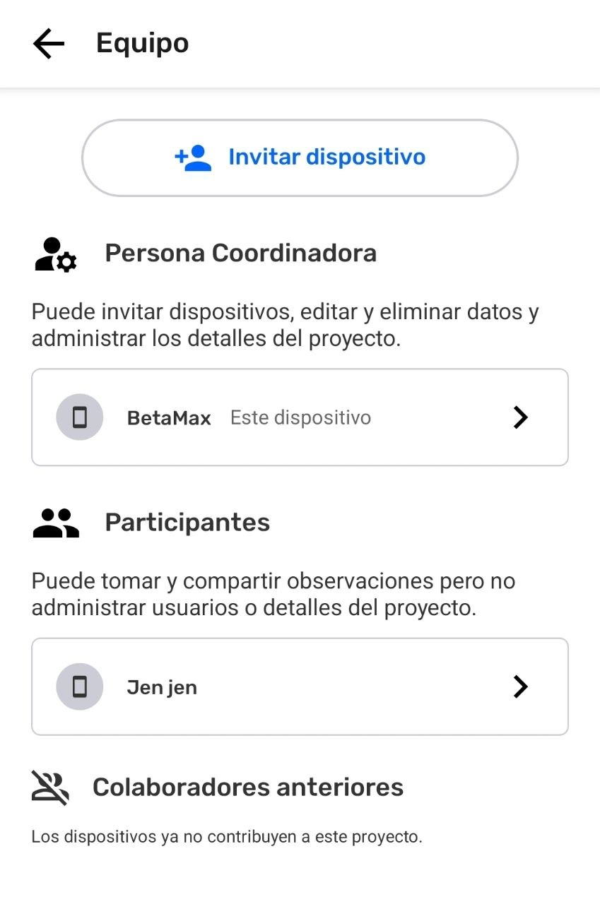
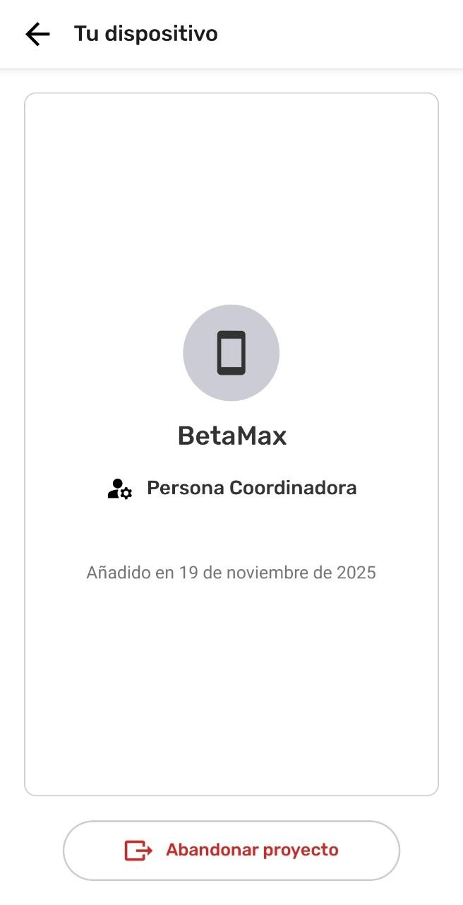
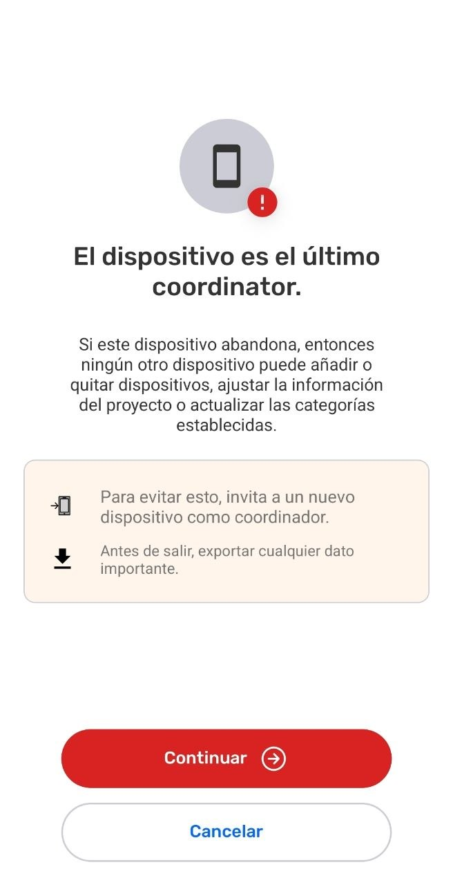
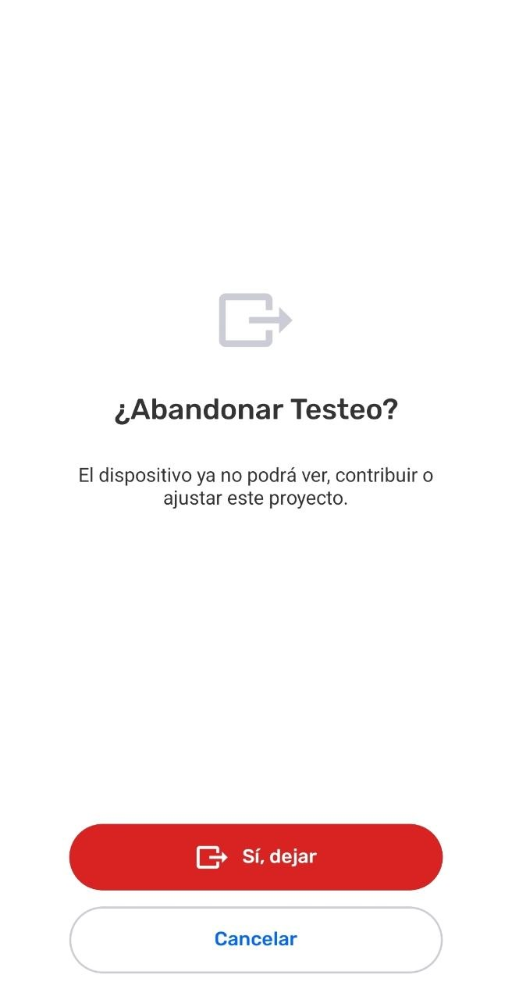
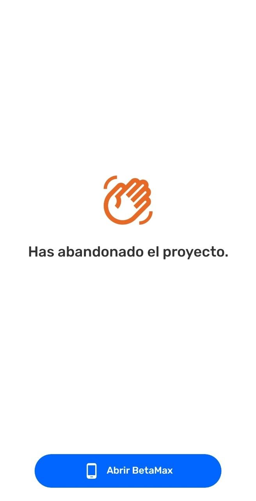
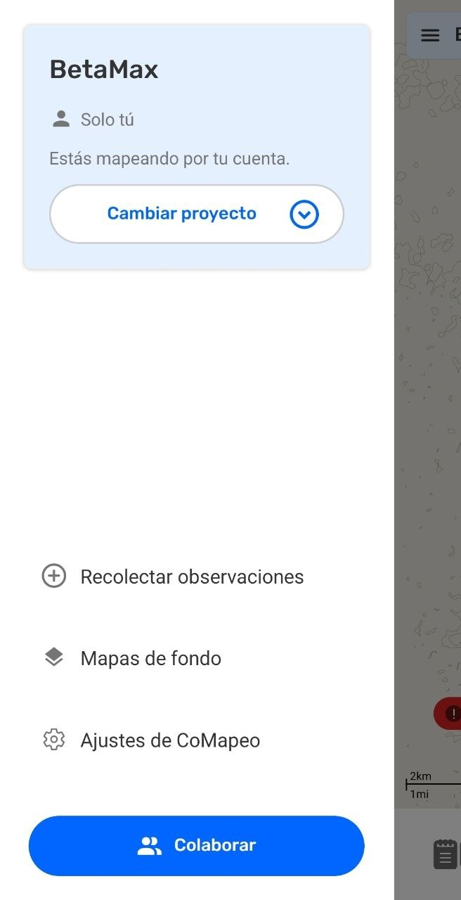
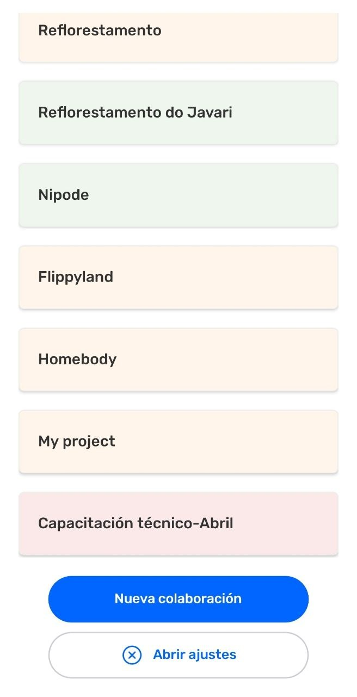

---

# Finalizar un Proyecto

## Acerca de finalizar proyectos en CoMapeo

En teoría es posible finalizar un proyecto sin conexión a internet, por las características de CoMapeo, pero quizá su ejecución sea imperfecta. Esto depende del equipo que utiliza CoMapeo y el contexto en el que trabajan.

Es importante notar que al finalizar un proyecto **no se elimina ninguna información recolectada por los dispositivos**. Al igual que ocurre con el intercambio de conocimientos entre las personas, la información de CoMapeo no se borra, pero se puede olvidar. 

Para finalizar un proyecto exitosamente, se requiere coordinar acciones entre el equipo. No es una sola tarea. Esto es porque CoMapeo usa una estructura descentralizada para almacenar e intercambiar información a través de cada dispositivo en un proyecto. La naturaleza de los sistemas descentralizados es que son notablemente resilientes porque cada dispositivo es una copia de seguridad. Finalizar un proyecto implica intentar desconectar todas las copias de seguridad entre sí.

:::note ⚠️ Advertencia
En un proyecto donde no hay archivo remoto y los compañeros de equipo no se están conectando al mismo router, no hay forma de confirmar al 100% que todos los dispositivos lo abandonaron o fueron eliminados.
:::

## Preparación para finalizar un Proyecto

Para finalizar un proyecto en CoMapeo, la mejor práctica es archivar todos los datos. Luego, todos los miembros del equipo, dispositivos listados dentro del  **Equipo, **abandonan el proyecto, siendo un coordinador el último en hacerlo.

### Planificar el archivo de datos

Es buena práctica que un proyecto termine con una base de datos archivada de forma adecuada.

- Intercambia con todos los dispositivos del equipo que sea posible, para asegurar que todos los datos estén actualizados antes de guardar tus archivos.
Ir a 🔗 [Intercambiando Observaciones](/categoria/intercambiando-observaciones) para aprender más

- Guarda un archivo de la información recolectada: expórtala y guárdala en otras ubicaciones.
Ir a 🔗 [*Exportando todas las Observaciones](/docs/exportando-todas-las-observaciones)* para aprender más.
:::note 💡 Consejo
Si el proyecto fue personalizado, guarda los archivos correspondientes en una carpeta junto con los datos descargados de CoMapeo. Esto puede incluir un archivo personalizado .comapeocat del  Conjunto de Categorías, un archivo personalizado smp. del  Mapa de Fondo, o notas de configuración del  :Archivo Remoto en formatos .txt, .doc, o .md
:::

- Decide si hay alguna posibilidad de que el proyecto de CoMapeo pueda ser usado nuevamente en el futuro.
  - Si la respuesta es afirmativa, mantenga uno o dos dispositivos coordinadores en el proyecto. Estos conservarán la configuración y los datos recolectados, permitiendo reactivar el proyecto e invitar a otros usuarios en el futuro. En la práctica, esto equivale a poner el proyecto en espera en lugar de finalizarlo.

### Limpiar dispositivos del Equipo

> [!NOTE]
> Unsupported Notion block: `heading_4`

Todos en el equipo, excepto un coordinador, dejan el proyecto.

Una vez que los participantes abandonen el proyecto, si se conectan a la misma red Wi-Fi que el coordinador, la lista del equipo se actualizará automáticamente para confirmar su salida.
Ir a 🔗 [Abandona un proyecto](/docs/abandona-un-proyecto) para aprender más.

### **Purgar el Equipo**

Un coordinador remueve todos los participantes y a otros coordinadores del proyecto.
Ir a 🔗 [Eliminar un dispositivo de un proyecto](/docs/eliminar-un-dispositivo-de-un-proyecto) para aprender más.

:::note ⚠️ Advertencia
Los dispositivos eliminados deben conectarse al mismo router Wi-Fi o tener configurado el Archivo Remoto para recibir la notificación de remoción. De lo contrario, permanecerán en el proyecto hasta que se conecten con otro dispositivo que ya tenga la información actualizada.
:::

:::note 💡 Consejo
Si el objetivo es que el único Coordinador deje el proyecto pero también se busca el proyecto como activo, se debe invitar a un dispositivo Coordinador diferente antes de que el último Coordinador abandone el proyecto.
:::

## **Abandonando un proyecto**

Cuando el último  **Coordinador ** **Abandona un Proyecto, **ese proyecto se queda sin Coordinador y sin liderazgo. Ese proyecto puede tener  **Participantes** que aún pueden  **Intercambiar,** pero no pueden acceder a las  **Herramientas de Coordinador** ni invitar ni remover otros dispositivos.

:::note 👣
### **Paso a Paso**

***Paso 1:*** En el **Menú**, selecciona  Equipo.

---

***Paso 2:*** Selecciona **Este dispositivo**. El dispositivo en uso debería ser el único listado como coordinador.

---

***Paso 3:*** Selecciona   **Abandonar** ** proyecto.**

---

***Paso 4:*** Revisa y considera las recomendaciones indicadas antes de seleccionar  **Continuar **

---

***Paso 5:*** Si estás preparado para abandonar el proyecto, selecciona  **Sí, dejar **

---

***Paso 6:*** Este dispositivo ha abandonado el proyecto. Comienza a **Mapear por tu cuenta** abriendo el proyecto con el **Nombre del Dispositivo **

---

***Paso 7:*** Para **Mapear por tu cuenta** crea al menos una observación. De lo contrario, selecciona  **Cambiar proyecto.**

:::note 👉🏾 Más
Al cambiar de proyecto sin añadir una observación en “Mapea por tu cuenta”, ésta no se guardará y no aparecerá en la lista de proyectos.
:::

---

***Paso 8:*** Abre el proyecto deseado 

:::

## Contenido Relacionado

Ir a 🔗 [Comprende las Bases Sobre Proyectos](/docs/comprende-las-bases-sobre-proyectos)

Ir a 🔗 [Abandona un proyecto](/docs/abandona-un-proyecto)

Ir a 🔗 [Eliminar un dispositivo de un proyecto](/docs/eliminar-un-dispositivo-de-un-proyecto)

### **¿Tienes problemas?**

Ir a 🔗 [Solución de Problemas: Mapeo con Colaboradores](/docs/solucion-de-problemas-mapeo-con-colaboradores)

---

