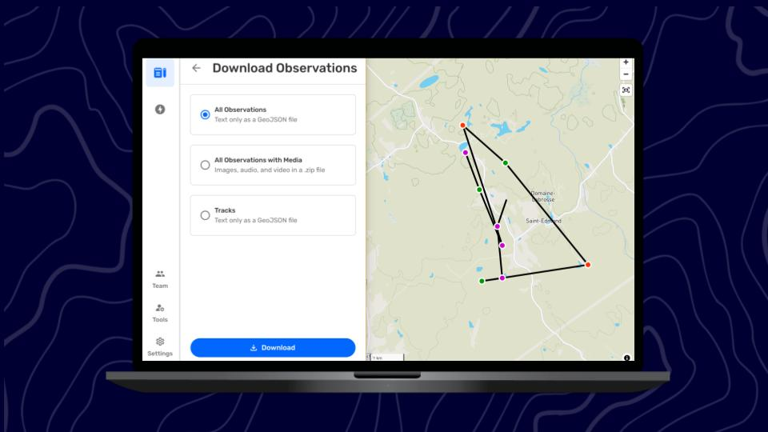

:::note 🚧 Work in progress
More content to be added
:::

## Related Content

Go to 🔗 [Using Observations outside of CoMapeo](/docs/using-observations-outside-of-comapeo)

Go to 🔗 [Sharing a Single Observation & Metadata](/docs/sharing-a-single-observation-and-metadata)

### Having Problems?

Go to 🔗 [Troubleshooting: Moving Observations & Tracks outside of CoMapeo](/docs/troubleshooting-moving-observations-and-tracks-outside-of-comapeo)

