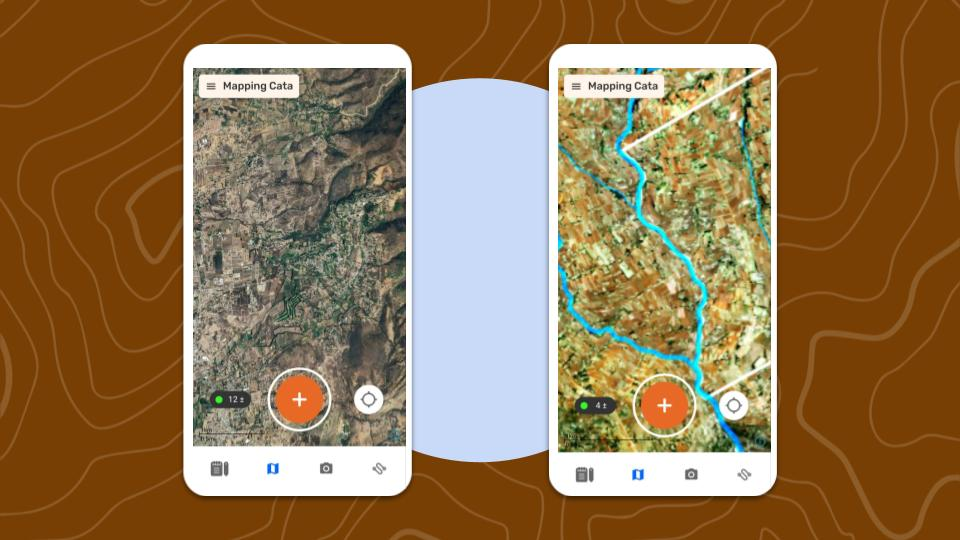
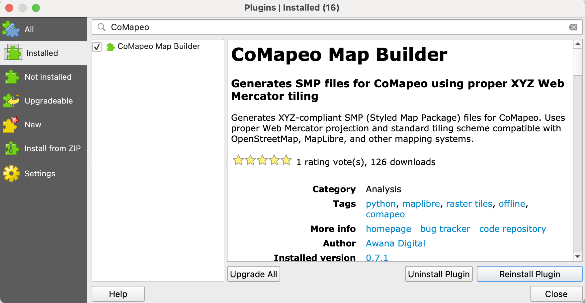
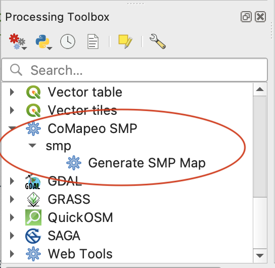
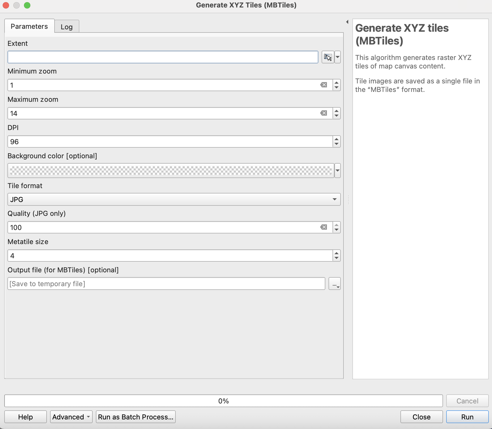
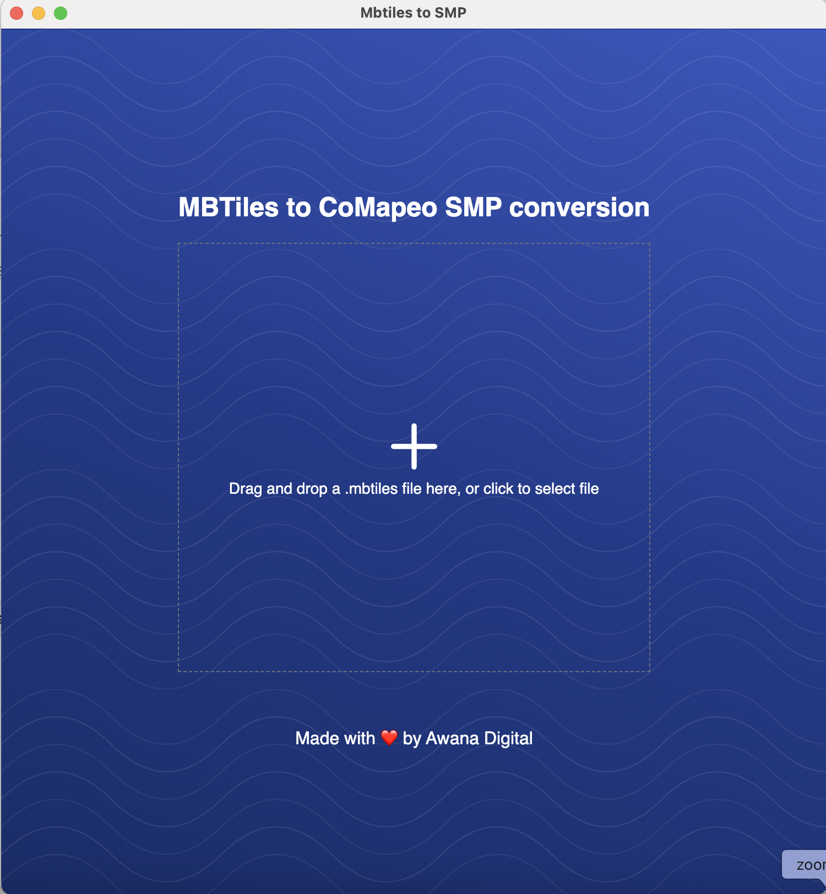
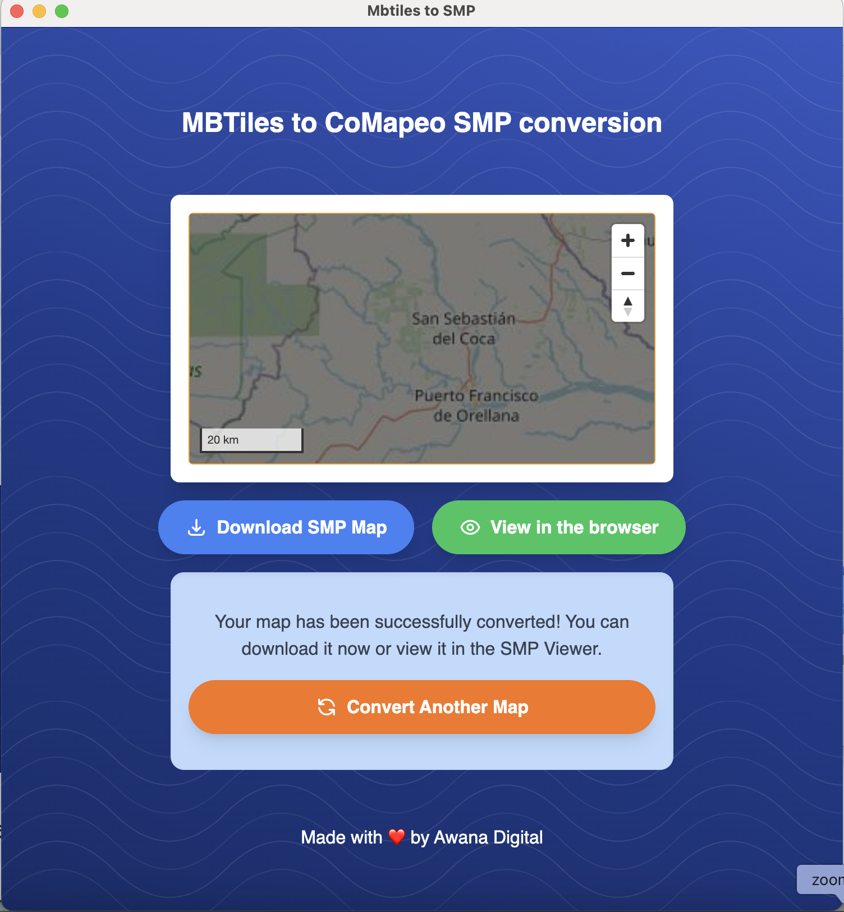

:::note 🚧 Work in progress
More Content will be added soon
:::

:::note 💥
**Delete buttons above and this callout**

This area is for content to be published
:::

# Building Custom Background Maps

## What is a Custom Background Map  

CoMapeo Mobile and Desktop have links to an online world map by default, provided by Mapbox and including Open Street Map data. However if users are going to be collecting data offline, or want to view particular geographical datasets and elements relevant to their project on their basemap as they collect data, it might make sense to build and import a custom map for their project.

Once added to a CoMapeo device, Custom Background Maps are available completely offline within the application.

## Format

CoMapeo uses a map file format called **.smp** which packages tiles with styling, projection and other project information, to render as a zoomable map within CoMapeo.

Below are described two ways of getting a map in .smp format. The first uses a plugin Awana Digital has built for QGIS, the second is a way of converting a map from an .mbtiles format to .smp. 

## Method 1: Plugin from QGIS

:::note 👣
**Step by Step**

***Step 1:***** ** Create and style the map in QGIS as you would like it to appear in CoMapeo.

---

***Step 2:***** **Search for and install within QGIS the plugin **CoMapeo Map Builder. **

[https://plugins.qgis.org/plugins/comapeo_smp/](https://plugins.qgis.org/plugins/comapeo_smp/)

---

***Step :***** **Use the plugin **CoMapeo Map Builder, **choosing it from the Processing Toolbox menu, to **Generate SMP Map** for using directly within CoMapeo.

---

:::

## Creating a Custom Background Map

## Method 2: Converting MBTiles to SMP format

### Part 1: Generate MBTiles

:::note 👣
**Step by Step (QGIS)**

***Step 1:***** ** Create and style the map in QGIS as you would like it to appear in CoMapeo.

---

***Step 2:***** **Export the map as xyz tiles (MBTiles), using the tool in the processor toolbox, or other methods as preferred. 

If you use the Generate XYZ Tiles process within QGIS, complete the fields  and run the process. 

---
:::

💡 **TIPS:**

- **Zoom level: **The higher the zoom level the better detail will appear on the offline map but this comes with an exponentially increasing file size, particularly if the area is large. Experiment a bit with this - try to zoom level 16, and if this isn’t too large a file, go higher. If the area is very large a lower zoom level might need to be used. Cutting out low zoom levels does not make much of a difference to size, as they do not use many tiles. 

- **DPI:** You may want to change this setting depending on the devices you have chosen to use for your project. DPI (dots per inch) refers to how many pixels are on your screen and affects how sharp things appear as well as how much can fit on the screen at once. Typically lower end android phones will be around 160dpi to 240 with more high end models around 320 maxing out around 480 at the top end.   The DPI on the specific device you have chosen can be accessed in developer tools where is says “minimum width”, or by downloading a specific app like DPI checker.  Generally, the higher the number you use, the larger and more clear icons and labels will appear on the phone’s screen.  

- **Metatile size:** If you use higher DPIs (anything higher than around 192) you may find icons and labels start to get weirdly cut off when viewing the maps tiles, this can often be fixed by changing the Metatile size from 4 to 8.

### Part 2 : Convert MBTiles to SMP

:::note 👣
**Step by Step**

***Step 1:***** **Download and Install the MBTILES-to-SMP GUI tool from Awana Digital github:

Go to 🔗 [https://github.com/digidem/mbtiles-smp-gui/releases/latest](https://github.com/digidem/mbtiles-smp-gui/releases)

---

***Step 2:***** **Open the MBTILES-to-SMP tool and drag and drop your .mbtiles file into MBTILES-to-SMP tool.
The conversion will start automatically.

---

***Step 3:***** The map has been converted to SMP for use in CoMapeo.
**Select  View in the browser to preview the map conversion, paying attention to styling at different zoom levels

:::note 👉🏽 Note
Any changes needed to the map must be done in the tool used to create the MBTiles
:::

---

***Step 4: ***Select**  ** **Download SMP Map** to save the map file. The file is ready to be imported to CoMapeo.
:::

## **Test out new Maptiles**

Import the SMP file into CoMapeo via the  **Background Map** screen in the **Menu**

:::note 👉🏽
Go to 🔗 [Changing Background Maps](/27d1b08162d58039a13ae5ba8ba87ce1)  for illustrated instructions.
:::

New maps should be checked within CoMapeo on both Desktop and Mobile to make sure that the formatting and parameters of the map appear as expected. It can be helpful to include a couple teammates to help catch any improvements needed. 

Maptiles are are not shared automatically between devices on a project, as Category Sets are. So the maptiles have to be uploaded to each device, and will be device wide (the same background map will appear across all projects on a device). 

Any revisions to the map must be made where the map was originally styled, likely QGIS, and then exported and converted again.

## Related Content

Go to 🔗 [Planning and Preparing for a Project](/docs/planning-and-preparing%20for-a-project) 

Go to 🔗 [Changing Background Maps](/docs/changing-background-maps)  

---

### Having Problems?

Go to 🔗 [Troubleshooting: Setup and Customization → Custom Categories Set Problems](/docs/troubleshooting-setup-and-customization/#custom-category-set-problems)** **

---

