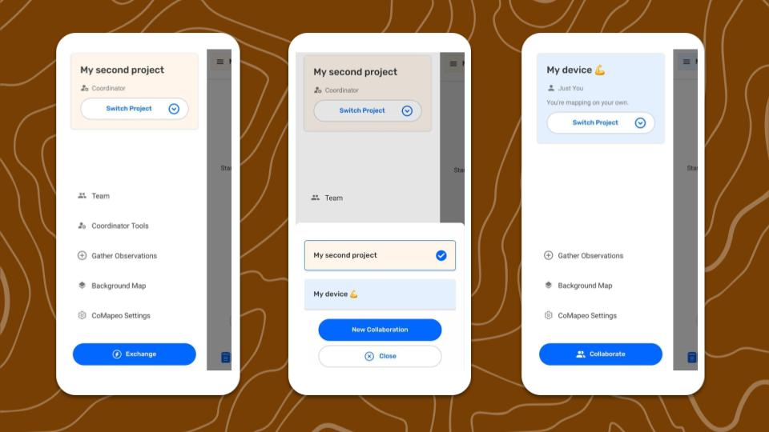

Projects are how you organize your mapping work. They can be used for solo mapping or for collaboration with a team.

When you first open CoMapeo, can begin collecting observations in your own project right away.  you can edit its name and description to help you stay organized.

## A project includes:

- **Project info**: Name, description and color

- **Team**: list of colaborators

- **Gathered information**: Tracks and observations with associated media and metadata.

- **Project settings:** As seen in Coordinator Tools; current category set, Remote archive settings etc.

## Personal vs Collaborative Projects

A personal Project is automatically set up in CoMapeo when you first onboard. The P**roject Name** is the set to match the **Device Name** initially**. **It can be changed any time.

Collaborative projects are ones were people work as a team using CoMapeo to share project data. Exchange is the feature that makes it possible to gather and share data as a team, even when offline

Go to 🔗 [Understanding How Exchange Works](/docs/understanding-how-exchange-works)**
**Go to 🔗 [Selecting Device Roles and Teams](/docs/selecting-device-roles-and-teams) to learn about making your project collaborative

## Multiple Projects

CoMapeo offers people the ability to work on multiple mapping and monitoring projects on a single device. This is useful for differentiating the type on information being gathered and working in different teams.

**Use CoMapeo securely with Multiple Projects.**

CoMapeo is engineered to keep data safe and organized, even when using a single device for more than one project

Data does not transfer between projects, and will not get mixed or modified if multiple projects are being used on any devices. 

:::note 👉🏽 More
Since v5 released in October 2025, CoMapeo supports **multiple projects **on the same device without losing data
:::

### Switching Projects

Data collection can only happen in one project at a time. 

:::note 👣
**Step By Step**

***Step 1: ***Open the  Main Menu

---

***Step 2: ***Select  **Switch project.**

---

***Step 3:*** Open the desired project
:::

## Related Content

Go to 🔗 [Planning and Preparing for a Project](/docs/planning-and-preparing-for-a-project)** **

Go to 🔗 [Selecting Device Roles and Teams](/docs/selecting-device-roles-and-teams)** **to learn about making your project collaborative 

Go to 🔗 [Creating a New Project](/docs/creating-a-new-project)** **

### Having Problems?

Go to 🔗 [Troubleshooting: Mapping with Collaborators](/docs/troubleshooting-mapping-with-collaborators)** **

