## About Common Solutions

This page offers quick solutions and additional details about why this tend to work. These solutions are not likely to get to the root of a problem nor prevent it from happening again, but are helpful to keep workflows moving forward. 

### 🟩 Solution: Close & **Restart CoMapeo**

Sometimes CoMapeo can misbehave after a long time being opened, this can happen for various reasons. For example, the phone is low on memory, or the application got into a weird state

**👣 Step by step instructions**

***Step 1:***** **Swipe up from the bottom while CoMapeo is selected, to see all the open applications on the phone
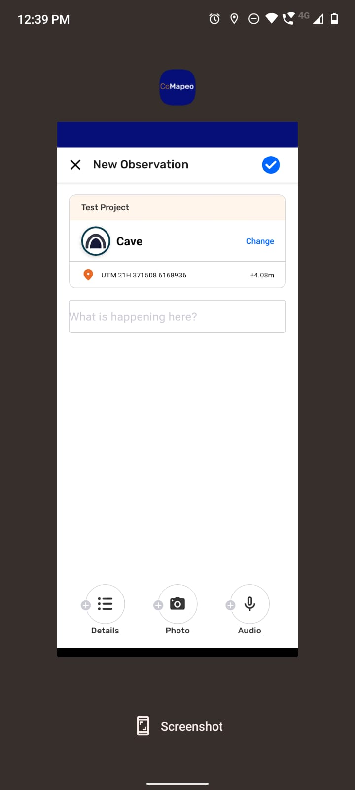
***Step 2:***** **Swipe up again centering your finger on **CoMapeo **to close it
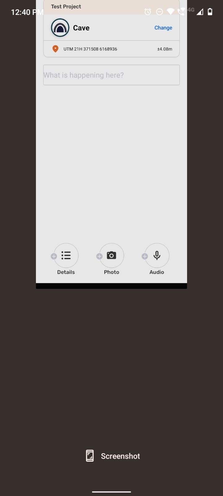
***Step 3: ***Go to the **CoMapeo** app icon in your main screen or apps screen menu and select **CoMapeo**
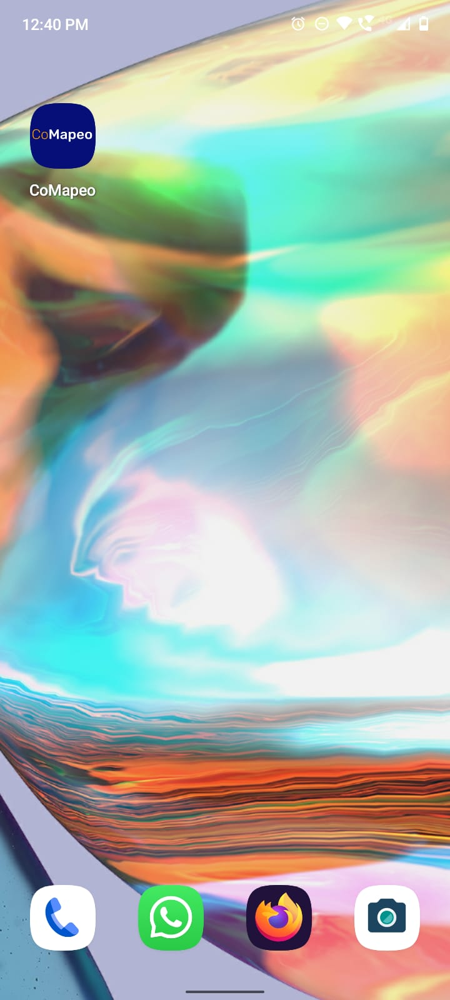

### 🟩 Solution: Make sure your device has enough free space available

There are different scenarios where not having enough space available in your device can create issues. For example, when creating a new observation, or when exchanging collected data with collaborators. 

**👣 Step by step instructions**

***Step 1:***** **Go to the Android Configuration screen (⚙️)
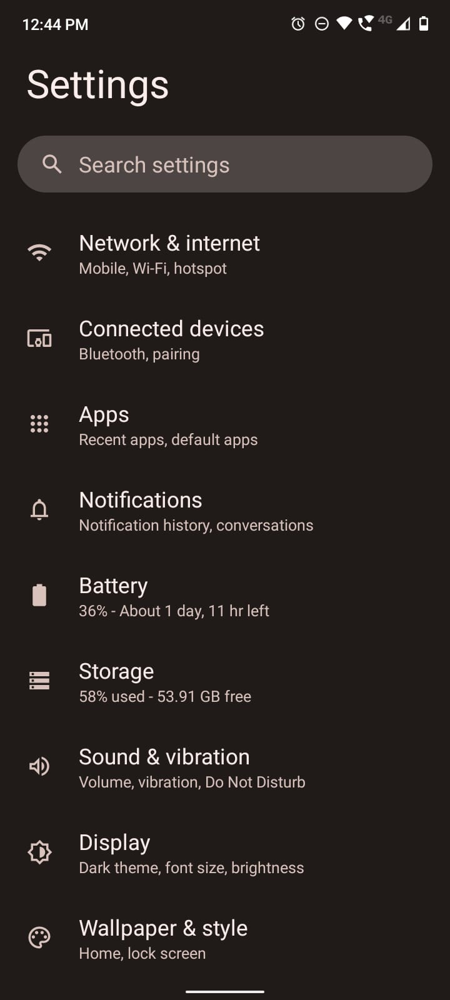
***Step 2:***** **See the available storage. Android will try to show which type of files are consuming more storage. So, for example, if most of the space is fill with videos, or images, one can go to the android File Manager (📁) and delete files so that there’s free space for new collected data (from the user, or exchanged with collaborators)
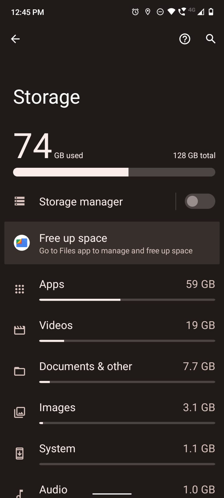
👉 **CoMapeo **will try its best to inform the user that the device is low on storage so that the user can delete content in their device to make room for new data

### 🟩  Solution: Restart Device

When devices have been turned on for a long time (like, months) they can start to mismanage resources (like memory). This can happen more if there’s many applications open. In general this shouldn’t happen, but restarting the device can avoid issues in certain situations

**👣 Step by step instructions**

***Step 1: ***Long press the *block device* button that’s usually located on one side of the phone. Is pretty common that devices have three buttons: two buttons to lower and increase volume, and one button to block (turn off the screen) the device.
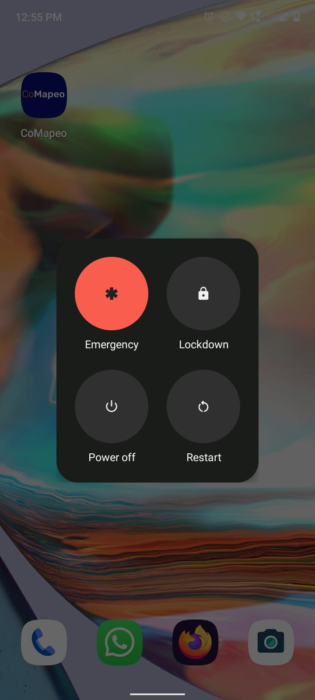
***Step 2:***** **Press the **Restart** button so that the phone restarts itself
***Step 3:***** **Wait until the phone has restarted, and re-open **CoMapeo**

👉 Complementary information for prevention or reduced issues

### 🟩  Solution: Check app permissions

**CoMapeo **needs a set of permissions to work correctly. This permissions ensure that the app has access to different features of the phone. Mainly, access to the **camera**, the **GPS** device and the **microphone**. Except some exceptions, the app only needs those permissions while its focused, so it asks specifically for that type of permission (access while using the app). 

When opening the app for the first time, **CoMapeo **will ask for the minimum permissions needed for its correct use. This are, permission to use the **Camera **and permission to access the **GPS**. It may happen that the user didn’t give some of all those permission to the app, which will mean that the app won’t function correctly. If that’s the case, every time you restart (or re-open) the app, **CoMapeo **will ask for those permissions again. For restarting the app see [🟩 Solution: Close & Restart CoMapeo](#solution-close--restart-comapeo)

Device permission for CoMapeo Mobile

| **Device Permission type** | **Use in CoMapeo** | **Permission needed** |
| --- | --- | --- |
| Camera  |  To take pictures | while the app is being used |
| GPS  |  Coordinates saved with Observations | while the app is being used |
| GPS  | Track recording while using other features or apps, and phone is on standby | all the time |
| Audio  |  Audio recording | while the app is being used |

In order to check that you have the sufficient permissions for the correct use of **CoMapeo**, do the following steps:

**👣 Step by step instructions**

***Step 1: ***Go to the Android Configuration screen (⚙️)

***Step 2:***** **Go to the Apps menu
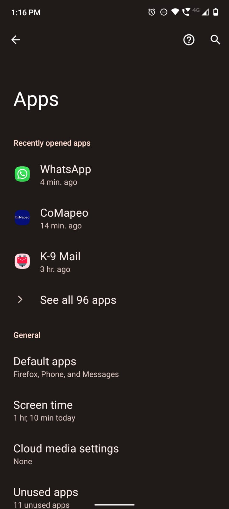
***Step 3:***** **Look for **CoMapeo **in the list of apps (you have a search bar for quickly finding it)
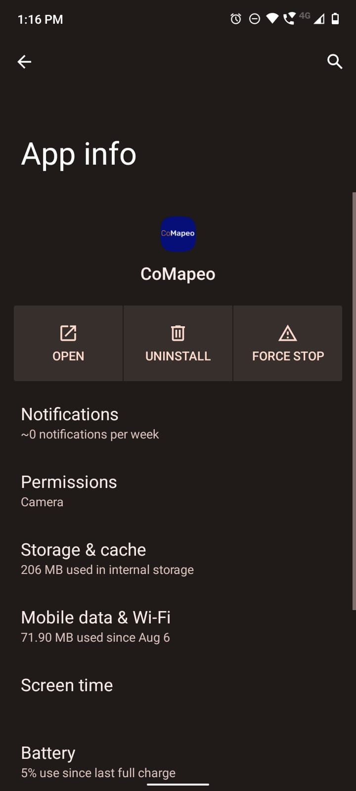
***Step 4*****:** On the App info screen, select the **Permissions** item
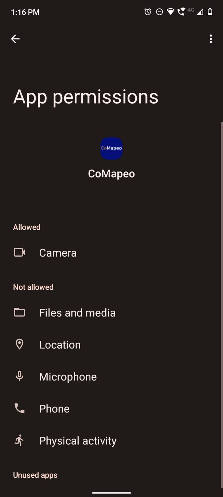
***Step 5: ***There, you will see a list of **Allowed **and **Not allowed** permissions. Clicking on a specific item (like Camera), will show the type of permission granted to that item and allow the user to select a different type of permission
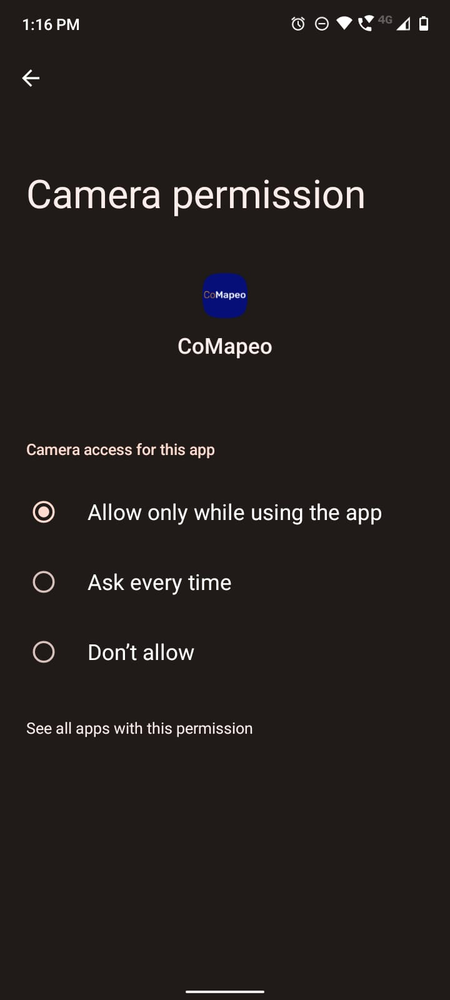
***Step 6:***** **Matching the permissions detailed in the list above, may solve issues related to **permissions**

### 🟩  Solution: Check that every device is on the same WiFi network

There are a number of issues that can exist can be solved by checking that you’re on the same wifi network than other devices. This issue can appear when:

- Trying to invite collaborators to a team

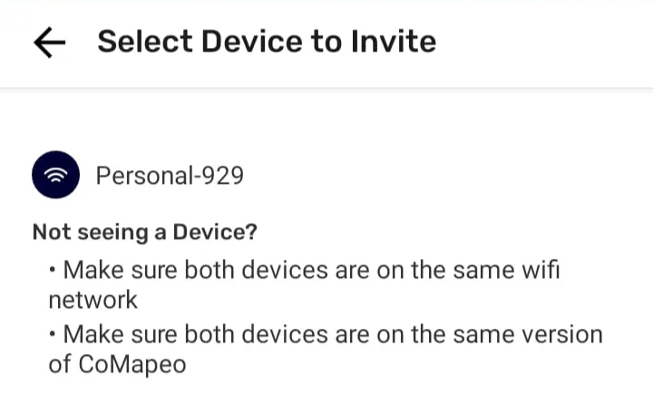

- Trying to exchange collected data

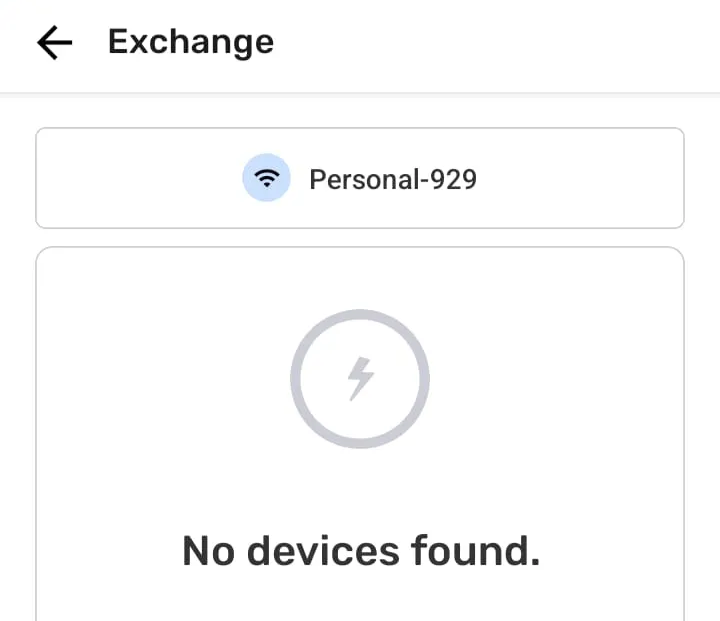

### 🟩  Solution: Check that every device is actually connected to the WiFi network

When exchanging collected data in CoMapeo it is a pretty common case that the device providing the network (for example a cellphone, or a router) doesn’t have internet connection. This may happen because you are in an area with low cellphone signal, or because the router assigned for exchange in that space is not connected to the internet.
Cellphones may choose to automatically disconnect from a network that doesn’t have internet connection, which may conflict with various functionalities of **CoMapeo **(like inviting collaborators to a project, or exchanging collected data).
To make sure the device is actually connected to the desired network check the following instructions

**👣 Step by step instructions**

***Step 1: ***When connecting to the network pay attention to a prompt that may appear. It will tell you that the network doesn’t have internet access, and ask you if you want to keep connected to the network. Select **YES**
***Step 2:***** **Check that the device is actually connected to the desired network. You can check the WiFi icon on the top of the screen, and it if the network doesn’t have internet access it will usually show an exclamation mark next to the WiFi icon
👉🏽 ** **Sometimes the prompt of **Step 1 **may not appear. In order to force that message, one may need to go to the WiFi settings on the phone and that will force the prompt to appear

## Explore the troubleshooting Pages

Browse specific problems and learn how to avoid them in the future. Explore the troubleshooting pages by selecting the specific topic in question.

The CoMapeo Help team updates these pages as problems and solutions emerge.

## **Contact **the CoMapeo Help Team 

If you have not been able to resolve issues with the resources shared in the [CoMapeo Help Pages](/docs/introduction)**,** please contact us. Someone at Awana Digital will be happy to receive details about your experience  including screen captures to help explain what is not working as expected
📧 Email us at [help@comapeo.app](mailto:help@comapeo.app)

💬 You can also chat with us on  [Discord](https://discord.gg/kWp34am3)**!**

