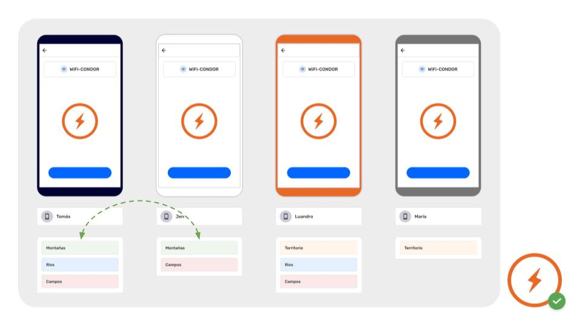
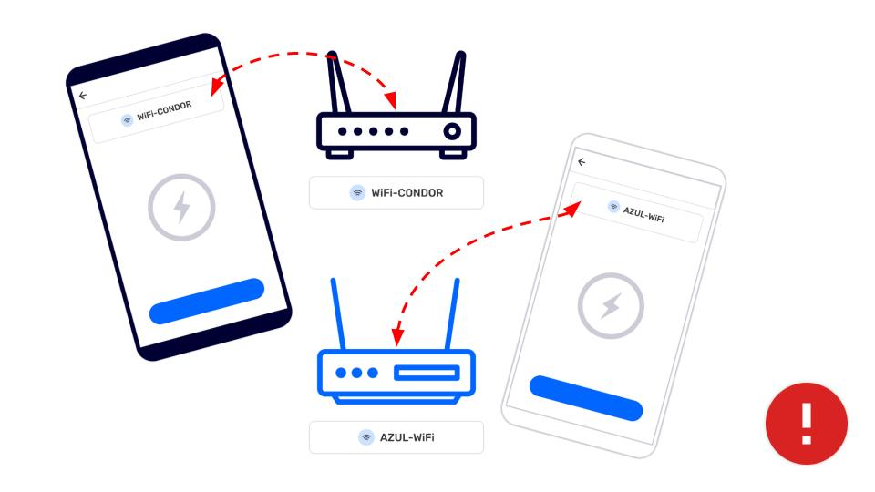

## Exchange with Wi-Fi

---

Exchange requires 4  things:  

- Two or more devices with  CoMapeo,

- Devices are connected to the same WiFi connection

- devices belong to the same project

- New observations or tracks to exchange

 Go to 🔗 [Understanding How Exchange Works](/docs/understanding-how-exchange-works) for full overview and details

:::note 👣
### Step by Step

***Step 1: ***Open the Menu

***Step 2: ***Tap  ***Exchange***

***Step 3: ***Exchange screen will display “Devices Found” when properly connected to a router.

Tip: Exchange Settings can be adjusted if needed

Go to 🔗 [Understanding How Exchange Works -> Exchange Settings](/docs/understanding-how-exchange-works#adjusting-exchange-settings) 

---

***Step 4: ***Tap **Start** to let connected devices know you are ready to exchange project data

***Step 5: ***When other devices join the Exchange, all new observations and relevant project data will be exchanged.

***Step 6: *****Complete** will display when all observations are exchanged. Tap **Done** to return to Menu
:::

:::note 💡 Tip
Offline exchange can happen fairly quickly if everyone starts exchange around the same time.
:::

---

## Related Content

Go to 🔗 [Understanding How Exchange Works](/docs/understanding-how-exchange-works) for full explanation 

### Having Problems?

Go to 🔗 [Troubleshooting: Mapping with Collaborators -> Exchange Problems](/docs/troubleshooting-mapping-with-collaborators#exchange-problems)** **

Common issues with exchange relate to connecting to the same WiFi at the same time, especially if the router or mobile hotspot is not connected with the internet. Often devices will disconnect from a WiFi source to favor one that has internet,  or is saved in the devices memory. These are setting you can check to reduce issues related to WiFi connections.

