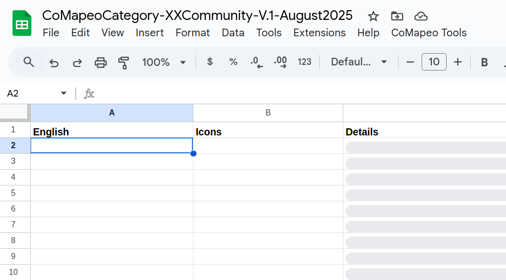
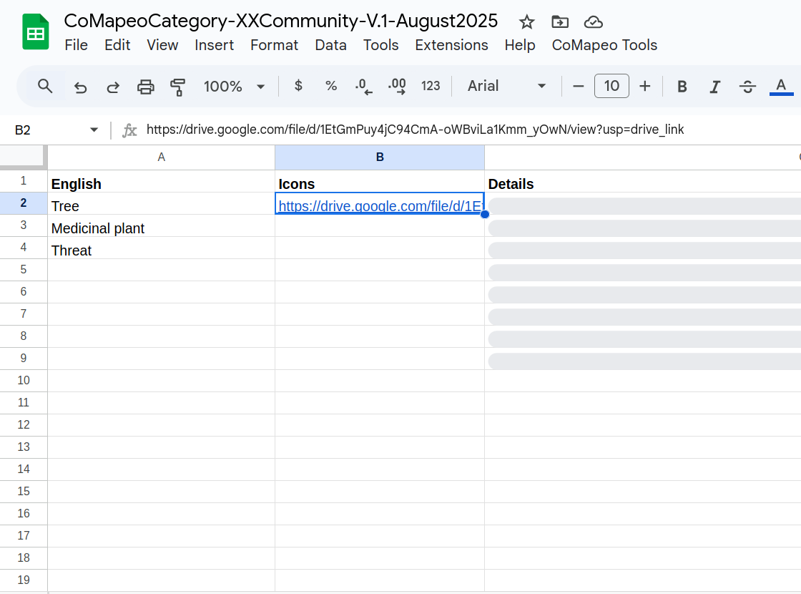
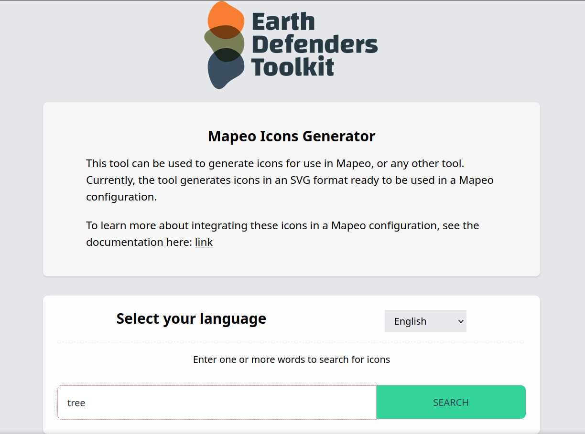
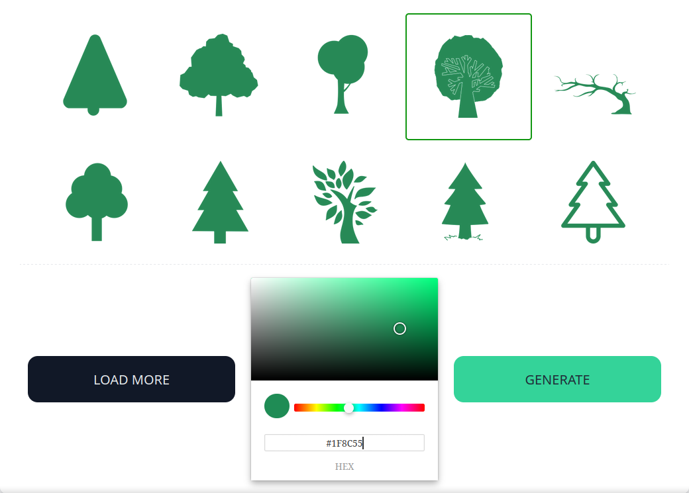
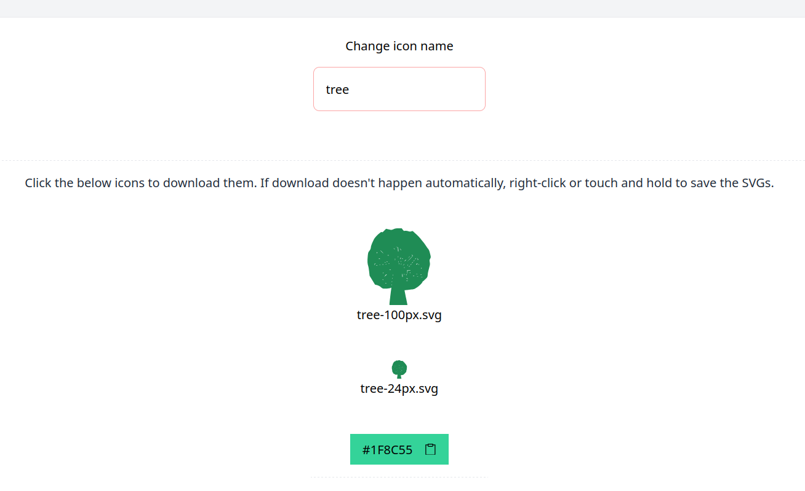
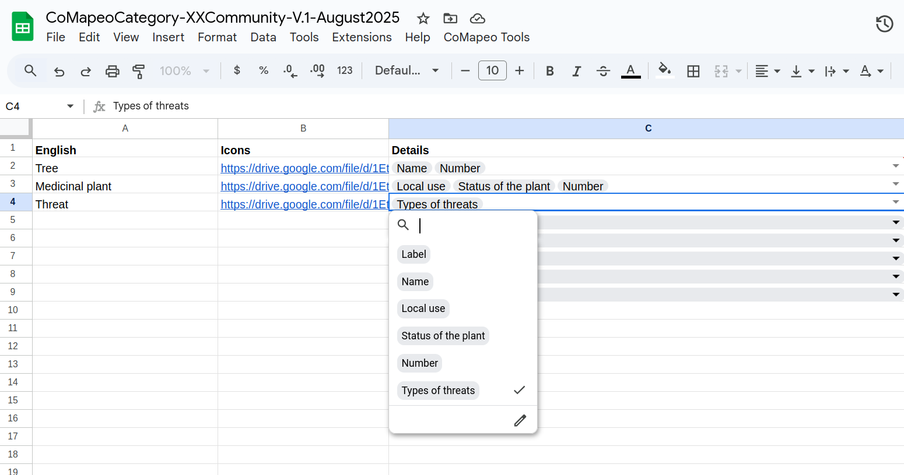
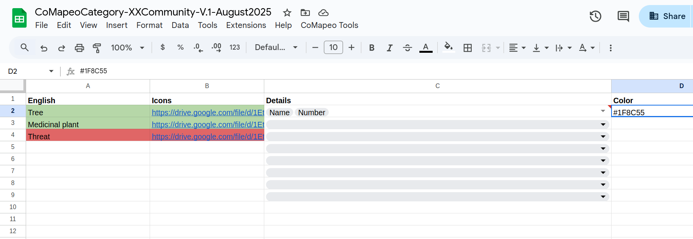
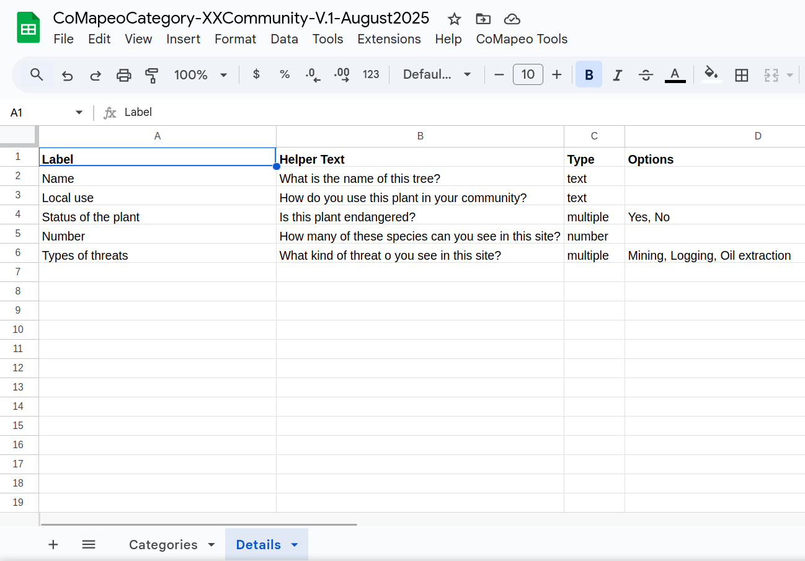

# Building a Custom Category Set

## About Categories in CoMapeo

### **What is a category in CoMapeo?**

A category is a predetermined icon, label, and detail questions for any data type being collected. For each observation made with CoMapeo, participants select a category to classify it, and may answer questions or respond to prompts to provide more detail about what is being documented.

**What are Category Sets in CoMapeo?**

Category Sets are files that contain and define the distinct Categories for a Project. Creating config used to require coding skills that limited the possibility for people to customize their own categories. We have now made it more accessible through a spreadsheet template that we explain in this section.

:::note 💡
For those familiar with the predecessor app Mapeo, Category Sets were previously known as *Configurations.*
:::

---

## Why customize Category Sets?

[VIDEO WALKTHROUGH]

**Reasons for customizing CoMapeo Category Sets**

- Custom Categories are a powerful tool for customization in CoMapeo, allowing users to define specific icons, and questionnaires for their projects.

- Text can be written in any language that can be typed, ensuring that key parts of the data collection interface can appear in the native language of the groups using it.

**Reflect and organize information you will need**

Initial planning and consultation with project participants is essential to designing effective ways of organizing your data. To start the customization process, project participants should reflect on the project goals, what kind of data will be needed, and what properties might be required for data outputs.

You will need to think through what to include for each of the **key customizable areas of CoMapeo.**

| Categories component | Description | Format |
| --- | --- | --- |
| **Category Name** | When collecting or creating data with CoMapeo, users assign a top-level category to each observation or element on the map | text (recommended less than x characters for best display |
| **Icon** | Each Category you include must have an icon or a small graphic to display to users when selecting a category. | png, (max 100px) |
| **Color** | Color appears as observations on  map view and in the Category selection screen. It helps to use thematic groups when defining colors functioning like a map legend. | [Hex colour code](https://htmlcolorcodes.com/color-picker/) |
| **Details fields** | For each Category in your Category Set, you can include one or more structured data fields (like a mini form or questionnaire) that users can optionally fill out when creating a new observation or map element with that category. | Text prompt and with fields that can be filled with values that are typed text, single select, or multiple select. The values can be text. Note that single select options may be preferred for data processing when organizing or doing analysis |

## Using the **CoMapeo Category Generator Spreadsheet**

Once you have this information, use the  to create your categories. This tool will allow you to create and edit Categories, icons, details fields and language, and export all this information into a **.comapeocat** file

Whether you imported a Mapeo config or are starting from scratch, you will find these two main sheets named in tabs on the bottom of Googlesheets 

**→ Categories sheet** to define category name, icon and colour 

**→ Details sheet** to create a simple form included in different categories

:::note 👉🏽
Download the **CoMapeo Category Generator**
:::

:::note 👣
### **Converting Legacy Mapeo Configurations**
:::

### **Categories sheet contents**

**Names** (COLUMN A) Use the column titled English (by included) to type the name of each category. You can change the language to the one you are using as your included language.

**Icons** (COLUMN B) This is a link (URL) to an image in **SVG format** in an associated Google Shared folder. 

:::note 👣

**Step by step**

***Step 1: ***Open a folder in your GDrive and name it “icons”. 
***Step 2: ***In the folder, make sure the sharing settings are “anyone with the link”. 
***Step 3: ***Right-click on the icon of your choice 
***Step 4: ***Click on Share -> Copy Link. 
***Step 5: ***Paste it in the Icon column, next to the category name that you want it to represent.

:::

:::note 💡 Tip
Naming the file with the name of the category will help you keep order and make sure you have the right image for the right category.
:::

:::note 👉🏽 More
Use the [Mapeo icon generator](https://icons.earthdefenderstoolkit.com/) to create images into svg files, choosing among colors and options it provides.

Follow the steps displayed on the tool, and once you have downloaded them into your computer, upload them into your “icons” folder and continue with step 

When you create an icon using the **CoMapeo Icon Generator, **you will find a **hex color code** below your svg file options. Use this for COLUMN D.
:::

**Details** (COLUMN C) 
Choose the list of questions you want to add to each category. Select the details that you want to add to each category row. 

:::note 💡 Tip
To populate to the list of details to select from  n the **Categories sheet ,** use the **Details sheet. **
:::

**Color** (COLUMN D)  
Add a thematic color in [hex code format](https://htmlcolorcodes.com/color-picker/) in which each observation will be shown as a point in the  map to improve experience of viewing diverse data . 
Example: #1F8C55**.** 

:::note 💡 Tip
Use the “Fill color” spreadsheet tool to fill rows or cells with the color matching hex color code to help with creating a useful legend.

:::

### Details sheet content

Here you can customize the questions you want to ask for each category. 

**Label** - This works like a title for the detail that appears as options in Column D in the Categories sheet.

**Helper text** - This explains what that detail field is for or a prompt question

**Type** of response you want to get as detail: 

### **Exporting the Category Set File **

After the spreadsheet content has been filled in completely, a **.comapeocat file** is ready to be exported by the **CoMapeo Category Generator**

:::note 👣
### **Step by step**

***Step 1: ***To export the category file, first review that all tabs are ready and do not show any red, orange or yellow color indicating an error. If you want to double check, go to CoMapeo Tools -> Lint Sheets and it will show you any of these. 

***Step 2: ***Once its ready go to the top menu and click on CoMapeo Tools -> Generate CoMapeo Category.

***Step 3: ***Choose a language to translate to. At this moment, you have to choose at least one language for the export to work.

***Step 4: ***After completing 8 automatic steps, the spreadsheet will show a “Download file” button. The file will be in a zip folder, open it and find it ending in comapeocat.
:::

## **Translations**  

When you generate a CoMapeo Category File, the spreadsheet automatically creates other sheets as tabs at the bottom of the spreadsheet. Each new sheet contains automated translations from the language you selected. 

:::note ⚠️ Warning
These translations use Google Translate and will likely need your revision and improvement. Click on each cell to edit or improve the translations.
:::

## **Testing out new categories**

An important part of the process is to test out the custom categories set created in CoMapeo Mobile. It can be helpful to include a couple teammates to help catch any improvements needed. 

Go to 🔗 [Changing Categories Set](/docs/changing-categories-set)** ** for instructions on importing .comapeocat files

Revisions must be made in the **CoMapeo Category Generator. **Repeat the export steps again, and test as needed.

## Related Content

Go to 🔗 [New Tool: Mapeo Icons Generator](https://www.earthdefenderstoolkit.com/new-tool-mapeo-icons-generator/)** **blogpost by Luandro Vieira.

Go to 🔗 [Welcome to CoMapeo Cateogries Library](https://www.earthdefenderstoolkit.com/welcome-to-the-comapeo-categories-library/)** **blogpost by María Alvarez

---

### Having Problems?

Go to 🔗 [Troubleshooting: Setup and Customization → Custom Categories Set Problems](/docs/troubleshooting-setup-and-customization/#custom-category-set-problems)** **

---
