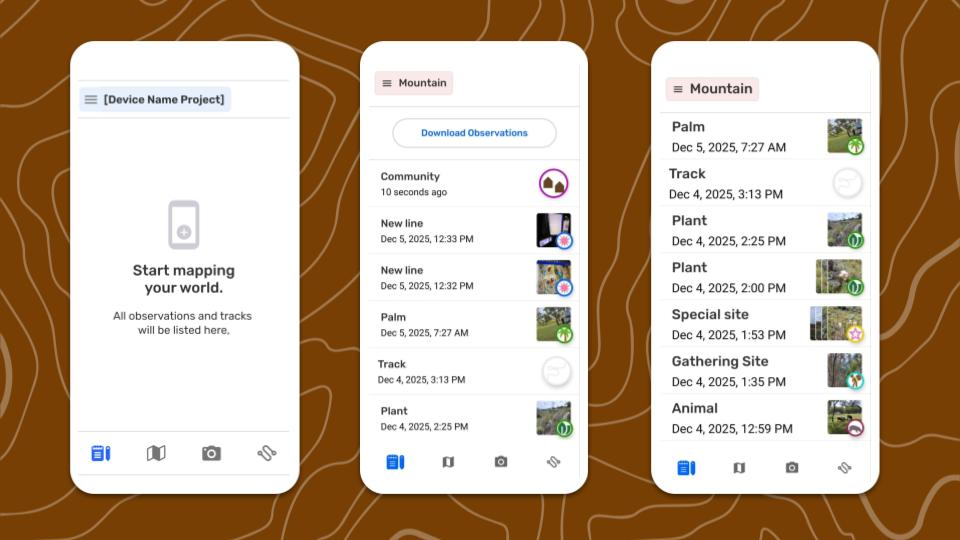
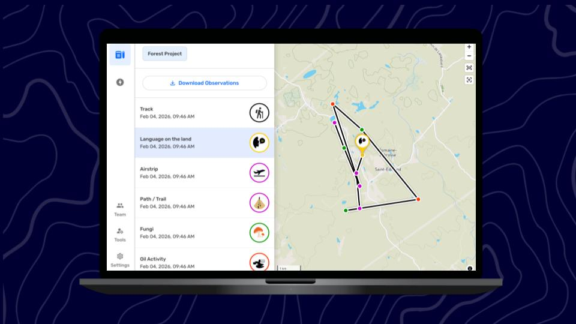

---

# Explorar la Lista de Observaciones

## ¿Qué es la Lista de Observaciones?

La  **Lista de observaciones** es la pantalla en la que se ven todas las observaciones y trayectos guardados en un proyecto, en orden cronológico y con las más recientes en la parte superior. Esta pantalla es útil a la hora de buscar una observación entre muchas, especialmente en proyectos que incluyen observaciones y trayectos recibidos de otros dispositivos mediante el  **Intercambio**. La Lista de Observaciones es una alternativa a la pantalla del mapa, donde también se puede acceder a la información registrada en un proyecto, mediante la selección de observaciones del mapa.

:::note 💡 Consejo
Accede a la lista de observación en cualquier momento desde las pestañas principales situadas en la parte inferior de la pantalla.

:::

## Cómo navegar por la lista de observación

Este es el mejor lugar para revisar observaciones *específicas*, ya que los nombres de las categorías, las fechas y horas, y los íconos se ven de un solo vistazo.

Cada elemento de la lista ofrece un resumen que incluye:

- **Nombre de la categoría** (solo para observaciones)
Se trata de la etiqueta predeterminada de la categoría seleccionada.

- **Marca de tiempo**
Es la fecha y la hora en que se guardó por primera vez la observación o el trayecto. Para las observaciones y los trayectos realizados el mismo día en que se consulta la lista, esta información se muestra como el tiempo transcurrido desde que se realizó la observación.

- **Ícono de la categoría**
El ícono se muestra a tamaño completo para los trayectos y observaciones sin fotos. Este ícono se mostrará más pequeño cuando haya miniaturas de fotos.

- **Miniatura de foto**
Las miniaturas de las fotos adjuntas a una observación se muestran como mosaicos apilados. Son referencias visuales útiles al desplazarse por una lista larga de observaciones.

- **Indicadores de intercambio**
Si el dispositivo ha intercambiado observaciones con otros dispositivos de un proyecto, todas las observaciones, las tuyas y las de los demás, aparecerán en esta lista.
Las observaciones y los trayectos recopilados por otros dispositivos tendrán una línea azul vertical en el margen izquierdo.

## ¿Cómo acceder a más funciones?

La pantalla Lista de observaciones es el punto de partida para algunos flujos de trabajo habituales de procesamiento de datos:

**Lista de observaciones**

↳ Revisar una observación

↳ Revisar un trayecto 

↳ Descargar observaciones

## Contenido relacionado

Ir a 🔗** **[Revisa una Observación](/docs/revisa-una-observacion)

Ir a 🔗 [Exporta todas las Observaciones](/docs/exporta-todas-las-observaciones)

### ¿Tienes problemas?

Ve a 🔗 [Solución de Problemas: Observaciones y Trayectos](/docs/solucion-de-problemas-observaciones-y-trayectos)

---

