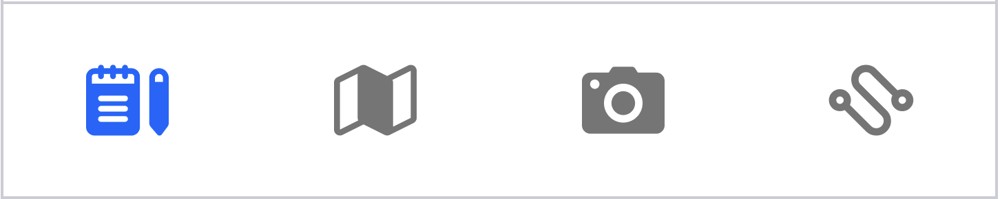
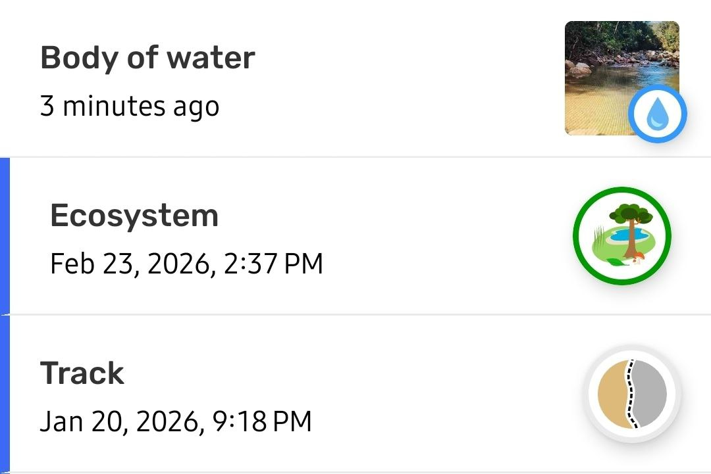

---

---

[image]

# Explorando a Lista de Observações

Para CoMapeo Mobile v8

## O que é a Lista de Observações

A  ** Lista de Observações** é a tela onde todas as observações e trilhas salvas em um projeto podem ser visualizadas cronologicamente, com as mais recentes no topo. Essa tela é útil ao procurar uma observação específica entre muitas, especialmente em projetos que incluem observações e trilhas recebidas de outros dispositivos via  **Troca**. A Lista de Observações é uma alternativa ao uso da tela do mapa, onde também é possível acessar as informações coletadas em um projeto selecionando observações diretamente no mapa. 

:::note 💡 Dica
Acesse a Lista de Observações a qualquer momento a partir da guia principal na parte inferior da tela

:::

## Como navegar pela Lista de Observação

Este é o melhor lugar para revisar observações *específicas*, pois os nomes das categorias, datas e horários, além dos ícones, ficam visíveis à primeira vista.

Cada item da lista apresenta um resumo que inclui:

- **Nome da categoria** (Apenas para observações)
Este é o nome predefinido da categoria selecionada.

- **Carimbo de data/hora**
Esta é a data e a hora em que a Observação ou a trilha foi salva pela primeira vez. Para observações e trilhas registradas no mesmo dia em que a lista é visualizada, essas informações são exibidas como o tempo decorrido desde que a observação foi feita.

- **Ícone da categoria**
O ícone é exibido em tamanho real para trilhas e observações sem fotos. Este ícone será exibido menor quando houver miniaturas de fotos.

- **Miniatura da foto**
As miniaturas de quaisquer fotos anexadas a uma observação são exibidas como blocos empilhados. Elas são referências visuais úteis ao percorrer uma longa lista de observações.

- **Indicadores de troca**
Se o dispositivo trocou observações com outros dispositivos em um projeto, todas as observações – as suas e as de outras pessoas – aparecerão nesta lista.
As observações e trilhas coletadas por outros dispositivos terão uma linha indicadora azul vertical na margem esquerda.

## Acesso a mais recursos

A tela Lista de observações é o ponto de partida para alguns fluxos de trabalho comuns de processamento de dados:

**Lista de observações**

↳ Revisar uma observação

    ↳ Editar uma observação

    ↳ Excluir uma observação

    ↳ Compartilhar uma observação

↳ Revisar uma trilha

    ↳ Revisar observações criadas em uma trilha

↳ Baixar observações

## Conteúdo relacionado

Acesse 🔗 [Revisando uma observação](https://www.notion.so/docs/reviewing-an-observation)

Acesse 🔗 [Exportando todas as observações](https://www.notion.so/docs/exporting-all-observations)

### **Está com problemas?**

Acesse 🔗 [Solução de problemas: Observações e trilhas](https://www.notion.so/docs/solu%C3%A7%C3%A3o-de-problemas-observa%C3%A7%C3%B5es-e-trilhas)

