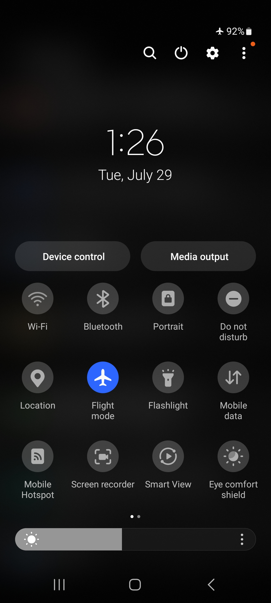

---

### ¿Por qué es importante mantener mi dispositivo?

Cuidar tu dispositivo móvil o computadora ayuda a mantenerlo en buen estado, y a que sea rápido, seguro y no tenga problemas de rendimiento.

:::note 💡 Consejo
Considera realizar los siguientes pasos para optimizar tu smartphone al usar CoMapeo.
:::

:::note 🚧
Próximamente, compartiremos recomendaciones para computadoras y uso de CoMapeo Desktop.
:::

# Configurar tu dispositivo para usar CoMapeo Móvil

Aquí aprenderás qué hacer en tu teléfono inteligente o tableta Android   (fuera de CoMapeo) para obtener el mejor rendimiento, mientras lo usas.

### ✔️ Lista de verificación

:::note ✅ Activa el GPS
Asegúrate de que la Ubicación / GPS esté activada en tu teléfono. Por lo general, puedes encontrar esto en el menú de acceso rápido, al que se accede deslizando hacia abajo desde la parte superior de la pantalla.

---
:::

:::note ✅ Comprueba la duración de la batería
Para optimizar la duración de la batería durante el registro de datos, utiliza el modo avión. Si es posible, lleva una batería externa y el cable de carga del teléfono para recargar mientras estás en el campo. También, asegúrate de que otras aplicaciones no se ejecuten en segundo plano, agotando tu batería.

---
:::

:::note ✅
**Gestionar y mantener el almacenamiento**

CoMapeo no es una aplicación pesada, y los datos de observación (coordenadas GPS y notas) no ocupan mucho espacio. Sin embargo, si empiezas a tomar muchas fotografías o a grabar audio, estos pueden empezar a llenar tu memoria.

- Administra el uso de tu almacenamiento eliminando las aplicaciones no deseadas en Ajustes > Aplicaciones > Ordenar por "Último uso" o "Tamaño".

- Si hay muchas fotos y videos en la galería de tu teléfono, considera moverlos a un dispositivo diferente de almacenamiento multimedia.

:::

---

### Buenos prácticas de mantenimiento de teléfonos

:::note 🔒
**Asegura tu teléfono**

- Asegúrate de tener un PIN, patrón o huella digital seguros para desbloquear la pantalla. Esto ayudará a mantener los datos de CoMapeo a salvo si pierdes tu teléfono o cae en manos equivocadas.

- También puedes proteger el acceso a CoMapeo estableciendo una contraseña de la aplicación: ver **Trabajar con una contraseña de la aplicación**
:::

---

:::note ✅
**Mantén tu sistema operativo actualizado**

***Paso 1: ***Ve a Configuración

***Paso 2: ***Pulsa en Actualización de software

:::

---

:::note ✅
**Mantén tus aplicaciones de Android actualizadas**

***Paso 1: ***Abre Google Play Store

***Paso 2*****: **Abre el menú principal (foto de perfil de Google)

***Paso 3: ***Selecciona administrar aplicaciones y dispositivos

***Paso 4: ***Selecciona la configuración de actualización que prefieras.
Si tienes buen acceso a internet, selecciona “Actualizar todo”. Si tienes acceso limitado, selecciona “Ver detalles” para actualizar manualmente aplicaciones específicas que uses con frecuencia. Recuerda seleccionar CoMapeo.

:::

:::note 👀
**Practica una rutina de mantenimiento regular**

✔️ Reinicia tu teléfono

✔️ Realiza un análisis de malware

✔️ Comprueba tu almacenamiento

✔️ Comprueba el uso de la batería
:::

### Protege tu teléfono contra daños físicos

**Fundas para smartphones**

Elige una funda que proteja contra la exposición al agua, las caídas accidentales y la abrasión general. Se recomienda añadir un protector de pantalla.

**Consideraciones sobre el tiempo y el clima**

Experiencias habituales al utilizar el teléfono inteligente en entornos de alta exposición

- Calor alto → El dispositivo se sobrecalienta y se apaga

- Frío extremo → Agotamiento acelerado de la batería

- Alta humedad → Corrosión acelerada de las piezas del dispositivo, especialmente los puertos de carga.

- Lluvia → La humedad puede filtrarse en los puertos, afectando los puertos de carga y, en casos graves, los chips dentro del dispositivo.

---

### Revisa CoMapeo Móvil en Android

Para obtener información sobre el espacio y los permisos que está utilizando CoMapeo, abre la pantalla de Administración de aplicaciones de CoMapeo Móvil

:::note 👣
Configuración de Android → Gestión de aplicaciones → CoMapeo

:::

:::note 💡 Consejo
Si CoMapeo está en la pantalla de inicio, **mantén pulsado el ícono de CoMapeo **para abrir las opciones de la aplicación. Selecciona información  para ir a la pantalla de Gestión de aplicaciones de CoMapeo Móvil.

:::

## Contenido relacionado

Ve a 🔗 [Instalación de CoMapeo e Inducción](/docs/instalacion-de-comapeo-e-induccion)

### ¿Tienes problemas?

Ir a 🔗 [Solución de problemas: configuración y personalización](/docs/solucion-de-problemas-configuracion-y-personalizacion)

---

