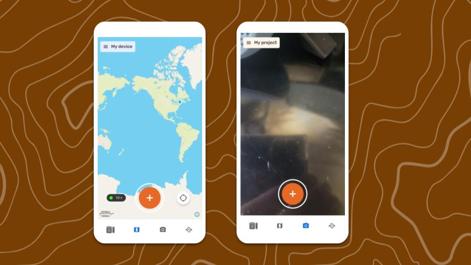
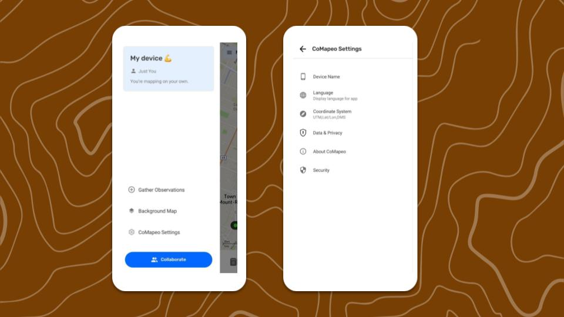

---

La vista principal de CoMapeo es el   Mapa, con acceso a las funciones de mapeo y al menú principal. Y es la pantalla de inicio al reiniciar CoMapeo, luego de completado los primeros pasos.

Los controles del mapa incluyen  re-centrar,  deslizar para desplazar, y pellizcar para hacer zoom con una escala dinámica. La información del sensor GPS, en tiempo real, se puede ver en  detalles de GPS.

### Funciones primarias a explorar

✔️  Pantalla de mapa

✔️  Pantalla de cámara

✔️  Menú principal

✔️  Ajustes de CoMapeo

### Funciones y recursos a explorar luego

✔️ Ir a 🔗 [Crear una nueva Observación](/docs/crea-una-nueva-observacion)

✔️ Ir a 🔗 [Explorar la lista de Observaciones ](/docs/explora-la-lista-de-observaciones)

✔️ Ir a 🔗 [Crear un nuevo Trayecto](/docs/crea-un-nuevo-trayecto)

✔️ Ir a 🔗 [Planificación y Preparación para un Proyecto](/docs/planificacion-y-preparacion-para-un-proyecto)

✔️ Ir a 🔗[ ](/docs/invita-colaboradores)[Invitar Colaboradores](/docs/invita-colaboradores)

## Ajustes de CoMapeo

###  Nombre del dispositivo

La única forma de cambiar el nombre de un dispositivo en CoMapeo es utilizando el mismo dispositivo. El nombre del dispositivo se muestra en las funciones de colaboración de CoMapeo. Por ejemplo, al invitar a integrantes de equipo a unirse a un proyecto, o al ver quiénes participan en ese proyecto.

###  Idioma

Las opciones de idiomas disponibles pueden incluir idiomas con traducciones que van del 1% al 100%.

###  Sistema de coordenadas

Elige una de las siguientes opciones:

- Grados decimales

- Grados/Minutos/Segundos

- Universal Transversal Mercator

:::note 💡 Consejo
Selecciona la opción de  Sistema de coordenadas que más se usa en tu contexto.
:::

###  Datos y privacidad

Elige **participar** o **no participar **en el intercambio de datos de diagnóstico.

:::note 💡
Ir a 🔗 [Datos y privacidad de CoMapeo](/docs/ajusta-el-intercambio-de-datos-y-privacidad) para revisar la Política de Privacidad en inglés
:::

###  Acerca de CoMapeo

Muestra el número de versión de la aplicación y más detalles que ayudan con el diagnóstico, al acceder al soporte técnico del equipo de ayuda de CoMapeo.

###  Seguridad

Herramientas de seguridad frente a amenazas de seguridad física.

:::note 💡
Ir a 🔗 [Usar un código de acceso de la app para seguridad](/docs/usa-una-contraseña-para-comapeo-por-seguridad)
:::

## Contenido relacionado

Ir a 🔗 [Uso inicial y Ajustes de CoMapeo ](/docs/uso-inicial-y-ajustes-de-comapeo)

Ir a 🔗 [Desinstalación de CoMapeo](/docs/desinstala-comapeo)

### ¿Tienes problemas?

Ir a 🔗** **[Solución de problemas: configuración y personalización](/docs/solucion-de-problemas-configuracion-y-personalizacion)

---

