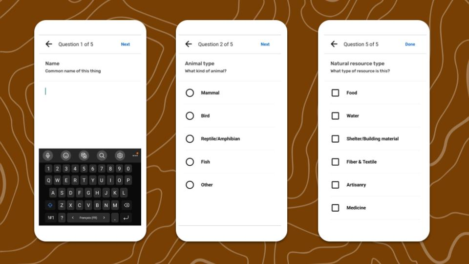
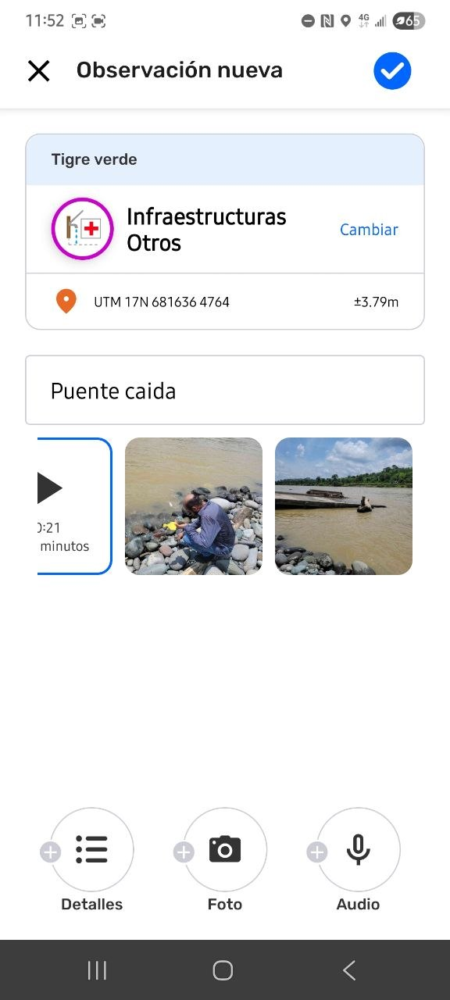
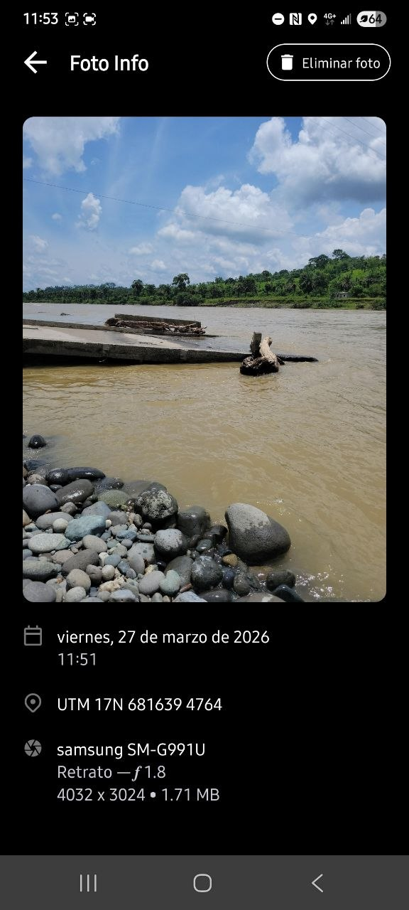
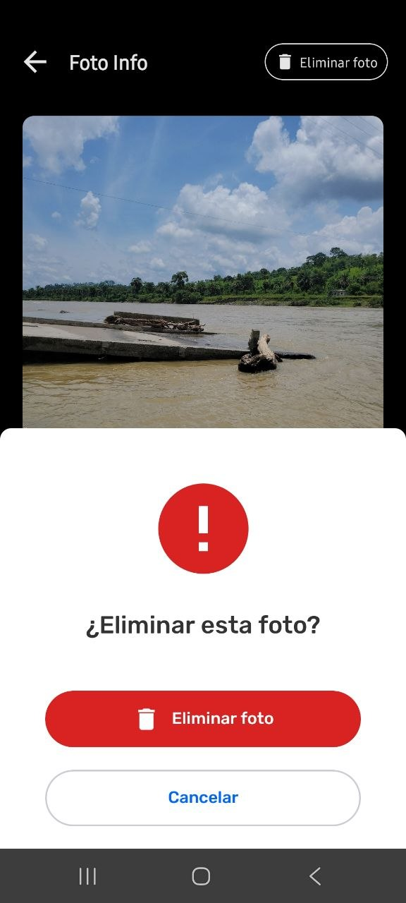
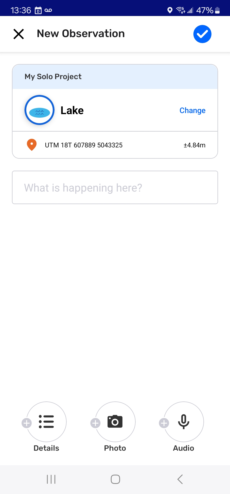
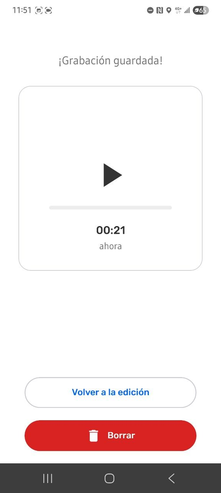

---

[Insert content here]

Para CoMapeo Móvil v8

# Crear una Nueva Observación

## ¿Qué son las Observaciones?

Las Observaciones son el corazón de CoMapeo. Son puntos de datos guardados como coordenadas GPS, con una categoría definida, fecha y hora. Los sensores GPS de un dispositivo móvil se utilizan para registrar coordenadas precisas, y guardarlas en una observación. Las Observaciones también pueden tener notas de texto, fotos y grabaciones de audio.

---

## Crear una Nueva Observación

:::note 👣
### **Paso a paso**

***Paso 1***: Desde la vista del mapa  o la vista de la cámara  , pulsa el botón añadir observación  para empezar a crear una nueva Observación.

---

***Paso 2*****: **Elige una categoría

Desplázate hacia abajo para explorar la lista completa de categorías . Toca el ícono de la categoría que mejor represente lo que estás documentando con la Observación.  

---

:::note 👉🏾 Más información
sobre los conjuntos de categorías en CoMapeo
🔗 Ir a [Crear un conjunto de categorías personalizado ](/docs/crea-un-conjunto-de-categorías-personalizadas)para saber más
:::

---

***Paso 3***:  Aparecerá el editor de observaciones mostrando los datos que se guardarán, incluyendo las  coordenadas GPS. Éstas pueden cambiar si se modifican los datos del sensor GPS. Se recomienda esperar a obtener una buena precisión antes de guardar.

---

***Paso 4*****:** Añade una descripción, detalles  , fotos   y audio , según lo requieras.

---

***Paso 5***: Presiona  **Guardar **para guardar tu observación. Ahora aparecerá en el  mapa y en la  lista de observaciones.

🔗 Ir a [Guardar una observación](#guardar-una-observacion) para más información.

:::note ⚠️ Advertencia
Si la Observación no se guarda en la ubicación prevista, no hay forma de editar esta información. Asegúrate de seleccionar  **Guardar** para crear la observación, o  Cerrar para salir sin guardar.
:::
:::

---

Video: @[document_4997224092760278339_trimmed.mp4](https://drive.google.com/file/d/14l9AjdANFSzhtCC94h0DHw2Xolt11_Yq/view?usp=drive_link)

---

## Agregar detalles

Los detalles son preguntas adicionales que están asociadas a cada categoría. La información específica que se ingresa aumenta la calidad de los datos, y ayuda a la generación de informes y a la registración de evidencia. Para guardar una Observación, no es obligatorio responder esas preguntas. 

Lo ideal es que sigas el protocolo y la metodología de registración de datos de tu proyecto, para asegurarte de que los datos que se recojan sean útiles para lo que el proyecto necesita.

Los detalles también se pueden completar después de guardar, usando la herramienta  **Editar.**

Ir a 🔗 [Editar Observaciones ](/docs/edita-observaciones)(enlace a instrucciones de edición)

:::note 👣
### Paso a paso

***Paso 1****:* En el nuevo Editor de Observaciones, pulsa  **Detalles** en la parte inferior. 

---

***Paso 2: ***Lee la indicación y responde las primeras preguntas. Las respuestas pueden tener tres formatos predefinidos.  Selecciona una opción;  Selección múltiple; o texto.

---

***Paso 3: ***Pulsa **Siguiente** para pasar a las siguientes preguntas y respóndelas según sea necesario. El avance en las preguntas se ve en la parte superior. Las preguntas sin responder aparecerán en blanco.

---

***Paso 4****:* Ve pasando por todas las preguntas y pulsa **Siguiente** hasta llegar a la última. 

---

***Paso 5:*** Pulsa **Hecho** para cerrar el formulario de detalles. 

:::note ⚠️ Advertencia
Al seleccionar **Hecho** no se guarda la observación. Solo se cierra el formulario.
:::

:::note 💡 *Consejo
*  Una vez completados los detalles, se vuelve al Editor de Observaciones. Completa la Observación introduciendo notas descriptivas en el área de texto libre. Recuerda pulsar  **Guardar** como paso final.
:::
:::

---

## Agregar Fotos

Las fotos que se añaden a una observación, se asocian con las notas, las coordenadas GPS y otra información recogida. Las fotos solo se pueden agregar a una observación cuando se toman con la cámara de CoMapeo. **No es posible** adjuntar fotos tomadas desde otras aplicaciones o desde la galería de imágenes del dispositivo. De manera similar, las fotos tomadas en CoMapeo **no se ven en la galería de imágenes de tu dispositivo**.

Ver 🔗[Usar Observaciones fuera de CoMapeo](/26a1b08162d5800d8342e1ab896f5485)** **para aprender sobre las opciones para compartir fotos fuera de un proyecto.

:::note 👣
### Paso a paso

***Paso 1****: *Cuando estés en la Nueva Observación o en el Editor, pulsa el botón  **Añadir foto, **de la barra de tareas inferior, para abrir la cámara.

---

***Paso 2****:* Encuadra la foto y presiona  **Capturar** para tomar la foto. 

Para volver al editor sin añadir una foto, pulsa ❌ **Cancelar.** 

No hay límite en el número de fotos que se pueden incluir en una observación, pero cada foto ocupa espacio en el almacenamiento del dispositivo. 
:::

:::note 💡 Consejo
Las fotos se pueden agregar al crear una Observación, así como al editar Observaciones. Los metadatos de la foto se guardan con cada fotografía para respaldar la validación.
Ir a 🔗 [Revisar una Observación](/docs/revisa-una-observacion)
:::

## Eliminar una foto

Las fotos se pueden eliminar solo en el momento en que se están agregando a una Observación.

:::note ⚠️ Advertencia
Las fotos no se pueden eliminar una vez que se guarda una observación. Elimina las imágenes de mala calidad o que no sean útiles antes de guardar.
:::

:::note 💡 Consejo
Para eliminar una foto de una Observación, en borrador, toca la miniatura de la imagen. La foto se muestra junto con sus metadatos y las opciones respectivas.
:::

:::note 👣
### Paso a paso

***Paso 1****:* Toca la miniatura de la foto para ver los detalles de la imagen.

***Paso 2****: *Pulsa el botón* * **Borrar foto 
**

---

***Paso 3****:* Confirma la eliminación con **Borrar foto **. 

:::note ⚠️ Advertencia
Una vez eliminadas, las fotos no se pueden recuperar. Para cancelar la eliminación de las fotos, presiona **CANCELAR. **Vuelve al Editor de la Observación con la flecha de retroceso .
:::
:::

---

## Agregar Audio

Agregar grabaciones de audio a las Observaciones ayuda a: brindar contexto, servir como testimonio oral, ser evidencia o datos para fines de monitoreo. También sirve como una forma alternativa de registrar información, en ocasiones en las que escribir notas en CoMapeo es difícil o peligroso.

Las grabaciones de audio se asociarán con las notas, fotos y coordenadas GPS de la Observación, y posteriormente podrán exportarse o compartirse junto con los demás datos. Solo puedes agregar audio desde la aplicación CoMapeo, en el momento en que registras la observación. No puedes agregar audios de otras fuentes.

Cada grabación de audio puede tener una duración de hasta 5 minutos. Puedes agregar múltiples grabaciones de audio a una sola observación.

:::note 👉🏽 CoMapeo en acción
Conoce cómo [esta característica se utiliza para documentar la biodiversidad](https://awana.digital/blog/sound-as-language-biodiversity-monitoring-and-comapeos-new-audio-recording-feature)
:::

---

:::note 👣
### Paso a paso

***Paso 1:***** **Selecciona  **Añadir audio**

La grabación comenzará de inmediato.

---

:::note 👉🏽 Nota
Si es la primera vez que grabas un audio con CoMapeo, tendrás que dar permiso para utilizar esta función. **Permite** que CoMapeo grabe audios **mientras utilizas la aplicación**.

:::

---

***Paso 2*****: **Selecciona ⏹️ **Detener** al terminar la grabación.

---

***Paso 3*****: **Elige una opción una vez finalizada la grabación.** **

→  ▶️ Escucha el audio grabado.

→ Continúa en el Editor de Observaciones seleccionando **VOLVER A EDITAR**

→  **BORRAR** el audio 

:::

:::note 💡 Consejo
Las grabaciones de audio se detendrán automáticamente si: la pantalla cambia, si navegas fuera de la pantalla de grabación, si comienzas a usar otra aplicación durante la grabación, o si la pantalla del teléfono se apaga por tiempo de espera y entra en modo de suspensión. Para evitar estos problemas, cambia el TIEMPO DE ESPERA DE PANTALLA a al menos 5 minutos en la configuración   de pantalla de tu dispositivo.

:::

---

## Eliminar un audio

La eliminación de un audio es irreversible. Sin embargo, es pertinente eliminar un audio si éste no es relevante para la observación o el proyecto. Los audios pueden ocupar una cantidad importante de almacenamiento en el dispositivo, en comparación a las fotos.

Una vez guardada una observación, el audio no se puede eliminar.

:::note ⚠️
### 👣 Paso a paso

***Paso 1****:* Toca la miniatura de audio para escuchar la grabación.

***Paso 2****:* Toca el botón **ELIMINAR** :app-icon-delete 

⚠️ **Advertencia**: Una vez eliminada, la grabación de audio no se puede recuperar.

:::

:::note 💡 Consejo
Para evitar que los archivos multimedia ocupen espacio de almacenamiento en el dispositivo cuando se trabaja en equipo, configura los Ajustes del Intercambio.
Ir a 🔗** **[Understanding How Exchange Works → Adjusting Exchange Settings](/docs/entiende-como-funciona-el-intercambio) para obtener más información.
:::

---

## Guardar una Observación

Guarda una observación tocando la marca de verificación azul  , en la parte superior de la pantalla. Una vez que se guarda una observación, aparecerá en la lista de observaciones y en la pantalla del mapa.

La información que se guarda y no se puede cambiar es:

- Coordenadas GPS

- Fecha y hora

- Metadatos de observación

- Fotos tomadas cuando se guarda la observación

Existen otros tipos de datos que pueden editarse después de guardar una Observación. Esto es útil para situaciones que requieren una registración rápida de datos y una descripción exhaustiva de los detalles.

🔗 Ir a [Editar Observaciones](/docs/edita-observaciones)** **para más información.

## Guardar cuando la precisión del GPS es baja

**La precisión del GPS **es una propiedad de metadatos calculada por el sensor GPS de un dispositivo. Se basa en la información proporcionada por los satélites. Esta información se muestra en CoMapeo Móvil en la pantalla del mapa y en la pantalla de la cámara, a la izquierda del botón de captura.. También se muestra en las coordenadas de la pantalla **Crear Observación** y se actualizará hasta que se guarde la observación.

Si las coordenadastienen una precisión peor a ±10 m o si no hay señal GPS en el momento de guardar la observación, CoMapeo ofrece tres opciones:

- **Continuar esperando **hasta que la señal GPS mejore para obtener una buena precisión. Por lo general, esperar un poco y realizar ligeras maniobras suele ayudar. Revisa las coordenadas  hasta que la precisión sea mejor que ±10m, y y luego pulsa . Esto evitará que la advertencia del GPS vuelva a aparecer.

- **Guardar **para usar las coordenadas GPS actuales, incluso si la precisión es peor que ±10m. Considera si esto es adecuado para el propósito de los datos.
:::note 💡 Consejo
Si guardas una observación sin coordenadas GPS, éste no aparecerá en tu mapa, pero sí se verá en tu lista de observaciones.
:::

- **Entrada manual de coordenadas **es una opción práctica solo si tienes acceso a otro dispositivo GPS con mejores sensores y más precisión. Se deben tomar medidas alternativas si la validación de datos es importante para la observación.

---

## Entrada manual de coordenadas

La entrada manual de coordenadas nunca es una situación ideal, pero a veces es necesaria si el sensor GPS de un teléfono no alcanza adecuadamente los satélites GPS. Esto puede ocurrir en regiones remotas, bajo copas de árboles frondosos, en edificios o cuando la cobertura de nubes es densa.

:::note ⚠️ Advertencia
CoMapeo no valida observaciones donde las coordenadas se ingresaron manualmente. CoMapeo valida las observaciones, incluyendo los metadatos GPS, de los sensores y adjunta datos relevantes como los Metadatos de observación. Las observaciones que no incluyan estos detalles aparecerán como no validadas por CoMapeo.
:::

:::note 💡 Consejo
Otra forma de validar las coordenadas, es añadir una foto  de la pantalla de un dispositivo con mejor señal GPS, donde se vean las coordenadas y la precisión antes de guardar la Observación. Esto se debe hacer antes de ingresar las coordenadas manualmente.  Cuando se presente estas Observaciones a un análisis legal o científico, envía la observación junto con los metadatos de la Observación y los metadatos de la foto.
:::

:::note 👣
### Paso a paso

***Paso 1: ***Selecciona **COORDENADAS MANUALES **para abrir la pantalla **Ingresar coordenadas**.

💡**Consejo: **para volver a las opciones, toca el Botón de retroceso 

**Paso 2: **Elige tu **Formato de Coordenadas**, para que coincida con el formato del otro dispositivo.
Las opciones incluyen: Grados Decimales, Grados/Minutos/Segundos, o Universal Transverse Mercator.

***Paso 3: ***Lee y copia los detalles de las coordenadas del otro dispositivo, con cuidado. **Ingresa los valores requeridos **completando todos los campos.

:::note ⚠️ Advertencia
No hay forma de editar la información de coordenadas que se ingresó, una vez guardado .
:::

***Paso 4: ***Pulsa **Guardar ****. **La observación es guardada con las coordenadas al mismo tiempo.
:::

---

## Contenido relacionado

Ir a 🔗 [Explorar la Lista de Observación](/docs/explora-la-lista-de-observaciones)

Ir a 🔗 [Revisar una Observación](/docs/revisa-una-observacion)

### **¿Tienes problemas?**

Ir a 🔗 [Solución de problemas: Observaciones y Trayectos](/docs/solucion-de-problemas-observaciones-y-trayectos)

