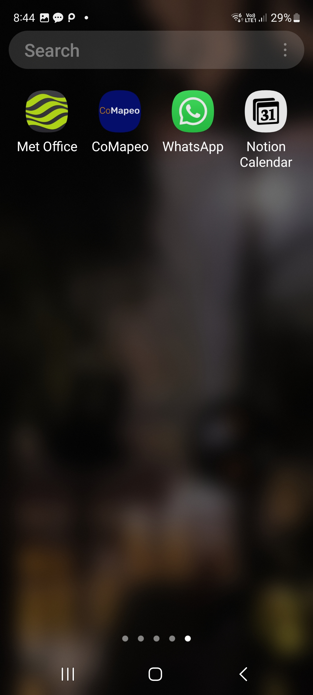
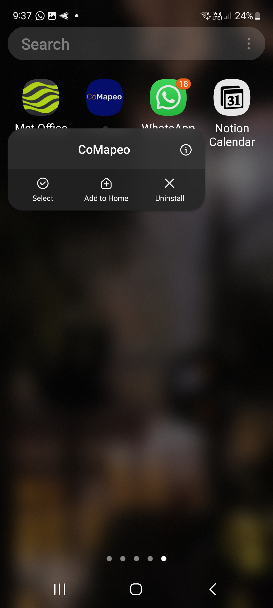
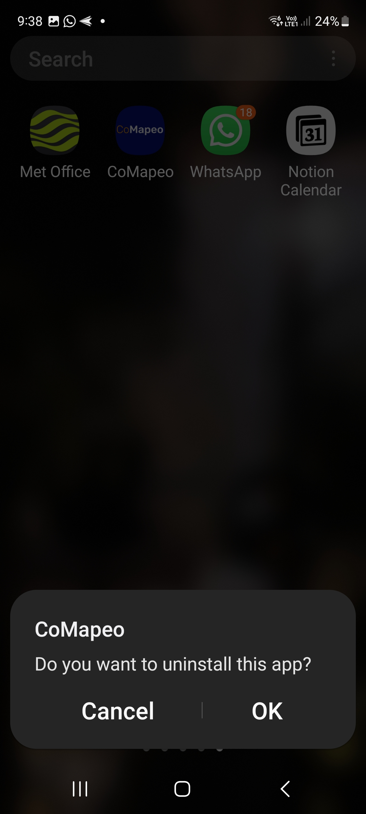
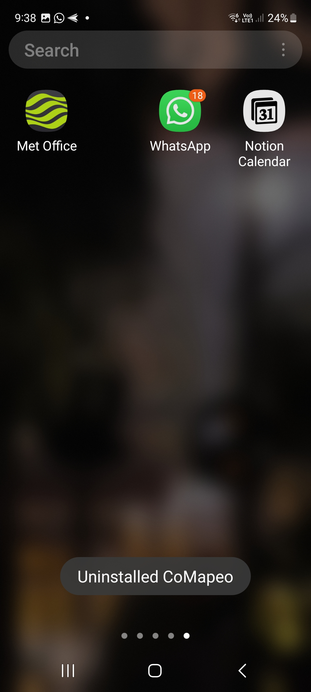

---

## Razones para desinstalar CoMapeo

Es posible que desees desinstalar CoMapeo por varios motivos. Por ejemplo:

- Has decidido que la herramienta no es la adecuada para ti

- Ya no formas parte de determinados proyectos

- Quieres regalar tu teléfono a otra persona

- Crees que tu dispositivo y los datos no están seguros

Sin embargo, desinstalar CoMapeo tiene consecuencias irreversibles, así que asegúrate de tener claras tus razones y consulta la siguiente lista de verificación antes de completar la desinstalación.

## Antes de desinstalar CoMapeo 

Al desinstalar CoMapeo, se eliminarán todos los datos de la aplicación y no se podrán recuperar. Además, perderás el acceso a todos los proyectos en los que participes, incluso si eres el coordinador. Por lo tanto, sigue estos pasos antes de desinstalar CoMapeo.

- Si no formas parte de ningún proyecto en equipo, sino que solo utilizas CoMapeo por tu cuenta, asegúrate de exportar todos los datos de los proyectos individuales que tengas, o comparte cualquier dato de observación individual que consideres importante a través de WhatsApp, correo electrónico, etc.
Ir a: 🔗 [Exporta todas las Observaciones](/docs/exporta-todas-las-observaciones)

---

- Si formas parte de uno o varios proyectos, asegúrate de estar al día con el intercambio de datos, para que toda la información que hayas recopilado pueda formar parte de los datos del equipo.
Ve a  🔗 [Entiende cómo funciona el Intercambio](/docs/entiende-como-funciona-el-intercambio)

---

- Si eres coordinador de un proyecto, asegúrate de configurar al menos otro dispositivo coordinador para el proyecto. Si no lo haces, el proyecto solo contará con participantes y no será posible realizar determinadas acciones.
Ve a 🔗 [Selección de roles y equipos de dispositivos](/docs/seleccion-de-roles-y-equipos-de-dispositivos)** **

---

## Desinstalación de CoMapeo

[VIDEO TUTORIAL](https://drive.google.com/file/d/1heo-81t9Z9aQAp5vP3sYATVcwp6kAHzk/view?usp=drive_link)

:::note 👣
### Paso a paso

***Paso 1*****: Busca CoMapeo**

Localiza CoMapeo en tu lista de aplicaciones o en la pantalla de inicio. 

---

***Paso 2*****: Desinstala CoMapeo**

Mantén pulsado el ícono de CoMapeo, y aparecerán tres opciones, que incluye la de desinstalar CoMapeo.

---

***Paso 3*****: Confirma la desinstalación**

---

***Paso 4:***** Desinstalación completa**

CoMapeo ya no está en tu teléfono. No lo encontrarás en la lista de aplicaciones ni en la pantalla de inicio. Todos los datos almacenados en CoMapeo se han eliminado de tu teléfono.

:::

---

## Borrar los datos de la aplicación

Es posible que quieras borrar los datos de la aplicación sin desinstalar CoMapeo de tu teléfono. Esto puede ser útil si detectaste errores o si quieres empezar de cero con CoMapeo. Al borrar los datos, se elimina todo el contenido de la aplicación y se restablece a su estado predeterminado, como cuando se instaló por primera vez. Si tienes acceso limitado a Internet o no lo tienes, esto puede ayudar a empezar de cero, borrando los datos de la aplicación, sin tener que volver a descargar CoMapeo desde Play Store.

:::note 👣
### Paso a paso

Los pasos pueden variar ligeramente según la versión de Android, pero serán similares a:

***Paso 1:***** **Ve a **Ajustes** y luego a **Aplicaciones & notificaciones** (o simplemente **Apps**)

***Paso 2:***** Busca en la lista y selecciona CoMapeo**

***Paso 3:***** **Toca **Almacenamiento **o** Almacenamiento y & caché**

***Paso 4:***** ** Borrar almacenamiento (asegúrate de borrar todos los datos y no solo el caché)

:::note 💡 Consejo
En Android 11 y versiones anteriores, “Borrar almacenamiento” aparece como “Borrar datos”. Algunas versiones antiguas de Android también pueden tener un botón de “Borrar datos” directamente en la pantalla de información de la aplicación.
:::

***Paso 5:***** Confirma **que deseas borrar los datos.
:::

## Contenido relacionado

### ¿Tienes problemas?

Ve a 🔗 [Solución de problemas: Configuración y Personalización](/docs/solucion-de-problemas-configuracion-y-personalizacion)** **

---

