---

---

Para o CoMapeo Mobile v8

# Criando uma Nova Observação

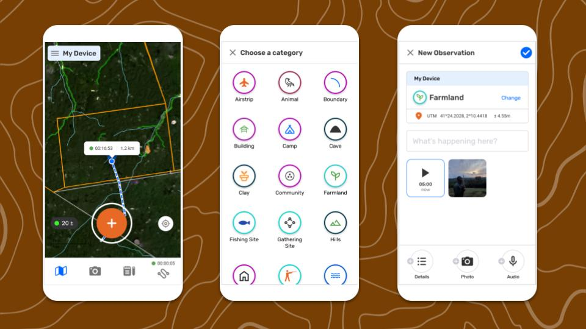

## O que são Observações?

Observações são o coração do CoMapeo. Observações são pontos de dados salvos como coordenadas GPS com uma categoria definida e data e hora. Observações também podem ter notas de texto, fotos e gravações de áudio.

---

## Criar uma Nova Observação

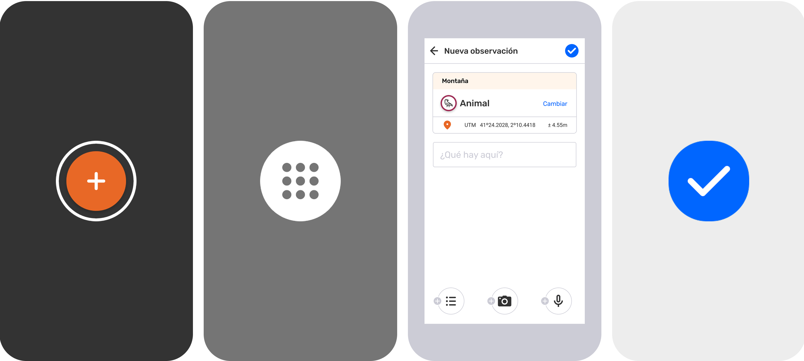

:::note 👣
### **Passo a passo**

***Passo 1***: Na visualização do mapa  ou na visualização da câmera , toque no botão  “Adicionar observação” para começar a criar uma nova observação.

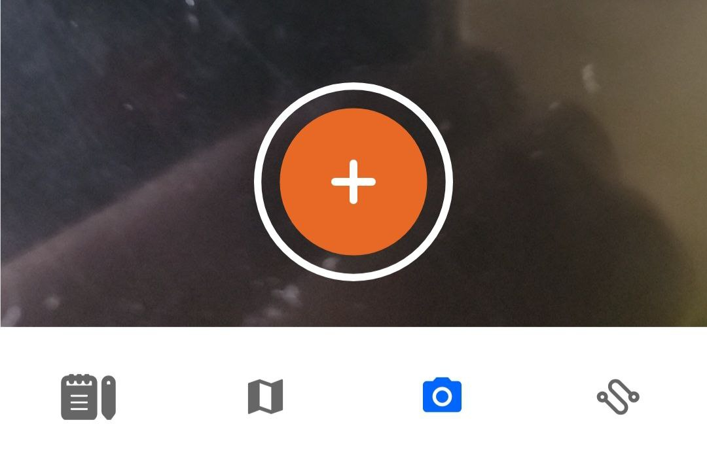

---

***Passo 2*****:** Escolha uma categoria

Role para baixo para explorar a lista completa de categorias . Toque no ícone da categoria que melhor represente o que você está documentando com essa **Observação**.

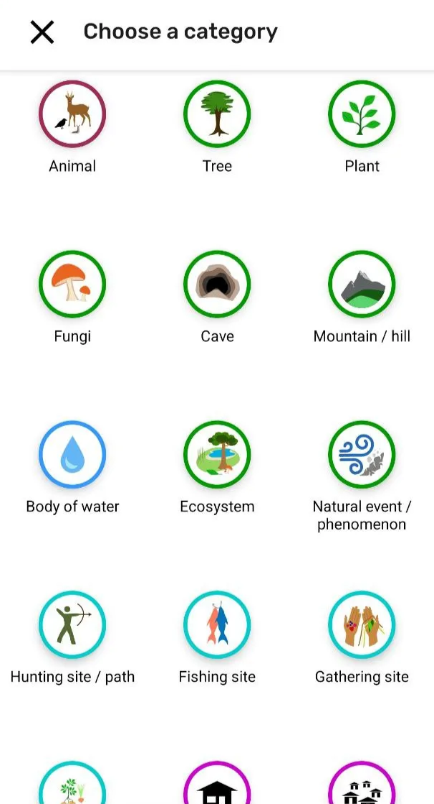

---

:::note 👉🏾 Mais
informações sobre os conjuntos de categorias no CoMapeo
🔗 Ir para [Criar um Conjunto de Categorias Personalizado](/docs/criar-um-conjunto-de-categorias-personalizado)
:::

---

***Passo 3***:  O editor de observações será exibido, mostrando os dados que serão salvos, incluindo as  coordenadas GPS. Estas podem mudar se os dados do sensor GPS forem modificados. Recomenda-se aguardar até obter uma boa precisão antes de salvar.

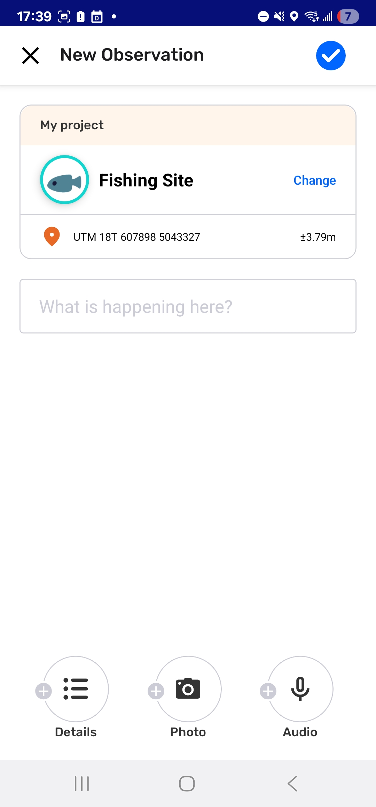

---

***Passo 4*****:** Adicione uma descrição,  [detalhes](#adicionando-detalhes),  [fotos](#adicionando-fotos)  e  [áudio](#adicionando-áudio) , conforme necessário.

---

***Passo 5***: Toque em  **Salvar** para salvar sua observação. Agora ela aparecerá no  mapa e na 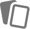  lista de observações.

🔗 Acesse [Salvar uma observação](#salvar-uma-observação) para mais informações.

:::note ⚠️ Aviso
Se a observação não for salva no local previsto, não há como editar essas informações. Certifique-se de selecionar  **Salvar** para criar a observação, ou  Fechar para sair sem salvar.
:::
:::

---

Vídeo: @[document_4997224092760278339_trimmed.mp4](https://drive.google.com/file/d/14l9AjdANFSzhtCC94h0DHw2Xolt11_Yq/view?usp=drive_link)

---

## Adicionando Detalhes

Detalhes são perguntas associadas a cada categoria. As informações específicas inseridas aumentam a qualidade dos dados para auxiliar na geração de relatórios e coleta de evidências. Responder a essas perguntas não é obrigatório para salvar uma observação. Siga o protocolo do seu projeto e a metodologia de coleta de dados para garantir que as informações sejam coletadas da maneira mais útil para as necessidades do projeto.

Os detalhes também podem ser completados após salvar, usando a ferramenta  **Editar **

Acesse: 🔗 [Editando Observações](/docs/editando-observacoes)** **

:::note 👣
### **Passo a passo**

***Passo 1****:*  No Novo Editor de Observações, toque em  **Detalhes** na parte inferior 

***Passo 2: ***Leia a instrução e responda às primeiras perguntas. As respostas podem ter três formatos predefinidos: 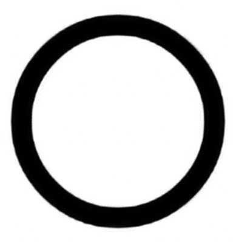 Selecione uma opção, 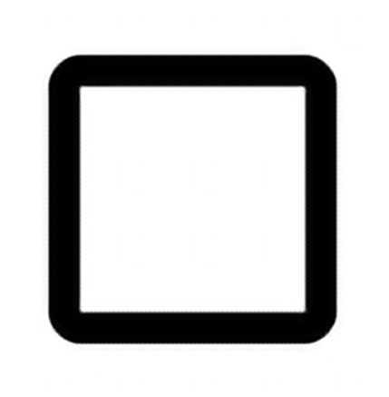 Selecione várias opções ou apenas texto.

***Passo 3:*** Toque em **Próximo** para avançar para as próximas perguntas e respondê-las conforme necessário.  O progresso nas perguntas é exibido na parte superior. As perguntas não respondidas ficarão em branco.

***Passo 4****:* Avance por todas as perguntas usando **Próximo** até chegar à última.

***Passo 5:*** Toque em **Concluído** para fechar o formulário de detalhes.

⚠️ **Aviso:** Selecionar **Concluído** não salva a observação. Isso apenas fecha o formulário.

💡*** Dica:*** Após fechar os detalhes, o editor de observação é exibido novamente. Continue adicionando informações à observação inserindo notas descritivas na área de texto aberta.
Lembre-se de tocar em  **Salvar** como etapa final.
:::

---

## Adicionando Fotos

Fotos adicionadas a uma observação são associadas às anotações, coordenadas GPS e outras informações coletadas. As fotos só podem ser adicionadas a uma observação quando tiradas com a câmera do CoMapeo. **Não é possível** anexar fotos tiradas de outros aplicativos ou vindas da galeria de imagens de um dispositivo. Da mesma forma, as fotos tiradas no CoMapeo **não são visíveis na galeria de imagens do seu dispositivo**.

Veja 🔗[Usando Observações fora do CoMapeo](/26a1b08162d5800d8342e1ab896f5485)** **para aprender sobre opções para compartilhar fotos fora de um projeto.

:::note 👣
### Passo a passo

***Passo 1****:* Quando estiver na tela “Nova observação” ou no “Editor”, toque no botão **Adicionar foto** na barra de tarefas inferior para abrir a câmera

***Passo 2:*** Enquadre a foto e toque em  para tirar uma foto. 

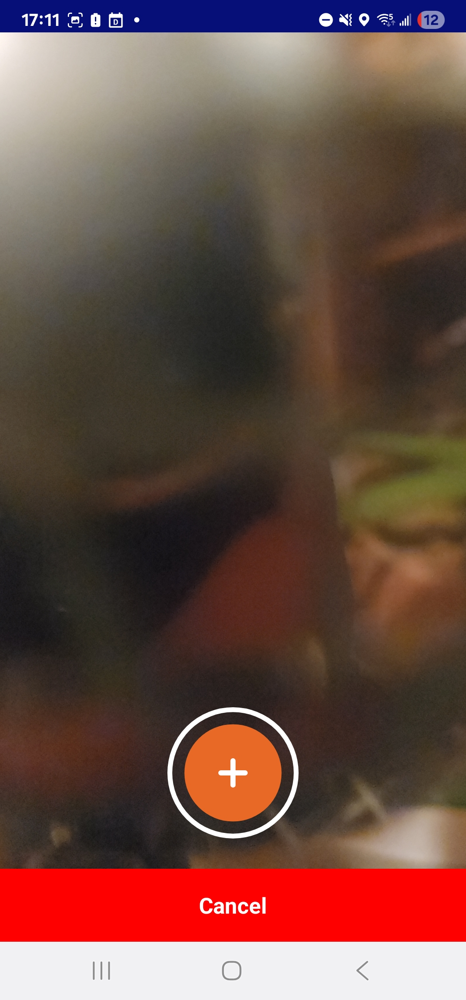

Para voltar ao editor **sem adicionar uma foto**, toque em ❌ **Cancelar**
Não há limite para o número de fotos incluídas em uma observação.
:::

:::note 💡 Dica
As fotos podem ser adicionadas ao criar uma observação, bem como ao editar observações. Os metadados da foto são salvos com cada foto para apoiar a validação.
Vá para 🔗 [Revisando uma observação](/docs/revisando-uma-observação)
:::

## Excluir uma foto

A remoção de fotos só pode ocorrer no momento em que elas estão sendo adicionadas a uma observação

:::note ⚠️ Aviso
As fotos não podem ser removidas depois que uma observação foi salva. Exclua fotos de baixa qualidade ou inúteis antes de salvar.
:::

:::note 💡 Dica
Para remover uma foto de uma observação em rascunho, toque na miniatura da imagem. A foto é exibida junto com os metadados da foto e opções.
:::

:::note 👣
### Passo a passo

***Passo 1****:* Toque na miniatura da foto para ver os detalhes da foto

***Passo 2****:* Toque no botão  **EXCLUIR FOTO**,

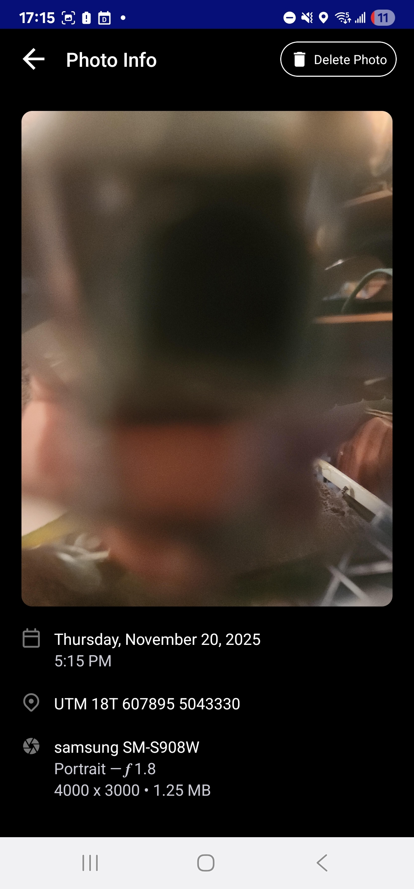

***Passo 3****:* Confirme a exclusão clicando em  **Excluir foto**.

⚠️ **Aviso**: Uma vez excluídas, as fotos não podem ser recuperadas. Para cancelar a exclusão da foto, toque em **CANCELAR.**  Volte ao Editor de Observações com a seta  **voltar**.

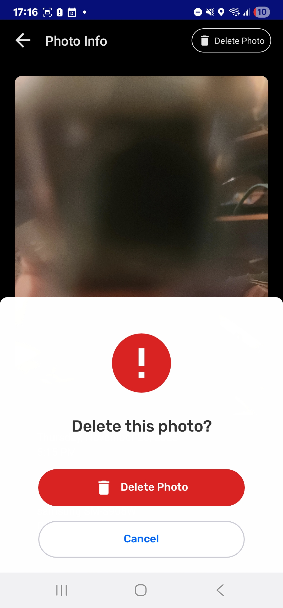
:::

---

## Adicionando Áudio

Adicionar gravações de áudio às **Observações** pode fornecer contexto, servir como testemunho oral, evidências, dados para fins de monitoramento, ou uma maneira alternativa de coletar informações em ocasiões em que escrever notas no CoMapeo é difícil ou perigoso.

As gravações de áudio serão associadas às anotações, fotos e coordenadas GPS da observação, e podem posteriormente ser exportadas ou compartilhadas junto com os outros dados. Você só pode adicionar áudio capturado dentro do aplicativo CoMapeo no momento em que coleta a observação, não é possível adicionar áudio de outras fontes.

Cada gravação de áudio pode ter até 5 minutos de duração. Você pode adicionar várias gravações de áudio a uma única observação.

:::note 👉🏽 CoMapeo em Ação
Aprenda como [este recurso é usado para documentar a biodiversidade](https://awana.digital/blog/sound-as-language-biodiversity-monitoring-and-comapeos-new-audio-recording-feature)
:::

:::note 👣
### Passo a passo

***Passo 1:***** **Selecionar  **adicionar áudio**

A gravação começará imediatamente.

---

:::note 👉🏽 Observação
Se esta for a primeira vez que você grava áudio com o CoMapeo, será necessário conceder uma permissão para usar esse recurso. **Permita** que o CoMapeo grave áudio **enquanto** **você usa o aplicativo**
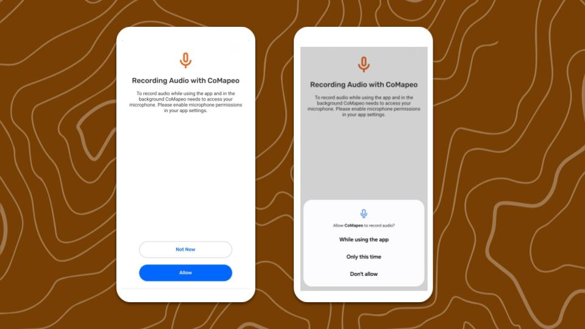
:::

---

***Passo 2*****: **Selecione ⏹️ **Parar** quando acabar a gravação.

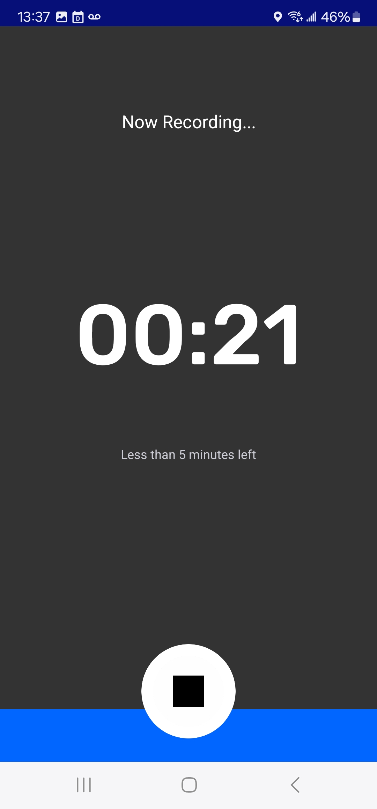

---

***Passo 3*****:** Escolha uma opção após concluir a gravação.

→  ▶️ Ouvir o áudio gravado.

→ Continuar para o editor de observações selecionando **VOLTAR À EDIÇÃO.**

→  **EXCLUIR** o áudio.

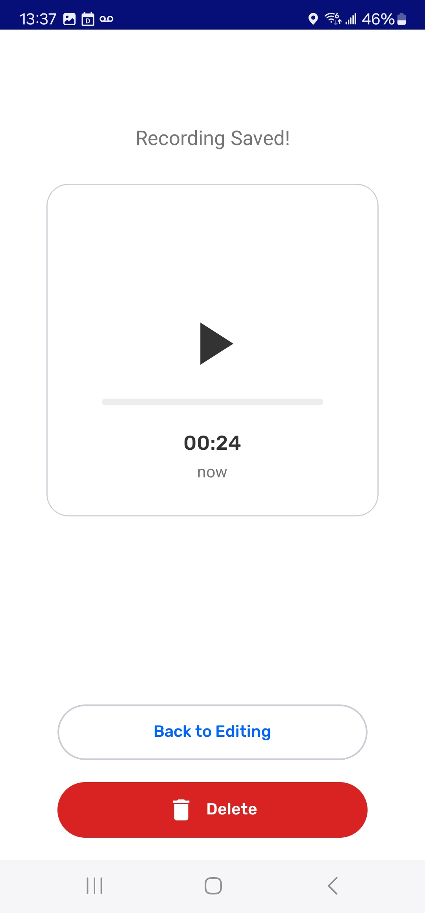
:::

---

:::note 💡 Dica
As gravações de áudio serão interrompidas automaticamente se a tela mudar, se você sair da tela de gravação ou começar a usar outro aplicativo durante a gravação, ou se a tela do telefone atingir o tempo limite e entrar em modo de suspensão. Para evitar esse problema de gravação de áudio, altere o TEMPO LIMITE DA TELA para pelo menos 5 minutos nas  configurações de exibição do seu dispositivo.
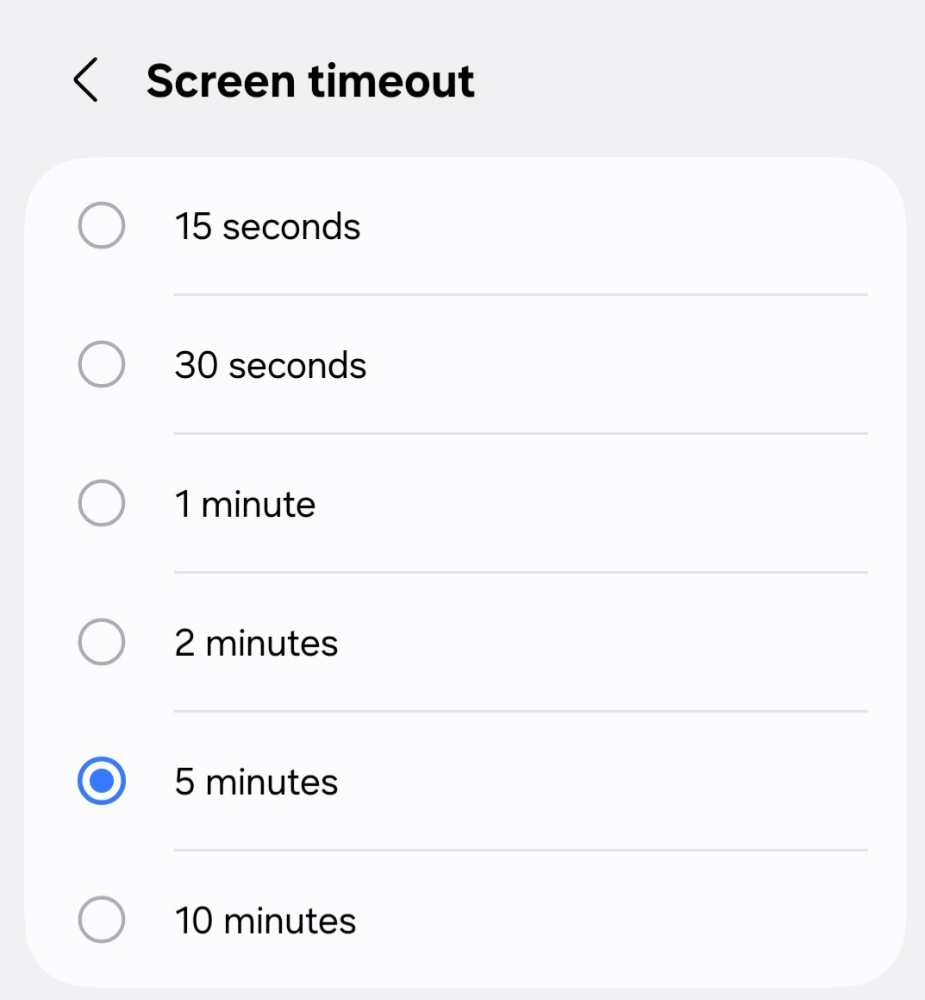
:::

---

### Excluir Áudio

A exclusão de áudio é irreversível. No entanto, é um bom motivo excluir o áudio se ele não for relevante para a observação ou para o projeto. As gravações de áudio podem ocupar uma quantidade significativamente maior de espaço de armazenamento no dispositivo em comparação com as fotos.

Depois que uma observação é salva, o áudio não pode ser excluído.

:::note 👣
### Passo a passo

***Passo 1****:* Toque na miniatura do áudio para ouvir uma prévia da gravação

***Passo 2****:* Toque no botão  **EXCLUIR**.

⚠️**Aviso**: Uma vez excluída, a gravação de áudio não pode ser recuperada.

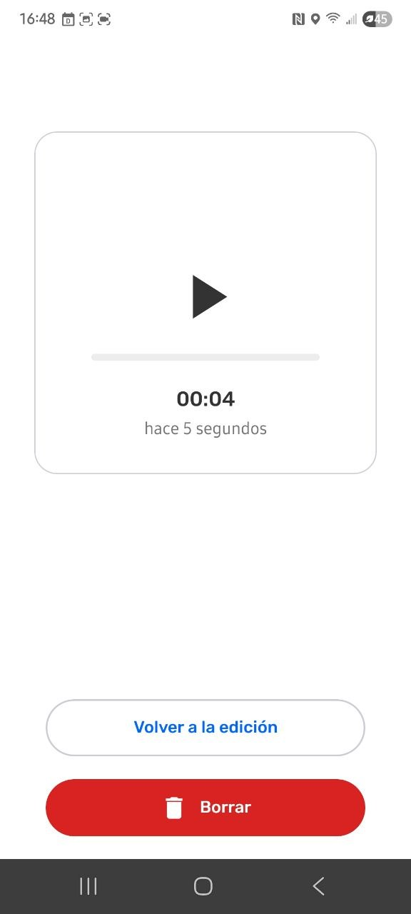
:::

:::note 💡 Dica
Para evitar que os arquivos de mídia ocupem espaço no armazenamento do dispositivo ao trabalhar em equipe, ajuste as configurações da Troca.
Acesse: 🔗 [Entendendo como a Troca funciona → Ajustando as configurações de Troca](https://www.notion.so/docs/understanding-how-exchange-works/#adjusting-exchange-settings) para saber mais.
:::

---

## Salvando uma Observação

Salve uma observação tocando no botão azul  no topo da tela. Uma vez que uma observação tenha sido salva, ela aparecerá na lista de observações e na tela do mapa.

Informações salvas que não podem ser alteradas:

- Coordenadas GPS

- Data e hora

- Metadados de observação

- Fotos tiradas quando a observação é salva

Existem vários outros tipos de dados que podem ser editados após uma observação ser salva. Isso é útil para situações que exigem coleta rápida de dados e conclusão completa de descrições e detalhes.

🔗 Ir para [Editando observações](/docs/editando-observacoes)** **para mais informações.

## Salvando quando a precisão do GPS está baixa

**Precisão do GPS **é uma propriedade de metadados calculada pelo sensor GPS em um dispositivo. Ela é baseada em informações fornecidas por satélites. Esta informação é exibida no CoMapeo Mobile na tela do mapa e na tela da câmera, à esquerda do botão de captura . Ele também é exibido nas coordenadas  na tela **Criar observação** e será atualizado até que a observação seja salva.

Se as  coordenadas têm uma precisão pior que ±10m ou se não houver sinal de GPS no momento de salvar a observação, o CoMapeo oferece três opções.

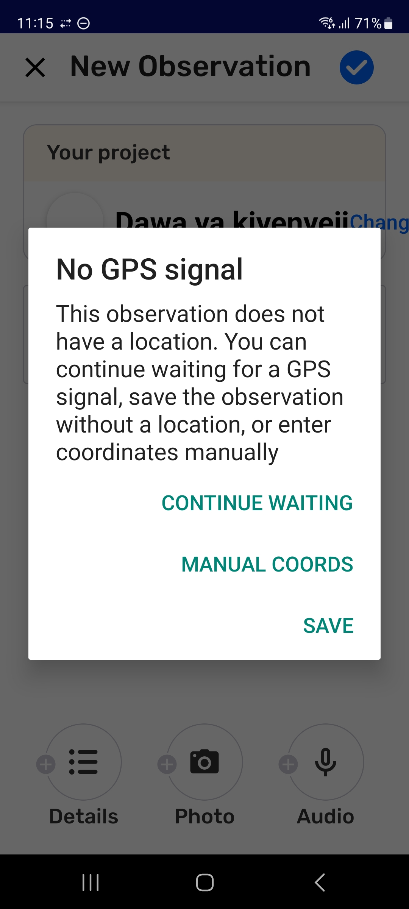

- **Continu****ar esperando **até que o sinal do GPS melhore para obter melhor precisão. O tempo e pequenas manobras no dispositivo geralmente ajudam. Verificar as coordenadas até que a precisão seja melhor que ±10m, e tocar em  então, impedirá que o aviso do GPS apareça novamente.

- **Salvar **para usar as coordenadas GPS atuais, mesmo que a precisão seja pior que ±10m. Considere se isso é satisfatório para o objetivo dos dados.
:::note 💡 Dica
Se você salvar uma observação sem coordenadas GPS, ela não aparecerá no seu mapa, mas ainda aparecerá na sua lista de observações.
:::

- **Entrada manual de coordenadas **é uma opção prática apenas se você tiver acesso a outro dispositivo GPS com sensores e precisão melhores. Medidas alternativas devem ser tomadas se a validação de dados for importante para a observação.

---

## Entrada manual de coordenadas

A entrada manual de coordenadas nunca é uma situação ideal, mas às vezes é necessária se o sensor GPS de um telefone não alcançar adequadamente os satélites GPS. Isso pode acontecer em regiões remotas, sob copas de árvores densas, em edifícios ou quando a cobertura de nuvens é intensa.

:::note ⚠️ Aviso
O CoMapeo não pode validar observações em que as coordenadas foram inseridas manualmente. O CoMapeo valida observações incluindo metadados de GPS de sensores e anexando dados relevantes como Metadados de Observação. Observações sem esses detalhes serão exibidas como não validadas pelo CoMapeo.
:::

:::note 💡 Dica
Uma alternativa para validar dados é  **adicionar uma foto** à observação das coordenadas e da precisão exibidas em um dispositivo com um sinal de GPS melhor. Faça isso *antes *de você inserir as coordenadas manualmente.
Ao enviar essas observações para análise jurídica ou científica, envie a observação juntamente com os metadados da observação e os metadados da foto.
:::

:::note 👣
### Passo a Passo

***Passo 1: ***Selecionar **COORDENADAS MANUAIS **para abrir a tela **Inserir Coordenadas.**

💡**Dica: **Para retornar às opções, toque no  Botão Voltar

**Passo 2: **Escolha seu **Formato de Coordenadas**, para corresponder ao formato do outro dispositivo.
Opções incluem Graus Decimais, Graus/Minutos/Segundos ou Universal Transverse Mercator.

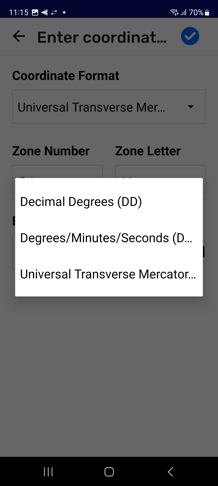

***Passo 3: ***Leia cuidadosamente e copie os detalhes das coordenadas do outro dispositivo. **Insira os valores necessários **completando todos os campos.

:::note ⚠️ Aviso
Não há como editar as informações de coordenadas inseridas após  salvar.
:::

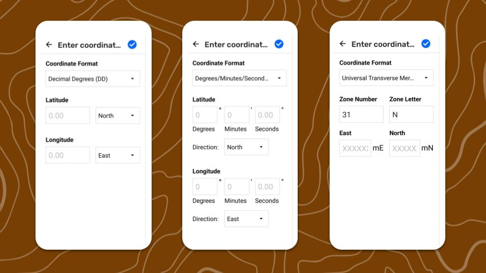

***Passo 4: ***Toque em  **Salvar. **A observação é salva com as coordenadas ao mesmo tempo.
:::

---

## Conteúdo Relacionado

Acesse 🔗[Explorando a Lista de Observações](/docs/explorando-a-lista-de-observacoes)

Acesse 🔗[Revisando uma observação](/docs/revisando-uma-observação)

### **Tendo problemas?**

Vá para 🔗[Solução de Problemas: Observações e Trilhas](/docs/solucao-de-problemas-observacoes-e-trilhas)** **

