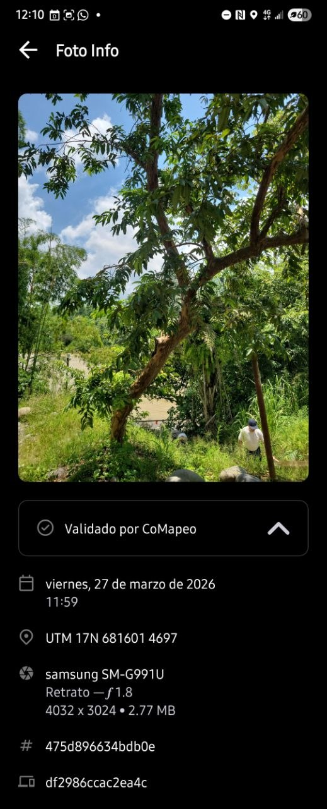
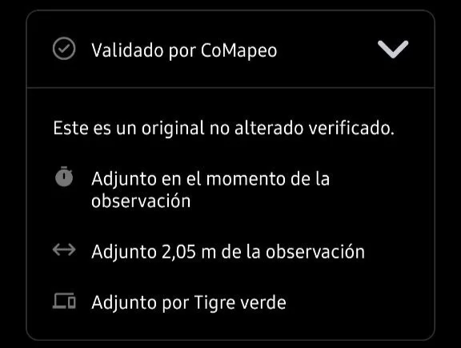
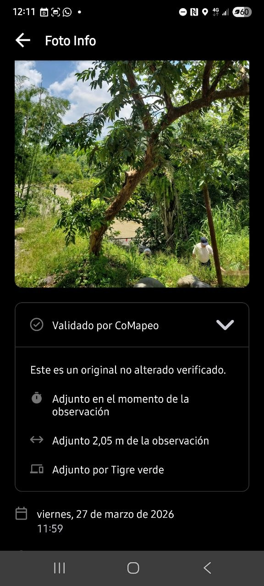

---

---

# **Revisar una sola Observación & Trayecto**

## **Revisión de una Observación**

Una **Observación** es un dato vinculado a una categoría y asociado a un único conjunto de coordenadas, que representa un punto en un mapa. Puede contener diversa información que ayuda a contar una historia o servir como evidencia. Las Observaciones se recopilan en CoMapeo y constituyen las principales fuentes de datos, junto con los trayectos.

:::note 💡 Consejo
Para abrir una Observación y editarla, selecciónala desde el  mapa o desde la  Lista de observaciones.
:::

### **¿Por qué revisar una observación?**

Revisa una observación para ver toda la información que se guardó con ella. La revisión puede ayudar a confirmar los detalles, verificar las evidencias y garantizar que los datos sean completos y precisos.

### **¿Qué información contiene una observación?**

### **Información añadida automáticamente**

Esta información procede de los sensores del dispositivo, la configuración del dispositivo y el uso de la aplicación, y no se puede modificar.

** Coordenadas y precisión**
La ubicación de la observación se muestra en la vista previa del mapa. Este suele ser el dato más importante a incluir, cuando se trata de una observación o se quiere compartirla, especialmente con las autoridades y los especialistas en SIG.

**Registro de fecha y tiempo**

Esta información procede de la configuración del sistema del dispositivo, en el momento en que se registró la observación.

**Metadatos de la Observación**

Son los metadatos asociados a las coordenadas registradas. Cuando el GPS está activado, estos metadatos se capturan directamente de los sensores y añaden información técnica que puede ser de interés para cualquiera que realice un análisis forense de una observación. Hay una pantalla específica para mostrar esta información.

**Trayecto correspondiente**

Si la Observación se registró mientras se grababa una trayecto, también aparecerá la etiqueta del trayecto.

### **Información añadida manualmente**

**Categoría**

El nombre de la categoría y el icono se muestran juntos

**Descripción**

Notas añadidas en el área de texto

**Detalles**

Respuestas del formulario **Detalles** (si se ha completado), que incluye campos de texto o preguntas estructuradas asociadas a la categoría elegida.

:::note 💡 Consejo
Comprueba que la información añadida describe correctamente lo que se observó. Si hay algo que deba revisarse o aclararse, se puede editar.
Ir a 🔗 [Edita Observaciones y Trayectos](/docs/edita-observaciones-y-trayectos)[ → Edit an Observation](/docs/edita-observaciones)
:::

### **Archivos multimedia**

Si se añaden fotos o archivos de audio a una observación, éstas se adjuntan automáticamente a ella.

**Miniaturas y vistas previas de fotos**

Todas las miniaturas de las fotos tomadas se mostrarán en un carrusel horizontal.

**Metadatos de las fotos**

Una pantalla que muestra los metadatos asociados a una foto tomada con CoMapeo.

**Miniaturas de audio y reproducción**

Se mostrará una miniatura de audio por cada grabación. Los archivos de audio se pueden reproducir o compartir desde CoMapeo Móvil, y descargar desde CoMapeo Desktop.

## **Validación de datos en CoMapeo**

Poder confiar en los datos, en su procedencia y en que no han sido manipulados es importante para generar confianza en las herramientas y en las metodologías de recopilación de datos. También puede ser fundamental si los datos van a ser admitidos en casos judiciales, en cuyo caso las pruebas deben ser trazables y verificables, lo que significa que se debe poder confirmar cómo, cuándo y dónde se recopilaron los datos.

Una observación **validada por CoMapeo** cuenta con coordenadas GPS y fotos registradas mediante CoMapeo, que se utilizan como medio para reforzar su valor probatorio. Para ello, CoMapeo requiere permisos relacionados con la localización de tu dispositivo y el uso de la cámara del mismo. Sin estos dos permisos, CoMapeo aún puede recopilar datos a través de opciones de introducción manual, pero estos se marcan como **observaciones no validadas**, ya que CoMapeo no puede garantizar que se hayan ingresado correctamente.

**Los metadatos de observación** que se muestran en CoMapeo siempre incluirán la fecha y la hora, las coordenadas GPS, la latitud y la longitud.

Los metadatos  **validados** también mostrarán la precisión, la altitud, la precisión de la altitud y la velocidad.

Los metadatos  **no validados** mostrarán el mensaje “*Estos datos se han introducido manualmente”*, para dejar claro que las coordenadas proceden de una introducción manual y no del GPS automático y verificable del teléfono.

:::note 👉🏾 Más información
Si se guarda el archivo con coordenadas ingresadas manualmente, la mayor parte de los metadatos del GPS no estarán disponibles y aparecerá un aviso indicando que la observación no está validada.
:::

:::note 👉🏾 Consejo
Para compartir los metadatos de la Observación con alguien de tu equipo, utiliza  **Compartir**. Elige entre correo electrónico y WhatsApp para abrir un borrador de mensaje con formato, listo para enviar.
:::

**Los metadatos de las fotos** son datos que captura un smartphone y que son específicos de cada foto tomada. Se muestran debajo de la foto.

Si existen dudas de la validez de una foto en una observación, los metadatos de la foto pueden incluirse como prueba. Estos metadatos incluyen:

- Registro de fecha y hora

- Coordenadas GPS de la fotografía

- Metadatos del dispositivo: tipo de dispositivo, detalles de la cámara (incluida la apertura) y tamaño de la foto

- ID de la observación

- ID del dispositivo

Abrir  **Validado por CoMapeo **para ver detalles adicionales que indican la proximidad, tanto en tiempo como en distancia, entre el momento en que se tomó la foto y el momento en que se guardó la observación.

:::note 👉🏾 Consejo
Para capturar toda la información disponible en una sola imagen, utiliza la opción desplázate hacia abajo , que aparece temporalmente luego de realizar una captura de pantalla.

:::

### Revisión del audio

Las grabaciones de audio se pueden revisar en CoMapeo Móvil seleccionando la miniatura y pulsando _12.57.02_p.m..png) **Reproducir.**

## Revisión de un Trayecto

Revisa un **Trayecto** para ver la información que se guardó en él. Los Trayectos aparecen en orden cronológico junto con las observaciones en la **Lista de observaciones**, acompañadas de un icono de la categoría. También pueden contener notas adicionales y asociaciones con Observaciones recopiladas entre el punto de inicio y el punto final.

:::note 💡 Consejo
Para revisar un Trayecto, puedes abrirlo seleccionándolo en el  mapa o desde la  lista de observaciones.
:::

### ¿Qué información contiene un recorrido?

> [!NOTE]
> Unsupported Notion block: `heading_4`

Esta información procede de los sensores del dispositivo, la configuración del dispositivo y el uso de la aplicación, y no se puede modificar.

**Polilínea**

La combinación de segmentos de línea conectados que forman una línea registrada dinámicamente en un mapa, tal y como la registran los sensores del dispositivo durante un intervalo de tiempo específico. En la cartografía, las polilíneas se utilizan habitualmente para dibujar elementos lineales en un mapa, como caminos, límites o ríos.

**Registro de fecha y hora**

Esta información procede de la configuración del sistema del dispositivo en el momento en que se guarda el trayecto.

**Observaciones correspondientes**

Cualquier Observación registrada mientras se graba un Trayecto también aparecerá en una lista desplegable en la pantalla del trayecto. La vista de las observaciones correspondientes es muy útil para comprender lo que ocurrió a lo largo de un viaje.

### Información añadida manualmente

**Categoría**

El nombre y el icono de la categoría se muestran juntos.

**Descripción**

Notas añadidas en el área de texto para explicar por qué es importante el trayecto o cuál es el uso previsto de la información.

:::note 👉🏾 Más información
La única forma de ver la descripción del trayecto en el móvil es en la pantalla de edición.
Ve a 🔗 [Edición de observaciones y rutas → Editar una ruta](/docs/edita-observaciones)
:::

### **Más acciones disponibles**

 Editar una Observación o Trayecto

 Eliminar una Observación o Trayecto 

 Compartir una Observación o Trayecto

### **Contenido relacionado**

Ir a 🔗 [Edita Observaciones y Trayectos](/docs/edita-observaciones-y-trayectos)

Ir a 🔗 [Borrando Observaciones y Trayectos](/docs/borrando-observaciones-y-trayectos)

Ir a 🔗 [Comparte una sola Observación y Metadatos](/docs/comparte-una-sola-observacion-y-metadatos)

Ir a 🔗 [Solución de Problemas: Observaciones y Trayectos](/docs/solucion-de-problemas-observaciones-y-trayectos)

Ir a 🔗 [Solution: Check app permissions](/docs/revisa-una-sola-observacion-y-trayecto)

### **¿Tienes problemas?**

Ir a 🔗 [Solución de Problemas: Observaciones y Trayectos](/docs/solucion-de-problemas-observaciones-y-trayectos)

---

