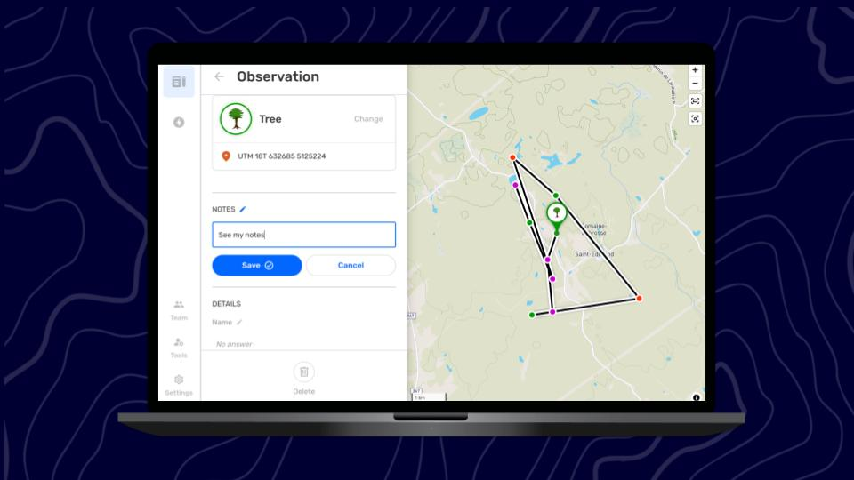

---

[image]

## Porquê editar observações e percursos?

A opção *Editar observações* ajuda a melhorar a qualidade da informação coletada. A edição oferece uma solução simples para alguns desafios comuns que se encontram no trabalho de campo:

- Corrigir erros de digitação e outros erros humanos.

- Corrigir a informação após consultar especialistas ou referências confiáveis.

- Salvar rapidamente uma observação para obter as coordenadas corretas e, em seguida, deslocar-se para um local seguro antes de adicionar informações detalhadas.

- A gravação de áudio é utilizada em campo para descrever a observação e, posteriormente, utilizada como fonte de informação para adicionar uma descrição escrita e completar os detalhes.

Antes de editar, reveja uma observação ou um percurso para determinar se são necessárias edições.

:::note 💡 Dica
Existe um processo comum no mapeamento participativo chamado **validação**, no qual as informações coletadas pelos participantes da atividade são analisadas por outras pessoas de confiança e com experiência. Recomenda-se a organização de processos de validação transparentes com as pessoas envolvidas no projeto, de modo a garantir que as informações coletadas sejam de alta qualidade e atualizadas. Recomenda-se a prática rotineira deste processo antes de compartilhar as informações fora do CoMapeo, para reduzir a necessidade de edição em software menos acessível.
:::

## Permissões limitadas para Editar e Deletar

As Observações e Trilhas criadas num dispositivo podem sempre ser editados ou deletados nesse mesmo dispositivo. Isto significa que o autor pode sempre editar ou deletar as suas próprias observações e trilhas, desde que não tenha mudado de dispositivo.

Um dispositivo com a função de  **Coordenador** num projeto tem permissão para editar ou deletar todas e quaisquer observações e percursos nesse projeto. Isto permite que os coordenadores ajudem os participantes a completar ou corrigir informações.

Um dispositivo com a função de  **Participante** num projeto **não** pode editar observações ou trilhas recebidos através da  **Troca**. Na lista de observações, as observações e percursos recebidos são identificados com uma linha azul à esquerda.

[image]

:::note 👉🏽 Mais
Essas permissões são aplicadas ao CoMapeo Mobile e ao CoMapeo Desktop.
:::

Acesse 🔗 [Selecionar funções de dispositivos e equipes → Funções disponíveis no CoMapeo](https://www.notion.so/docs/selecting-device-roles-and-teams/#roles-available-in-CoMapeo)** **para saber mais.

## Editar uma observação

### O que pode ser editado numa observação?

**Informações adicionadas manualmente podem ser editadas**

- Categoria

:::note 👉🏾 Mais
Ao alterar a categoria, os campos associados serão atualizados para permitir a introdução de detalhes. Faça isso antes de editar os detalhes.
:::

- Descrição

- Detalhes, incluindo respostas curtas e selecionadas

**Fotos e áudios podem ser adicionados**

É possível adicionar fotos e áudios ao editar uma observação. Isto visa melhorar a qualidade das observações coletadas em condições adversas. As fotos e áudios não podem ser eliminados depois de salvos.

:::note 💡 Dica
adicionar imagens de materiais de referência ou gravar testemunhos e histórias relevantes pode enriquecer a qualidade de uma observação.
:::

Os metadados das fotos adicionais incluem informações de localização no momento em que cada foto é tirada. Os metadados das fotos podem ser visualizados ao rever uma observação, mas nunca editados.

Acesse 🔗 [Revisão de observações individuais e percursos → Validação de dados no CoMapeo](https://www.notion.so/docs/reviewing-individual-observations-and-tracks/#data-validation-in-comapeo)  para saber mais

### O que não pode ser editado?

**As informações adicionadas automaticamente não podem ser editadas**

-  Coordenadas e precisão

- Data e carimbo de data/hora

- Metadados da observação

- Associação com a Trilha correspondente

:::note 👉🏾 Mais
Estas informações provêm dos sensores do dispositivo, das definições do dispositivo e da utilização da aplicação, e não podem ser modificadas.
:::

[image]

:::note 👣
### Passo a Passo - Celular

***Passo 1:*** Clique em  **Editar **para abrir o editor

---

***Passo 2:*** Confirmar ou **mudar** a Categoria

---

***Passo 3:***** Editar a descrição **conforme necessário.

***Passo****** ******4:***** Editar**   **detahes**, conforme necessário.

***Passo 5:***** Adicionar**   [fotos](#adding-photos) complementares, e  [áudio](#adding-photos) conforme necessário.

---

***Passo 6:*** Clicar em  **Salvar** para salvar as edições nas suas observações  

:::

:::note 👣
### Passo a Passo -  Computador

:::note 💡 Dica
Clique nos campos que precisam ser editados. O ícone de  **Edição** ficará azul para indicar que está a editar. Lembre-se de  **Salvar** após cada alteração.
:::

---

***Passo 1:*** Confirmar ou **mudar **a Categoria

---

***Passo 2:***** Editar a descrição **conforme necessário.

***Passo 3:*** Clique em  **Salvar** para salvar a nova descrição.  

***Passo 4:***** Editar**   **detalhes**, conforme necessário.

---

***Step 5:*** Clique em   **Salvar** após cada edição.
:::

:::note 👉🏾 Mais
No CoMapeo Desktop, é possível eliminar definitivamente as fotos desnecessárias com acesso de edição.
Acesse 🔗** **[Excluir observações e trilhas → Excluir ficheiros multimídia](https://www.notion.so/digidem/docs/deleting-observations-and-tracks/#deleting-media)** **para saber mais
:::

## Editar uma trilha

### O que pode ser editado numa trilha?

**As informações adicionadas manualmente podem ser editadas**

- Categoria

- Descrição

### O que não pode ser editado?

**As informações adicionadas automaticamente não podem ser editadas**

- Polilinha

- Data e carimbo de data/hora

- Associação com as observações correspondentes

A edição de trilhas é utilizada para corrigir a categoria ou para visualizar, adicionar ou corrigir a descrição.

:::note 👣
### Passo a Passo: Celular

***Passo 1:*** Selecione uma Trilha para revisar a partir do  Mapa ou pela  Lista de Observações. 

***Passo 2:*** Clique em  **Editar **para abrir o editor.

---

***Passo 3:*** Confirme ou **mude** a Categoria

---

***Passo 4:***** Edite a descrição **conforme necessário.

---

***Passo 5:*** Clique em  **Salvar** para salvar as edições em sua trilha.  
:::

## Como funcionam as funções Editar e Apagar durante a Troca de dados

Quaisquer alterações numa Observação ou numa Trilha serão atualizadas em outros dispositivos durante a Troca. Isto inclui categorias e notas editadas, fotos e áudios adicionados, bem como exclusões. O CoMapeo apresentará sempre a versão mais recente disponível de uma observação ou de um percurso.

Ao trabalhar em equipe, é melhor ter um protocolo acordado para editar, deletar e trocar as informações coletadas. Isto ajudará a evitar conflitos de dados; por exemplo: se uma observação tiver sido trocada com um ou mais dispositivos coordenadores, é possível que um edite uma observação e outro elimine essa mesma observação.

Acesse 🔗** **[Compreender como funciona a troca → E se houver um conflito de dados](https://www.notion.so/docs/understanding-how-exchange-works/#what-if-there-is-a-data-conflict)[?](https://www.notion.so/docs/understanding-how-exchange-works/#what-if-there-is-a-data-conflict)  para saber mais

## Conteúdo relacionado

Acesse 🔗** **[Criar uma nova observação](https://www.notion.so/docs/creating-a-new-observation)

Acesse 🔗 [Explorar a lista de observações](https://www.notion.so/docs/exploring-the-observations-list)

Acesse 🔗 [Revisão de observações e trilhas individuais](https://www.notion.so/docs/reviewing-individual-observations-and-tracks)

Acesse 🔗** **[Deletando observações e trilhas](https://www.notion.so/docs/editing-observations-and-tracks)** **

Ir para 🔗** **[Selecionar funções de dispositivos e equipes](https://www.notion.so/docs/selecting-device-roles-and-teams)

### **Está com** dificuldades?

Acesse 🔗 [Resolução de problemas: Observações e registros](https://www.notion.so/docs/troubleshooting-observations-and-tracks)

---

