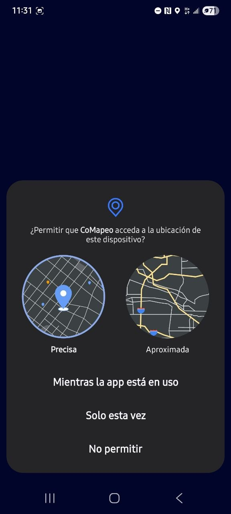
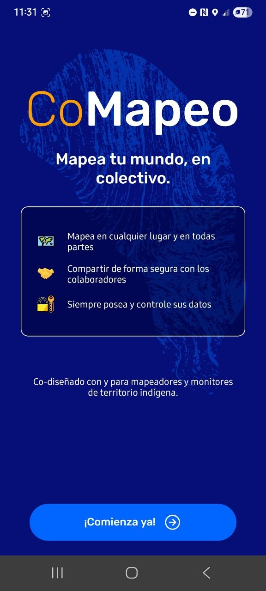
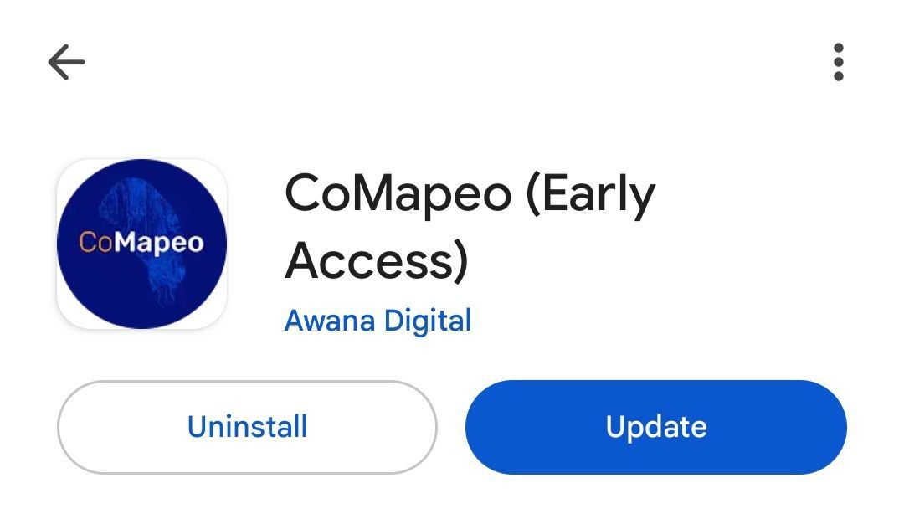

---

CoMapeo Móvil está disponible para  Android en Google Play Store y como APK

CoMapeo Desktop está disponible para Windows, Linux y Mac.

Ir a 🔗 [Obtén CoMapeo](https://comapeo.app/download)

---

## Instalando CoMapeo Móvil

Ir a 🔗[Obtén CoMapeo](https://comapeo.app/download)

:::note 💡 Consejo
Antes de instalar CoMapeo, asegúrate de que la batería del dispositivo esté cargada, y de que haya una conexión estable a Internet para facilitar la descarga. Considera realizar una verificación de mantenimiento de tu dispositivo antes de instalar nuevas aplicaciones.
:::

### **CoMapeo en Google Playstore**

Se recomienda Instalar desde Google Playstore porque facilita las actualizaciones de la aplicación.

---

:::note 👣
**Paso a paso**

***Paso 1: ***Busca CoMapeo, creado por Awana Digital, en Google Playstore.

***Paso 2: ***Selecciona Instalar

***Paso 3: ***Espera a que CoMapeo Móvil se descargue, luego instálalo

📼[VIDEO WALKTHROUGH](https://drive.google.com/file/d/1QWKYMfgGk2Qh8jGez_ZrwWhck8n_gn26/view?usp=drive_link)
:::

---

:::note 👉🏾 Más
Otra opción es descargar el **Android APK **de CoMapeo desde nuestra web. Si CoMapeo se instala de esta manera,** no se actualiza automáticamente.**
Ir a 🔗[Obtén CoMapeo](https://comapeo.app/download)
:::

## Inicio de la Aplicación

Busca el ícono de CoMapeo donde se encuentran las aplicaciones descargadas en tu dispositivo.

CoMapeo Móvil, como todas las aplicaciones nuevas, aparecerá al final de la pantalla de aplicaciones de los dispositivos  Android

:::note 💡 Consejo
CoMapeo se puede abrir directamente desde Google Play Store, una vez completada la instalación

:::

---

## Primeros pasos

Estos primeros pasos son necesarios para configurar los dispositivos y permitir que CoMapeo utilice las funciones disponibles. Esto incluye el almacenamiento y sensores esenciales como la cámara y el GPS. Para una experiencia sencilla, CoMapeo solicitará permiso para acceder a sensores adicionales, la primera vez que se utilicen funciones como trayectos y audio. Esto solo ocurrirá la primera vez que abras el aplicativo, e incluye:

**Pantalla de bienvenida **

Se te invitará a [Comenzar] y se te pedirán permisos de dispositivo.

**Política de datos y privacidad**

La aplicación presentará los datos que recopila, y podrás elegir [participar] o [no participar]. Esto también puedes cambiarlo luego en: **Configuración > Privacidad de datos**

Ver Política de Privacidad en inglés :[CoMapeo Datos y Privacidad](https://digidem.notion.site/CoMapeo-Data-Privacy-d8f413bbbf374a2092655b89b9ceb2b0)

**Nombre del dispositivo**

Debes ingresar un nombre para el dispositivo. Este es el nombre que otros dispositivos verán al invitarte a un proyecto, y se mostrará en la lista de miembros del proyecto.

:::note 👣
### **Paso a Paso: Móvil**

---

***Paso 1: *****Dar permiso para que CoMapeo tome fotografías. **La cámara de CoMapeo es una de las principales funciones de la aplicación. Sin este permiso, la cámara de CoMapeo mostrará una pantalla negra. Otras secciones de la aplicación seguirán funcionando.

---

***Paso 2: *****Conceder permiso para acceder a la ubicación**

CoMapeo necesita acceder a la ubicación del dispositivo para recopilar coordenadas GPS y guardarlas en Observaciones. Sin este permiso, CoMapeo aún podrá utilizarse, pero de manera limitada. Las Observaciones aún podrán guardarse con la opción de ingresar coordenadas GPS manualmente.

Las versiones más recientes de Android ofrecen opciones de datos de ubicación precisos o aproximados. **Elige “precisos” **para recopilar datos más exactos.

---

***Paso 3: ***Seleccionar **Comenzar **en la pantalla de bienvenida de CoMapeo

---

***Paso 4: *****Conoce más sobre Datos y Privacidad**

Descubre más sobre cómo Awana Digital ha construido CoMapeo para mantener tus datos seguros y protegidos.

Haz clic en Más información para obtener más detalles sobre la privacidad de datos y conocer qué datos se envían a Awana Digital para mejorar la aplicación.

Aquí también puedes elegir **participar **o **no participar **en compartir datos de diagnóstico. Esto lo puedes cambiar en cualquier momento, en:  Configuración → Privacidad de datos.

Ir a 🔗[CoMapeo Datos y Privacidad](https://digidem.notion.site/CoMapeo-Data-Privacy-d8f413bbbf374a2092655b89b9ceb2b0)** **para revisar la Política de Privacidad en inglés

---

***Paso 5*****: Nombra tu dispositivo**

- Se requieren nombres para todos los dispositivos en CoMapeo.

- Los nombres de los dispositivos se muestran en funciones de colaboración de CoMapeo, como:
  - Invitar a compañeros de equipo a unirse a un proyecto; y
  - Ver a los compañeros de equipo en un proyecto.

- Los nombres se pueden cambiar con facilidad.

- Nombrar dispositivos en un proyecto de equipo puede requerir seguir protocolos o acuerdos establecidos con las personas del equipo.

- Las opciones para los nombres incluyen: el nombre de la persona que posee el dispositivo, un apodo para el dispositivo, o un nombre en clave utilizado en tu equipo por razones de seguridad.

:::note 💡
Consejos:
- En contextos donde la seguridad es una preocupación, utiliza algo anónimo, como un nombre en clave o seudónimo. 

- Pon una pegatina con el nombre en cada teléfono, si lo utilizan varias personas.
:::

---

***Paso 6: *****¡CoMapeo está listo para usarse! **Elige  **Unirse a un Proyecto **o  **Mapea por tu cuenta**

Para explorar CoMapeo y configurar un proyecto, selecciona  **Mapea por tu cuenta**

:::note 💡 Consejo
Para unirse a un proyecto, un usuario diferente de CoMapeo debe tener un proyecto configurado y debe invitar dispositivos para crear un equipo en CoMapeo.
Ir a 🔗[Invitar Colaboradores](/docs/invita-colaboradores)** **para más instrucciones
:::

La próxima vez que inicies CoMapeo, será en el 

---

Ir a 🔗[Uso Inicial y Configuración de CoMapeo](https://notion.so/docs/initial-use-and-comapeo-settings)**

****For CoMapeo Desktop**
:::

## Actualizar CoMapeo

Las versiones más actualizadas de CoMapeo están disponibles en el [sitio web de CoMapeo](http://comapeo.app/)** **y en [Google Play Store](https://play.google.com/store/apps/details?id=com.comapeo&pcampaignid=web_share&pli=1)**.**

Google Play mostrará un botón de actualización cuando haya una nueva versión disponible con errores solucionados y, a veces, nuevas funciones.

Ir a 🔗 [Obtén CoMapeo](https://comapeo.app/download)

:::note 💡 Consejo
CoMapeo Móvil se puede configurar para actualizarse automáticamente, a través de las opciones disponibles en la aplicación de Play Store.

:::

---

## Contenido relacionado

Ir a 🔗 [Uso Inicial y Configuración de CoMapeo](/docs/uso-inicial-y-ajustes-de-comapeo)

Ir a 🔗 [Desinstalar CoMapeo](/docs/desinstala-comapeo)

### ¿Tienes problemas?

Ir a 🔗[Solución de problemas: Configuración y Personalización](/docs/solucion-de-problemas-configuracion-y-personalizacion)

---

