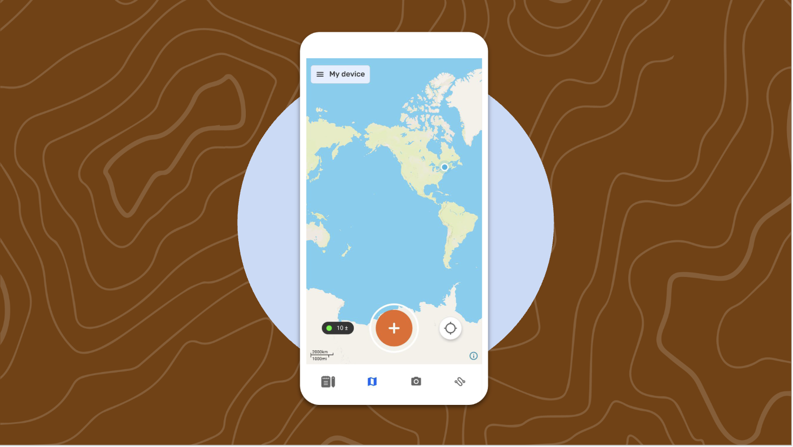
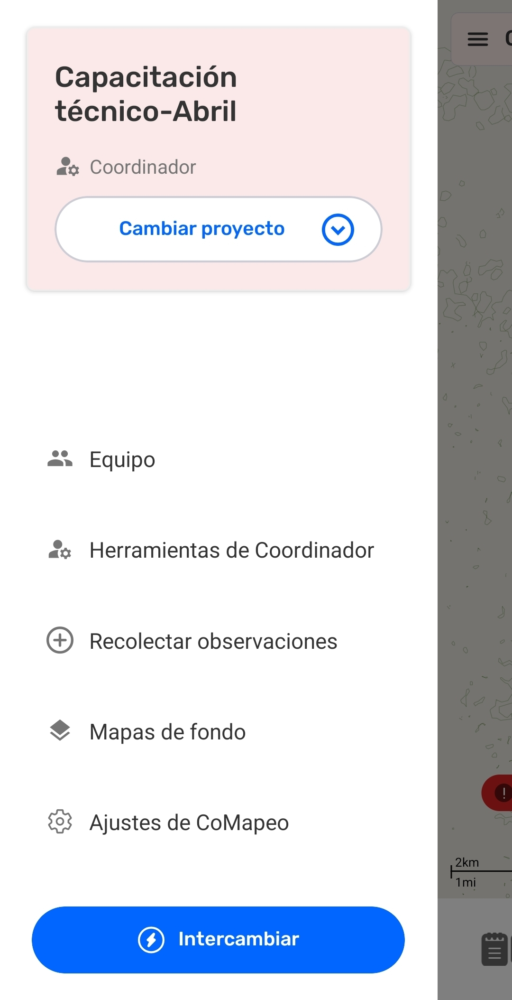
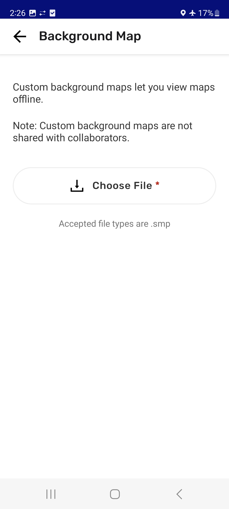
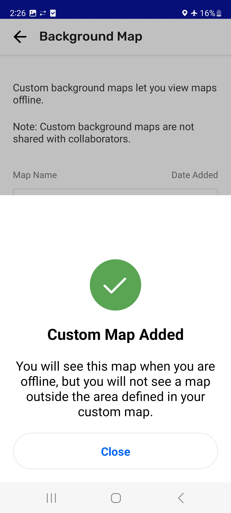
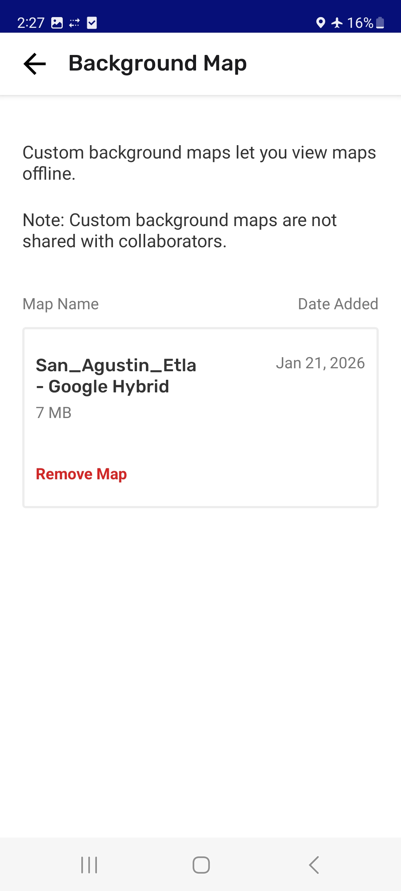
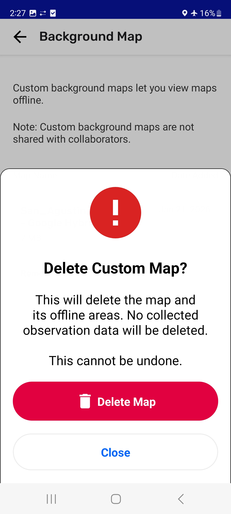

---

# Cambiar mapas de fondo

CoMapeo viene con dos mapas de fondo predeterminados.

- El **Mapa detallado** se cargará cuando hay conectividad a internet

- El **Mapa sin conexión** tiene detalles mínimos que aparecen cuando no hay conectividad a internet.

El cambio entre mapas predeterminados es automático y se basa en la presencia o ausencia de conectividad a internet.

## Usar un mapa de fondo personalizado

Un equipo que ha creado un **Mapa de Fondo personalizado,** utilizando una herramienta de creación de mapas para incluir referencias y detalles importantes, puede convertirlo a formato .smp, y utilizarlo en CoMapeo.

Ir a 🔗 [Crea Mapas de Fondo personalizados](/docs/crea-mapas-de-fondo-personalizados) para obtener instrucciones.

Detalles importantes a recordar:

- CoMapeo utiliza el formato de archivo .SMP para los mapas de fondo personalizados

- CoMapeo solo puede utilizar un mapa de fondo personalizado a la vez.

- CoMapeo mostrará un solo mapa de fondo personalizado en todos los proyectos de CoMapeo de un dispositivo. 
:::note 👉🏾 Más información
Un mapa de fondo personalizado se carga en un dispositivo, y no está asociado a un proyecto. No es posible que aparezcan mapas diferentes por cada proyecto.
:::
:::note 👉🏾 Más información
Los mapas no se intercambian con otros dispositivos dentro de un proyecto de CoMapeo.
:::

:::note 🚧 En Desarrollo
Se está probando una herramienta que permita compartir mapas de fondo personalizados.
Próximamente: 🔗 [Comparte el Mapa de Fondo](/docs/comparte-el-mapa-de-fondo)

Por ahora, los archivos **.SMP** necesitan descargarse en cada dispositivo, e importarse a CoMapeo, como se describe a continuación.
:::

### Cambiar a un mapa de fondo personalizado

:::note 👣
### **Paso a Paso: Móvil**

***Paso 1:*** Guarda el archivo personalizado **.smp** en el teléfono móvil. Guárdalo en la carpeta de descargas, para que sea más fácil encontrarlo.

---

***Paso 2:*** Ir al Menú Principal de CoMapeo y elige **Mapa de fondo. **

---

***Paso 3:*** **Elegir Archivo **

---

***Paso 4:*** Busca en tu teléfono y selecciona el archivo .smp que quieres utilizar como mapa de fondo en CoMapeo. Selecciónalo con la herramienta de selección de archivos.

---

***Paso 5:*** Después de unos segundos el teléfono debería mostrar una pantalla de éxito, y el mapa personalizado será listado en el menú.

***Paso 6:*** El nombre del mapa se verá en la pantalla del mapa de fondo. También, ahora aparecerá como el mapa en la pantalla del mapa. 

:::

### Reemplazar un mapa de fondo personalizado

Es común que los mapas de fondo requieran actualizaciones periódicas, especialmente ante cambios anuales en el uso del suelo, la titularidad, o los arrendamientos. Para reflejar estos cambios, el proceso de creación del mapa, la generación del archivo **.SMP** y su posterior importación debe repetirse según sea necesario.

Los pasos para reemplazar un mapa son bastante similares a cambiar a un mapa de fondo personalizado por primera vez.

:::note 👣
### **Paso a Paso**

***Paso 1:*** Ve al menú principal en CoMapeo y elige **Mapa de fondo**

---

***Paso 2:*** Aparecerá el mapa de fondo actual. Para cambiarlo, primero selecciona **Remover Mapa** y luego confirma **Eliminar Mapa**

---

***Paso 3:*** Selecciona **Elegir Archivo** y busca y selecciona el nuevo archivo .smp que quieres usar como mapa de fondo en CoMapeo

---

***Paso 4:*** Después de unos instantes, el teléfono mostrará una pantalla de confirmación, y el nuevo mapa personalizado aparecerá en el menú. También, este mapa se visualizará como el mapa en la pantalla de mapas. 
:::

## Eliminar un mapa de fondo personalizado

En el caso poco habitual de que un mapa de fondo personalizado sea menos útil que los mapas predeterminados de CoMapeo, existe la opción de eliminarlo. 

## Contenido Relacionado

Ir a 🔗 [Planificación y Preparación para un Proyecto](/docs/planificacion-y-preparacion-para-un-proyecto)

Ir a 🔗 [Crea Mapas de Fondo personalizados](/docs/crea-mapas-de-fondo-personalizados)

Ir a 🔗 [Comparte el Mapa de Fondo](/docs/comparte-el-mapa-de-fondo)

---

### ¿Tienes Problemas?

Ir a 🔗 [Solución de Problemas: Configuración y Personalización → Problemas de Conjunto de Categorías Personalizado](/docs/solucion-de-problemas-configuracion-y-personalizacion/#problemas-de-conjunto-de-categorias-personalizado)

---

