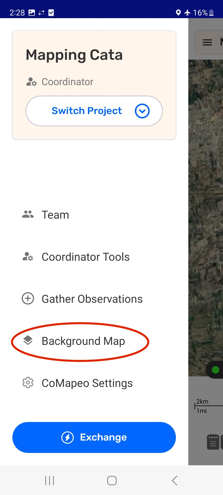

# Changing Background Maps

CoMapeo comes with a two default maps as Background Maps.

- The **Detailed Map**  will to load when there is internet connectivity.

- The **Offline Map** has minimal details appearning when there is no internet connectivity.

The switch between default maps is automatic based of the presence or absence of internet connectivity.

## Using a Custom Background Map

A team that has created a **Custom Background Map** using a map making tool to include important references and details can convert it to .smp format, for use in CoMapeo. 

Go to 🔗 [Creating Custom Background Maps](/docs/creating-custom-background-maps)** **for instructions. 

Important details to remember

- CoMapeo uses .SMP file format for Custom Background Maps

- Only one Custom background map can be used by CoMapeo at a time.

- CoMapeo will display a single Custom Background Map across all CoMapeo projects on a device. 
:::note 👉🏽 More
A Custom Background Map is loaded onto a device, and not associated with a project. It is not possible to have different maps appear for different projects.
:::
:::note 👉🏽 More
Maps do not exchange with other devices within a CoMapeo project.
:::

:::note 🚧 In Development
A map sharing tools is being tested to ba able to share Custom Background Maps

Coming soon: 🔗 [Sharing Background Maps](/docs/sharing-background-maps)

For now, **.SMP files **need to be  downloaded onto each device, and imported into CoMapeo as below.
:::

### Changing to a Custom Background Map

:::note 👣
### **Step by Step: Mobile**

***Step 1:***** ** Save the customized **.smp** file onto the mobile phone. Saving in the downloads folder makes it easy to find.

---

***Step 2:*** Go to the Main Menu in CoMapeo and choose **Background Map. **

---

***Step 3:*** **Choose File**

---

***Step 4:***** **Search for within your phone and select the .smp file you want to use as the background map within CoMapeo. Select it with the file picker tool.

---

***Step 5:***** **After a few seconds the phone should display a success screen, and the custom map will be listed in the menu. 

***Step 6: ***The map name will appear in the Background Map screen.  It will also now appear as the map on the map screen. 

:::

### Replace a Custom Background Map

It is common for information to require updating on a Background map, especially when land use designation, tenure or leases change  from year to year. To keep up with these changes, the process of map making, creating and .SMP file and Importing the file is repeated as needed. 

The steps for replacing a map are quite similar to changing to a Custome background map for the first time.

:::note 👣
**Step by Step **

***Step 1:***** **Go to the main menu on CoMapeo and choose **Background Map** 

---

***Step 2:***** **The current background map will appear. To change it first **Remove Map **and then confirm with **Delete Map**

---

***Step 3:***** **Select **Choose File** and search for and select the new .smp file you want to use as the background map within CoMapeo

---

***Step 4:***** **After a few seconds the phone should display a success screen, and the new custom map will be listed in the menu. This map should also now appear as the map on the map screen. 
:::

## Removing a Custom Background Map

For the rare scenario that a Custom Background Map is less useful than the CoMapeo Default Maps, there is an option to remove it. 

## Related Content

Go to 🔗 [Planning and Preparing for a Project](/docs/planning-and-preparing%20for-a-project) 

Go to 🔗 [Creating Custom Background Maps](/docs/creating-custom-background-maps)

Go to 🔗 [Sharing Background Maps](/docs/sharing-background-maps)  

---

### Having Problems?

Go to 🔗 [Troubleshooting: Setup and Customization → Custom Categories Set Problems](/docs/troubleshooting-setup-and-customization/#custom-category-set-problems)** **
