## What is Delete in CoMapeo? 

**Delete** is a specific kind of edit that hides observations and tracks from view within a project. It also removes associations between the different data elements that make up  observations and tracks.

:::note 👉🏽 More
Deleting observations does not free up device storage. However, in can prevent other devices from receiving media files that would otherwise take up device storage after exchange.
:::

## Why Delete an Observation  or Track

When an observation or track has no value or is potentially harmful in some way, it should be deleted. 

- Reduces inclusion of irrelevant data in a project.

- Hides information that may be result in a threat to personal or team safety.

:::note 💡 Tip
To reduce use of storage space on a device, delete inadequate media before saving the observation.
:::

## Limited Permissions for Edit and Delete

Observations and Tracks created on a device can always be edited on, or deleted from, that same device. This means that the author can always edit or delete their own observations and tracks if they have not changed devices. 

A device with a  **Coordinator** role in a project has permission to edit or delete any and all observations and tracks in that project. This allows coordinators to help participants complete or correct information.  

A device with a  **Participant** role in a project is **not** able to edit observations or tracks received through  **Exchange.  **On the observation list, received Observations and Tracks are identified with the blue line on the left.

:::note 👉🏽 More
These permissions apply to both CoMapeo Mobile and CoMapeo Desktop.
:::

Go to 🔗 [Selecting Device Roles and Teams → Roles Available in CoMapeo](/docs/selecting-device-roles-and-teams/#roles-available-in-CoMapeo) to learn more.

## Deleting Observations

:::note 👣
### Step by Step - Mobile

***Step 1:*** Review observation to confirm decision about deleting.

***Step 2:*** Scroll to bottom of the observation and select  **Delete**

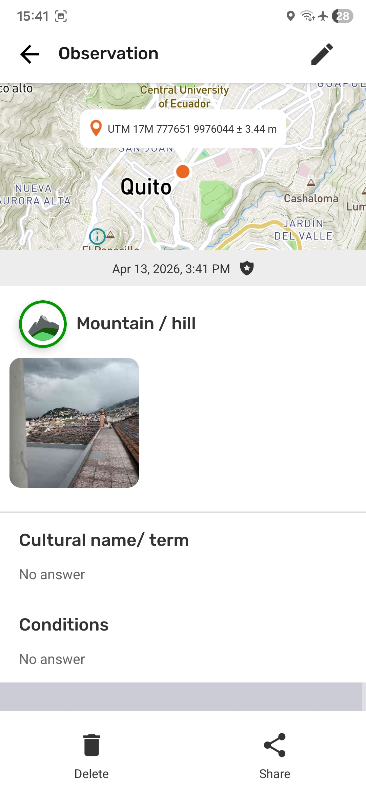

---

***Step 3:*** Confirm deletion of the observation.

:::note ⚠️ Warning
Once deleted, photos nor audio cannot be recovered from that device. To stop the deletion tap **CANCEL. **
:::

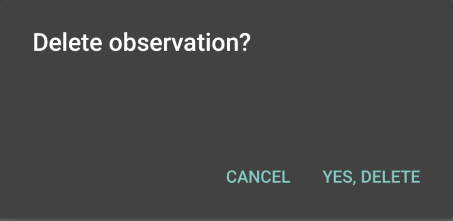

:::

:::note 👣
### Step by Step -  Desktop

***Step 1:*** Tap on   Delete

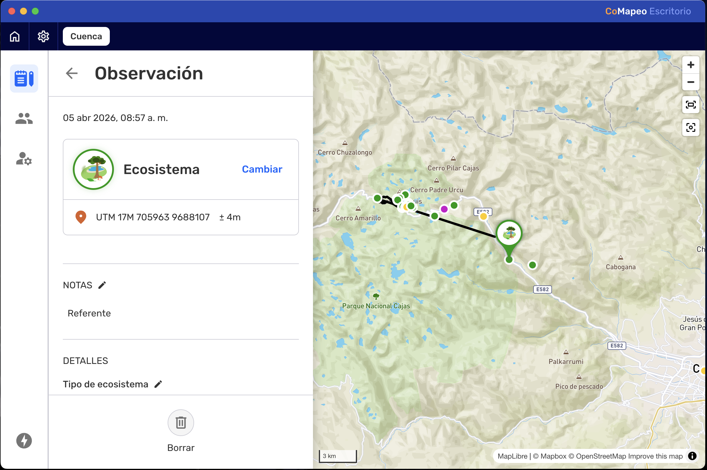

---

***Step 2:***  Confirm deletion with  Yes, delete. 

:::note ⚠️ Warning
Once deleted, an observation cannot be recovered from that device. To abort the photo deletion tap **CANCEL. **
:::

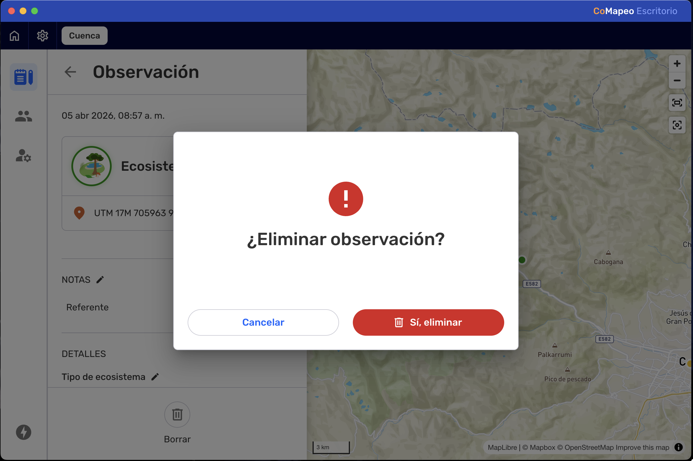

---

***Step 3:***** **Return to the observation List.

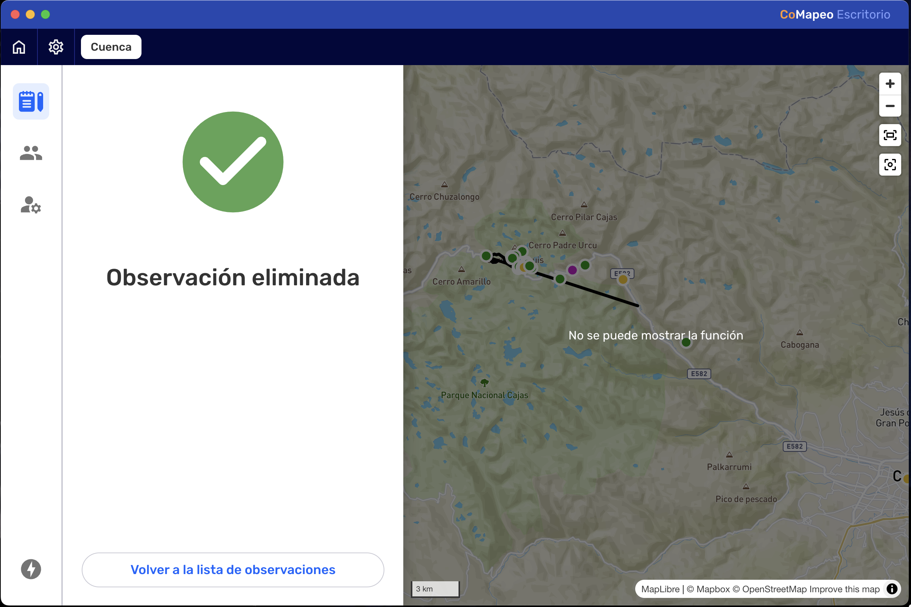
:::

### Deleting Media

Deleting photos or audio from an observation is limited with CoMapeo.  

- On CoMapeo Mobile, the possibility to delete media only exists as the observation is being collected, before saving.
  - Go to 🔗 [Creating a New Observation → Delete a Photo](/docs/creating-a-new-observation/#delete-a-photo) to learn more.
  - Go to 🔗** **[Creating a New Observation → Deleting Audio](/docs/creating-a-new-observation/#deleting-audio)** **to learn more. 

- On CoMapeo Desktop, individual photos and audio recordings can be deleted as a way to improve quality of gathered information.

:::note 👣
### Step by Step -  Desktop

***Step 1:*** Open the photo or audio be selecting the thumbnail. 

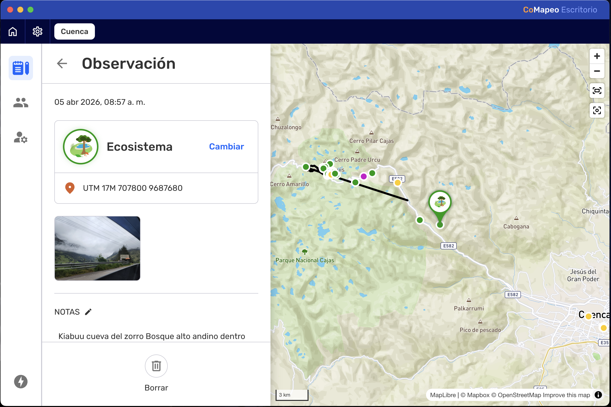

***Step 2:*** Tap on   Delete

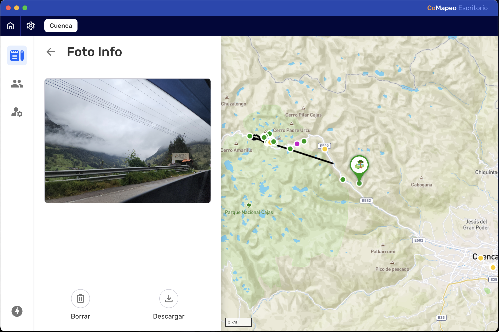

---

***Step 3:***  Confirm deletion with  **Delete Photo**. 

:::note ⚠️ Warning
Once deleted, photos nor audio cannot be recovered from that device. To abort the photo deletion tap **CANCEL. **
:::

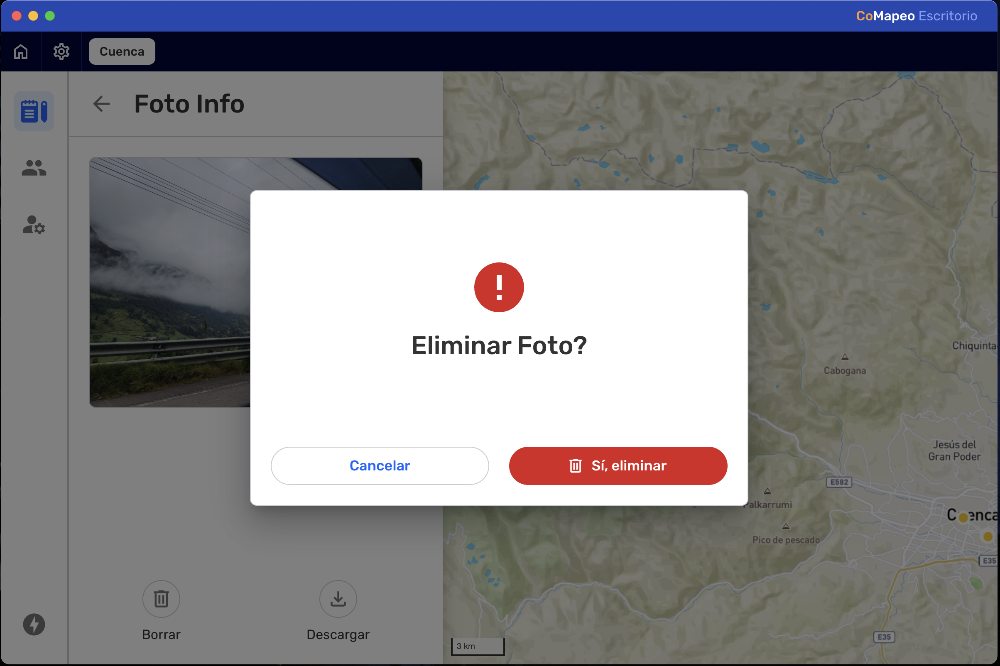

---

***Step 4:***** **Return to the observation.

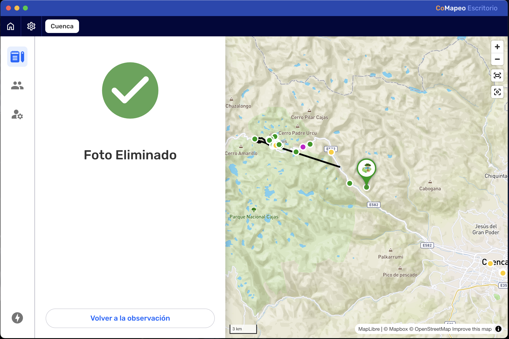
:::

## Deleting Tracks

:::note 👣
### Step by Step - Mobile

***Step 1:*** Review Track to confirm decision about deleting.

***Step 2:*** Scroll to the bottom of the observation and select  **Delete**

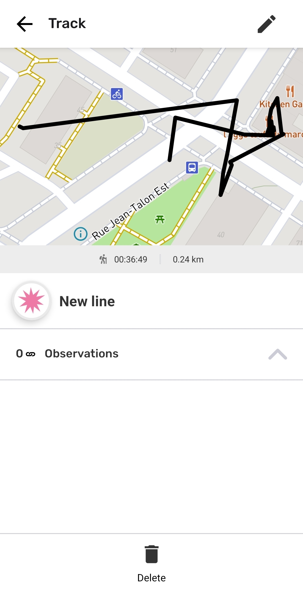

---

***Step 3:*** Confirm deletion of the track.

:::note ⚠️ Warning
Once deleted, tracks cannot be recovered from that device. To abort the deletion tap **CANCEL. **
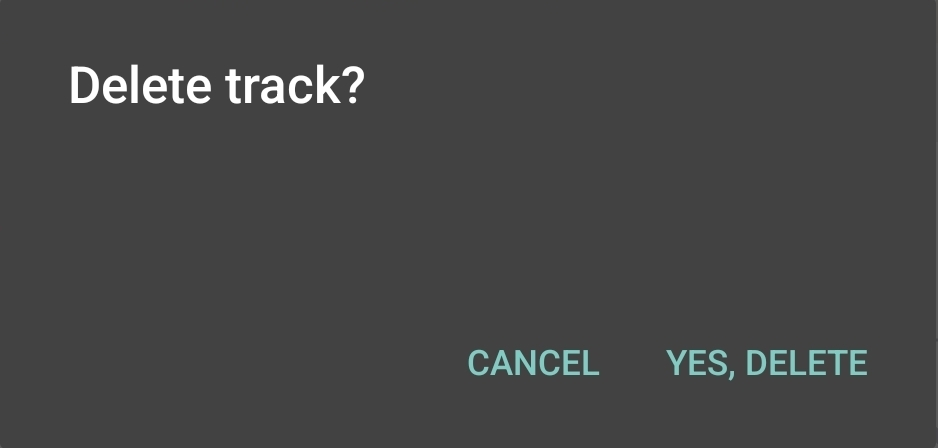
:::
:::

---

:::note 👉🏽 More
Deleting a Track will not delete associated observations. It will however, delete the association itself.
:::

---

:::note ⚠️ Warning
Editing tracks is currently not available in CoMapeo Desktop.
:::

## How do Edit and Delete work with Exchange

Any changes to an Observation or Track will be updated to other devices during exchange. This includes edited categories and notes, added photos and audio, and deletion. CoMapeo will always display the latest available version of an observation or track. 

When working in teams it is best to have an agreed upon protocol for editing, deleting and exchanging collected information. This will help you avoid data conflicts, for example: if an observation has been exchanged with one or more coordinator devices, it is possible for one to edit an observation, and another to delete that same observation.

Go to 🔗 [Understanding How Exchange Works → What if there is a data conflict?](/docs/understanding-how-exchange-works/#what-if-there-is-a-data-conflict)**   **to learn more

## Related Content 

Go to 🔗 [Creating a New Track](/docs/creating-a-new-track)

Go to 🔗 [Exploring the Observations List](/docs/exploring-the-observations-list)

Go to 🔗 [Reviewing Individual Observations & Tracks](/docs/reviewing-individual-observations-and-tracks)** **

Go to 🔗 [Editing Observations & Tracks](/docs/editing-observations-and-tracks)** **

Go to 🔗 [Selecting Device Roles and Teams](/docs/selecting-device-roles-and-teams)

### **Having **Trouble?

Go to 🔗** **[Troubleshooting: Observations & Tracks](/docs/troubleshooting-observations-and-tracks)

