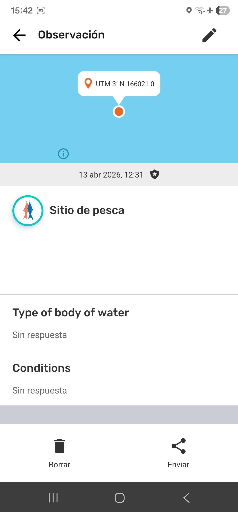
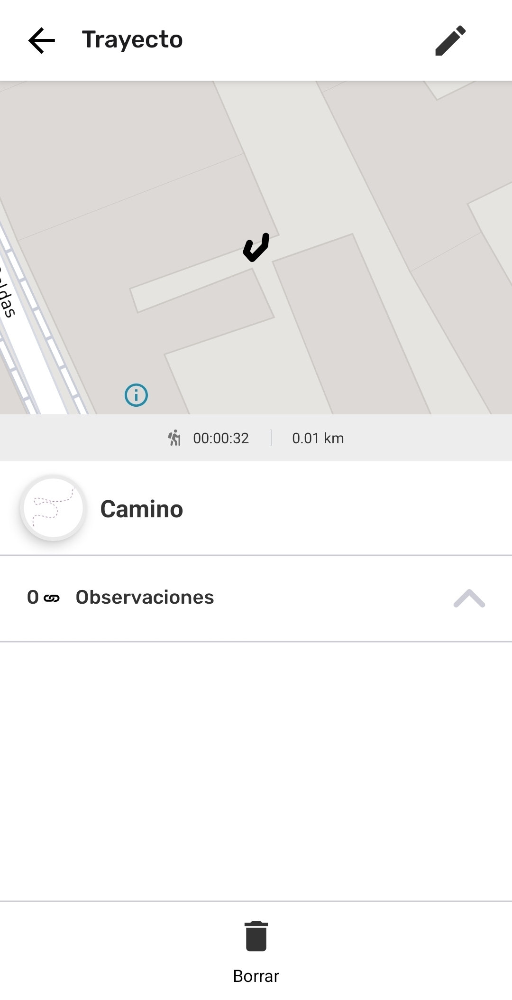
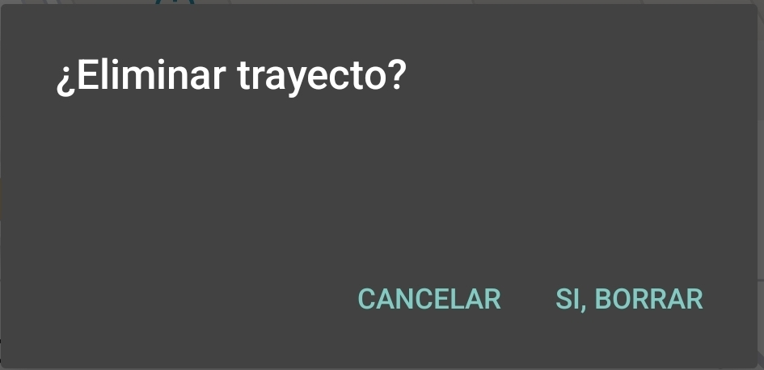

---

# Eliminar Observaciones y Trayectos

## ¿Qué es Eliminar en CoMapeo?

**Eliminar** es un tipo específico de edición que oculta las observaciones y los trayectos dentro de un proyecto. También elimina las asociaciones entre los diferentes elementos de datos que componen las observaciones y los trayectos.

:::note 👉🏾 Más información
La eliminación de observaciones no libera espacio de almacenamiento en el dispositivo. Sin embargo, puede evitar que otros dispositivos reciban archivos multimedia que, de otro modo, ocuparían espacio de almacenamiento tras el intercambio.
:::

## ¿Por qué eliminar una Observación o Trayecto?

Cuando una observación o un trayecto no tiene valor o puede ser perjudicial de alguna manera, debe eliminarse.

- Reduce la inclusión de datos irrelevantes en un proyecto.

- Oculta información que puede resultar una amenaza para la seguridad personal o del equipo.

:::note 💡 Consejo
Para reducir el uso de espacio de almacenamiento en un dispositivo, elimina los archivos multimedia innecesarios antes de guardar la observación.
:::

## Permisos limitados para editar y eliminar

Las observaciones y los trayectos creados en un dispositivo siempre se pueden editar o eliminar desde ese mismo dispositivo. Esto significa que el autor siempre puede editar o eliminar sus propias observaciones y trayectos si no ha cambiado de dispositivo.

Un dispositivo con el rol de  **Coordinador** en un proyecto tiene permiso para editar o eliminar todas y cada una de las observaciones y trayectos de ese proyecto. Esto permite a los coordinadores ayudar a los participantes a completar o corregir la información.

Un dispositivo con el rol de  **Participante **en un proyecto **no** puede editar las observaciones ni los trayectos recibidos a través del  **Intercambio**.  En la lista de observaciones, las Observaciones y Trayectos recibidos se identifican con una línea azul a la izquierda.

:::note 👉🏾 Más información
Estos permisos se aplican tanto a CoMapeo Móvil como a CoMapeo Desktop
:::

Ir a 🔗 [Selección de roles y equipos de dispositivos → Roles disponibles en CoMapeo](/docs/seleccion-de-roles-y-equipos-de-dispositivos#roles-disponibles-en-comapeo) para aprender más.

## Eliminar Observaciones 

:::note 👣
### Paso a paso - Móvil 

***Paso 1:*** Revisa la observación para confirmar la decisión de eliminarla.

***Paso 2:*** Desplázate hasta la parte inferior de la observación y selecciona  **Eliminar**

---

***Paso 3:*** Confirma la eliminación de la observación.

:::

:::note 👣
### Paso a paso -  Desktop

***Paso 1:*** Toca Eliminar 

---

***Paso 2:***  Confirma la eliminación con  Sí, eliminar.

:::note ⚠️ Advertencia
Una vez eliminada, una observación no se puede recuperar desde ese dispositivo. Para cancelar la eliminación de la foto, pulsa **CANCELAR.**
:::

---

***Paso 3***: Regresa a la lista de observaciones.

:::

### Eliminación de archivos multimedia

En CoMapeo, la eliminación de fotos o audios de una observación es limitada.

- En CoMapeo Móvil, solo es posible eliminar archivos multimedia mientras se está registrando la observación, antes de guardarla.
  - Ve a 🔗 [Crear una nueva observación → Eliminar una foto](https://www.notion.so/docs/creating-a-new-observation/#delete-a-photo) para obtener más información.
  - Ve a 🔗 [Crear una nueva observación → Eliminar audio](https://www.notion.so/docs/creating-a-new-observation/#deleting-audio) para obtener más información.

- En CoMapeo Desktop, se pueden eliminar fotos y grabaciones de audio individuales para mejorar la calidad de la información recopilada.

:::note 👣
### Paso a paso -  Desktop

***Paso 1:*** Abre la foto o audio seleccionando la miniatura.

---

***Paso 2***: Toca  Eliminar

---

***Paso 3***: Confirma la eliminación con  **Eliminar foto**

---

***Paso 4***: Regresa a la observación.

:::

## Eliminar Trayectos

:::note 👣
### Paso a paso -  Móvil 

***Paso 1:*** Revisa el Trayecto para confirmar la decisión de eliminar.

***Paso 2:*** Desplázate hasta la parte inferior de la observación y selecciona  **Eliminar**** **

---

***Paso 3:*** Confirma la eliminación del trayecto.

⚠️ **Advertencia**: Una vez eliminados, los trayectos no se pueden recuperar de ese dispositivo. Para cancelar la eliminación, pulsa **CANCELAR.**

:::

:::note 👉🏾 Más información
Al eliminar un Trayecto no se borrarán las observaciones asociadas. Sin embargo, sí se eliminará la asociación en sí misma.
:::

:::note ⚠️ Advertencia
actualmente, la edición de Trayectos no está disponible en CoMapeo Desktop.
:::

## ¿Cómo funcionan la edición y eliminación durante el Intercambio?

Cualquier cambio realizado en una Observación o un Trayecto se actualizará en los demás dispositivos durante el Intercambio. Esto incluye las categorías y notas editadas, las fotos y los audios añadidos, así como los eliminados. CoMapeo siempre mostrará la última versión disponible de una observación o un trayecto.

Cuando se trabaja en equipo, es mejor contar con un protocolo acordado para editar, eliminar e intercambiar la información recopilada. Esto te ayudará a evitar conflictos de datos; por ejemplo: si una observación se ha intercambiado con uno o más dispositivos coordinadores, es posible que uno edite una observación y otro elimine esa misma observación.

Ve a 🔗 [Cómo funciona el intercambio → ¿Qué sucede si hay un conflicto de datos?](/docs/entiende-como-funciona-el-intercambio#que-sucede-si-hay-un-conflicto-de-datos)** **para obtener más información.

## Contenido relacionado 

Ir a  🔗 [Crea un Nuevo Trayecto](/docs/crea-un-nuevo-trayecto)

Ir a  🔗 [Explora la Lista de Observaciones](/docs/explora-la-lista-de-observaciones)

Ir a  🔗 [Revisa una Sola Observación y Trayecto](/docs/revisa-una-sola-observacion-y-trayecto)** **

Ir a 🔗 [Edita Observaciones y Trayectos](/docs/edita-observaciones-y-trayectos)

Ir a  🔗 [Selección de roles y equipos de dispositivos](/docs/seleccion-de-roles-y-equipos-de-dispositivos)

### ¿Tienes problemas?

Ir a 🔗** **[Solución de Problemas: Observaciones y Trayectos](/docs/solucion-de-problemas-observaciones-y-trayectos)

---

