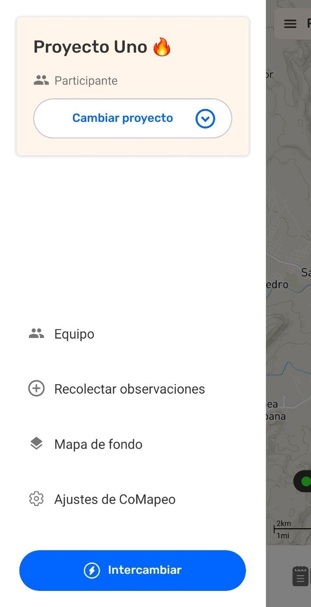
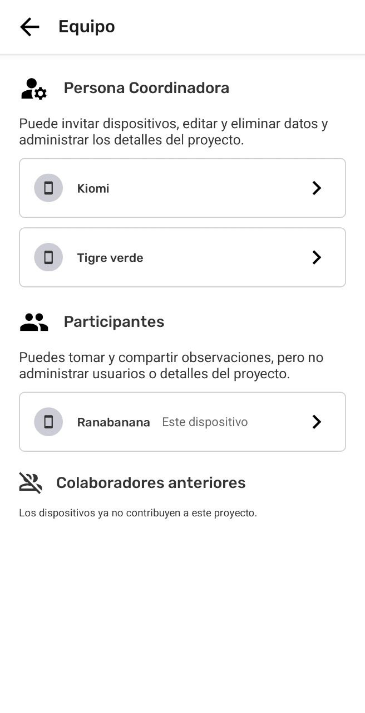
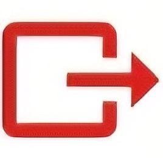
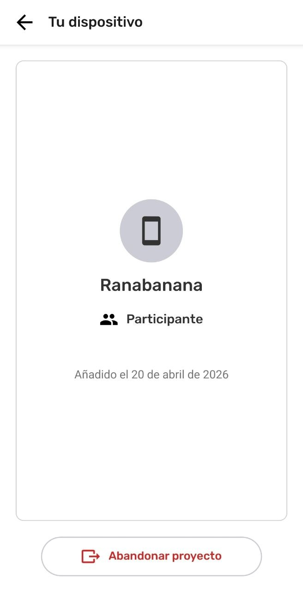
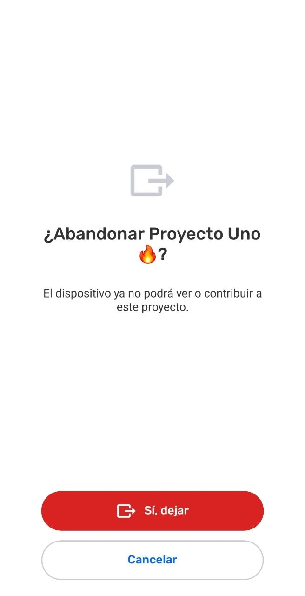
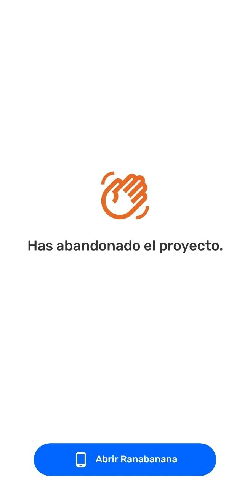
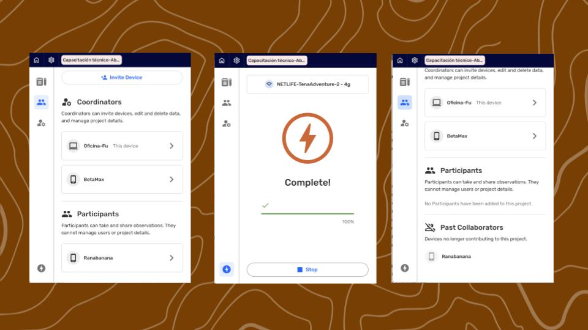

# Leave a Project

## About Leaving Projects

Leaving a project allows a device to disconnect from the collaboration is was part of, preventing exchange from happening, and removing the project from the list. Since the project cannot be viewed, the information gathered and project information can also no longer be accessed. 

:::note ⚠️ Warning
Leaving a project **does not remove any gathered information from any device**.  Device storage is not liberated by leaving a project, it just prevents future occurrence of  Exchange for that project.
:::

---

:::note 👣
### Step by Step [H3]

***Step 1: ***In the **Menu**, select  Team.

---

***Step 2:***  Select** This device**. 

---

***Step 3:*** Select  **Leave Project.**

---

***Step 4:*** Select  **Yes, Leave**

---

***Step 5:*** This device has left the project. 

:::

## Updating the Team after Leaving a Project

In an offline context, other devices in the project will not know a device has left until the devices have connected to the same Wi-Fi router at the same time. The device team data will sync behind the scenes updating the Team list in the Project.

:::note ⚠️ Warning
If a device uninstalls CoMapeo without leaving the project, the team list will not update. A Coordinator may want to remove the device to maintain the participant list accurately.
:::

### Updating project information from devices in the team

The  **Team** list is updated every time devices  **Exchange. **

## Related Content

Go to 🔗 [Understanding Projects](/docs/understanding-projects)

Go to 🔗 [Removing a device from a Project](/docs/removing-a-device-from-a-project)

### **Having problems?**

Go to 🔗 [Troubleshooting: Mapping with Collaborators](/docs/troubleshooting-mapping-with-collaborators)

