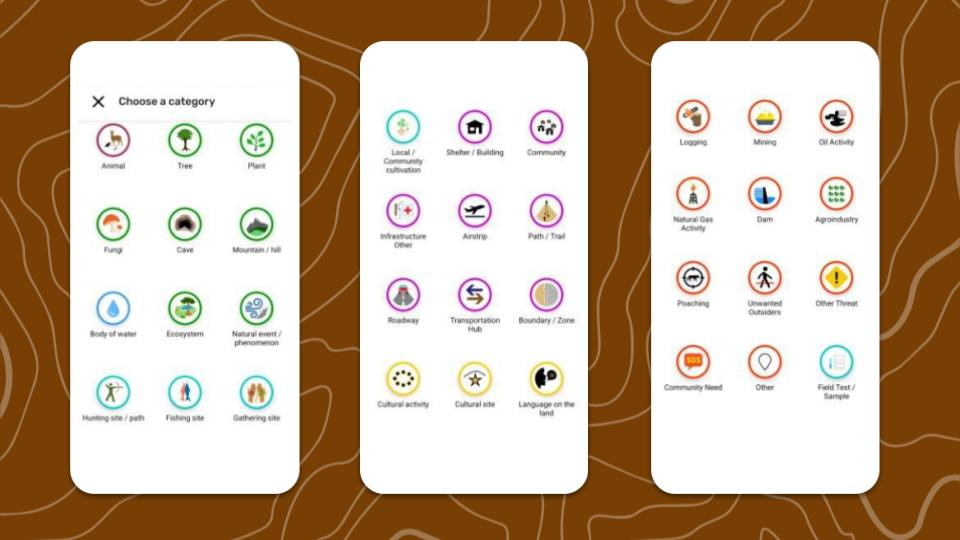

## About Categories in CoMapeo

### **What is a category in CoMapeo?**

Categories are the primary way people identify and related to information collected when mapping and monitoring. Each category includes additional details that can be filled in to improve quality of observations

A category has a predetermined icon, label, and detail questions. Any available category can be selected when creating or editing an observation.  For each observation and track made with CoMapeo, a category must be selected to classify it. In observations, category specific details can be revealed providing the option provide more detail about what is being documented.

**What are Category Sets in CoMapeo?**

Category Sets are files that contain and define the distinct Categories for a Project.   This may be the included Categories set described below, or a Customized Category Set.

:::note 👉🏽
Go to  🔗[Creating a Custom Categories Set](/docs/creating-a-custom-categories-set) to learn more
:::

:::note 💡
For those familiar with the predecessor app Mapeo, Category Sets were previously known as *Configurations.*
:::

## Included Categories Set

CoMapeo Mobile has an Included Categories Set that better represents the things being documented by communities and teams in areas where environmental and territorial threats are happening. 

:::note 💡 Tip
The easiest way is to explore the categories is in CoMapeo Mobile while creating new observations.
:::

## Categories for Tracks

Select categories have an additional geometry property of lines, allowing them to be options categories for Tracks

## Related Content

Go to 🔗 [Un](/docs/installing-comapeo--onboarding/)[install](/docs/installing-comapeo-and-onboarding/)[ing CoMapeo](/docs/installing-comapeo--onboarding/)** **

### Having Problems?

Go to 🔗 [Troubleshooting: Setup and Customization](/docs/troubleshooting-setup-and-customization)** **
