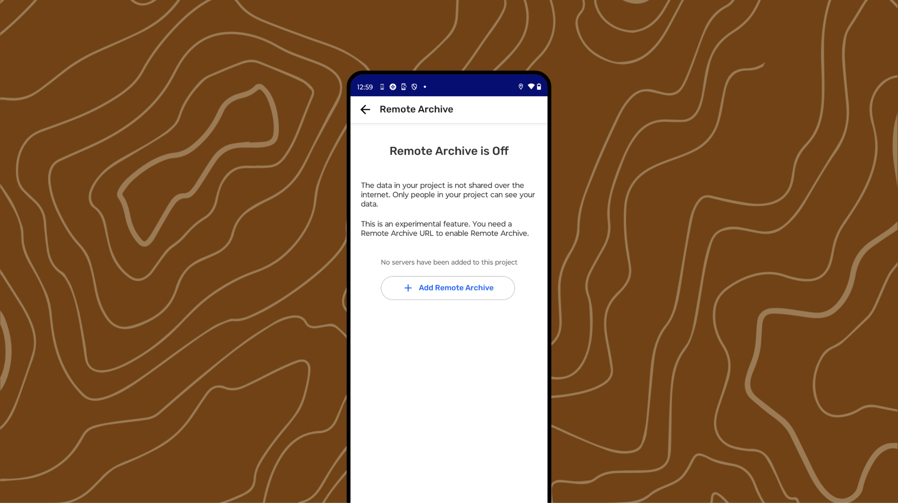
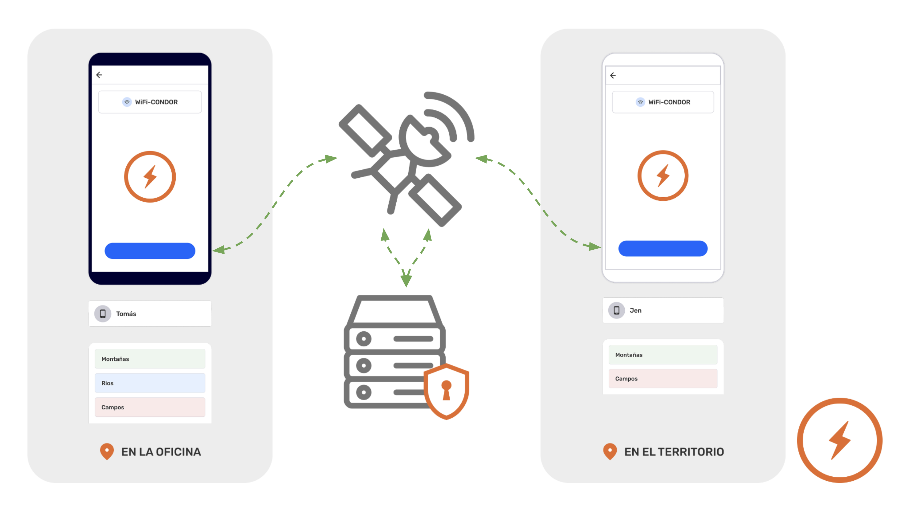
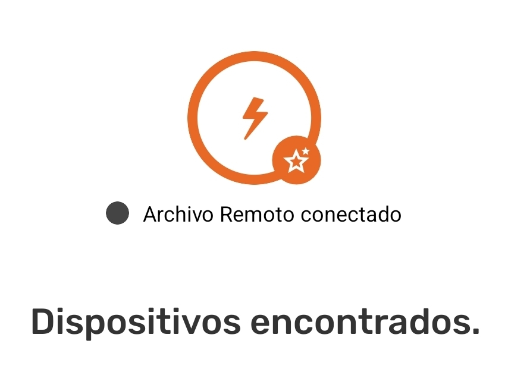

:::note ⚠️ Warning
Internet-connected sharing only works with  Remote Archive enabled.
:::

To exchange goods or services using an internet connection, five requirements must be met:

1. Two or more devices with CoMapeo 

1. The devices must have internet access.

1. Preparation of a  **Remote Archive** is completed.

1. The devices must belong to the same project where  **Remote Archiving** is enabled.

1. New observations or routes to exchange.

:::note 🔵 Visit 🔗** **[How the Exchange Works](https
//www.notion.so/docs/understand-how-the-exchange-works) for a full description and more details.
:::

:::note 👣
### Step by Step

***Step 1: ****Open the* ** Menu**

---

***Step 2: ****Select**** ***  **Intercambiar**  

***Step 3:*** The screen will show which devices are connected.

When a project has  **Remote Archiving **enabled, it will appear connected whenever there is an internet connection. This will be displayed just below the large **Exchange** icon.

:::note 👉🏽 More
Exchange with  **Remote Archive** works the same whether or not there are other devices connected via WiFi.
:::

:::note 💡 Tip
**Adjust the Exchange settings if necessary.** Swap settings can be modified to optimize device performance.
Go to 🔗 [Understand How Exchange Works →  Exchange Settings ](https://www.notion.so/digidem/docs/understand-how-swap-works#swap-settings)
:::

---

***Step 4: ***Tap** Start** to begin the exchange.

---

***Step 5: ***It will display **Complete** when all observations have been exchanged. Tap** Done** to return to the **Menu**
:::

:::note 💡 Tip
[app-icon-comapeo-exchange](assets/d1f75c78a51b8e5a813245aa74758646c26969350099762a8dc34b327ee517c7.png)** Exchange **with and without an internet connection, can happen simultaniously.
:::

---

## Related Content

Go to 🔗 [Understanding How Exchange Works](/docs/understanding-how-exchange-works) for full explanation 

### Having Problems?

Go to 🔗 [Troubleshooting: Mapping with Collaborators -> Exchange Problems](/docs/troubleshooting-mapping-with-collaborators#exchange-problems)** **

