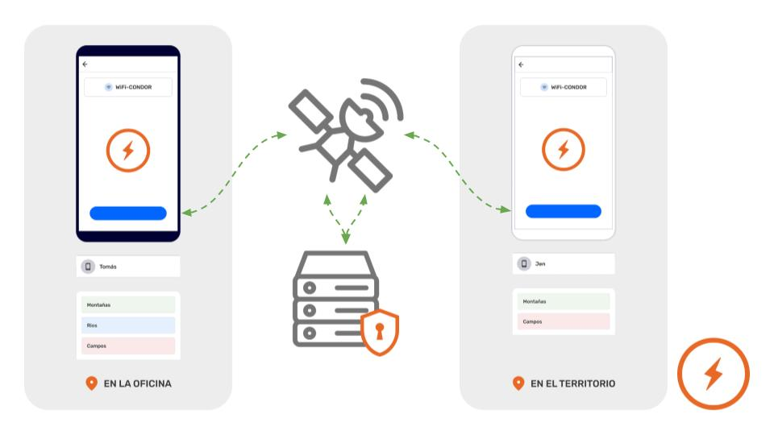
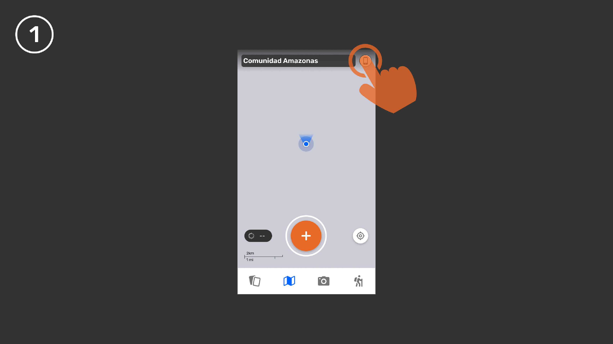

## What is a Remote Archive?

A **Remote Archive** is a dedicated server that allows projects to automatically back up their observations whenever connected to the internet.

- When enabled, all collaborators that opt-in to exchange their observations will automatically be doing so with the Remote Archive.

## What is required to set up a Remote archive

1. **Creating server for CoMapeo Remote Archive**
  - Any device can be considered a server as long as it is in perpetual state of being available to exchange observations.

1. **Generate a Remote Archive URL Using on Cloud Captain **

1. **Add a Remote Archive to a CoMapeo project**
  - Internet connectivity is required to both add a Remote Archive and to exchange with it.
  - Only Coordinators can enable a Remote Archive, 

1. **Exchange to share Remote Archive connection with collaborators **
  - After exchanging Participants can see it as part of the participants list.

---

## Part 1:  Creating server for CoMapeo Remote Archive

:::note ⚠️ Warning
This is not a considered easy nor accessible. Familiarity and comfort with server administration is ***required*** for  creating a server
:::

Deploying a “cloud sever” instance

add disclaimer about skill here

[https://github.com/digidem/comapeo-cloud](https://github.com/digidem/comapeo-cloud)

## Part 2: Generate a Remote Archive URL Using on Cloud Captain 

:::note ⚠️ Warning
This is not a considered easy nor accessible, but can be learned by someone eager to learn advanced technical skills. Familiarity and comfort with server administration is helpful for generating a Remote Archive URL.
:::

:::note 👣
### Step by step

***Step 1:*** Using a web browser, go to your server address

---

***Step 2:*** Enter the server password 

---

***Step 3:*** Click on `**Apps**` on the sidebar

---

***Step 4:*** Under **Create A New App** select `**One-Click Apps/Database**`

---

***Step 5:*** Select `**CoMapeo Archive Server**`

---

***Step 6:*** Set the `**App Name**` which will become the subdomain for the archive server
 `**https://app-name.comapeo.cloud**`

:::note 💡 Tip
No need to change the `**Docker Image**`
:::

---

***Step 7:*** Under `**Token for authenticating API request**` it’s good practice to generate a new token, use a [token generator](https://it-tools.tech/token-generator) to do so

---

***Step 8: ***Add a `**Recognizable server name**` which can be anything

---

***Step 9:*** Set the **number of projects allowed to register** which will depend on the use case, if you’re creating an archive server for an organization it will likely have many projects

---

***Step 10:*** Click `**Deploy**` which will spin the new Archive Server

---

***Step 11*****:** On `**Apps**` search for your newly created app and select it

---

***Step 12:*** Click on `**Enable HTTPS**` wait until it’s done

:::note 💡 Tip
Select **Force HTTPS by redirecting all HTTP traffic to HTTPS** in to
:::

---

***Step 13:*** Select `**Websocket Support**` 

---

***Step 14:*** Click `**Save and Restart**`

---

:::note ✅
A new CoMapeo Remote Archive Server should be running and ready to use on the application.
:::
:::

:::note 💡 Tip
Share the server address with project coordinators through a secure messaging app. They can copy it and past it into CoMapeo
Examples 

✅ `comapeo.example`

✅ `https://comapeo.example`

❌ `~~http://comapeo.example~~`
:::

---

## Part 3: Add a Remote Archive to **to a CoMapeo project**

Any coordinator of a project can add a Remote Archive once a they receive a URL for their server.

:::note 👣
### Step by Step

***Step 1: ***Go to the project where you’ll use a **Remote Archive**.

---

***Step 2:*** Open the :three-line-menu-black:Menu

---

***Step 3:**** *On the Current Project card in the Menu, tap **Switch Project**

---

***Step 4:**** *In the :app-icon-comapeo-coordinator: **Coordinator Tools** screen, look for :app-icon-comapeo-remote-archiver: **Remote Archive**

---

***Step 5:*** On the Remote Archive screen, tap **+Add Remote Archive Button**

---

***Step 6:*** In the input field, enter the previously generated **Remote Archive URL**.

:::note 💡 Tip
CoMapeo supports **https **servers, but <u>it does not support http servers</u>
If the server address provided has “**http**” in address, a solution is to replace with “**https**”
:::

---

***Step 7:**** *Once a valid Remote Archive URL has been entered, tap on the **Save** button to proceed.

---

***Step 8:**** *When the Remote Archive URL is successfully saved, the Remote Archive screen will update to **ON**. Also, when going back to Project Settings, the third module will now display **Remote Archive
:::

## Part 4: Exchange to share Remote Archive connection with collaborators

---

## Exchanging with a Remote Archive

If enabled and connected to the internet, Remote Archive will automatically backup every time a device starts an Exchange.

Attention: On CoMapeo Mobile 1.2.0 it is not possible to not exchange with the Remote Archive but this is a feature that may come in the future.

🔗 Go to Exchanging Observations

---

## Removing a Remote Archive

It is not currently possible to remove a Remote Archive from a Project once added. We anticipate having the ability to remove a Remote Archive available in late 2025.

- When it becomes available, only Coordinators will be able to add and remove a Remote Archive from their projects

- In this version and in the future, participants cannot remove the Remote Archive from the project.

---

## Relevant Content

Go to 🔗 [Understanding How Exchange Works](/docs/understanding-how-exchange-works) for full explanation 

### Having problems?

Go to 🔗 [Troubleshooting: Mapping with Collaborators](/docs/troubleshooting-mapping-with-collaborators)**  **

---

## Coming Soon

In the coming year, improvements to Remote Archives will include:

- Allowing Coordinators to remove a Remote Archive

- Making it easier process to add a Remote Archive

