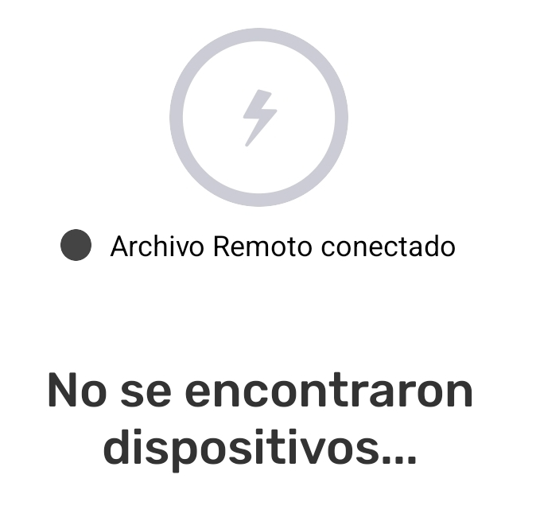

---

:::note ⚠️ Alerta
El intercambio con conexión a internet solo funciona con :app-icon-comapeo-remote-archiver: **Archivo Remoto** activado.
:::

Para intercambiar con conexión a internet se necesita cumplir cinco requisitos:

1. Dos o más dispositivos con CoMapeo :comapeo_logo_circle: 

1. Los dispositivos deben tener acceso al internet

1. La preparacion del :app-icon-comapeo-remote-archiver: **Archivo Remoto** se ha completado.

1. Los dispositivos deben pertenecer al mismo proyecto donde está activado :app-icon-comapeo-remote-archiver: **Archivo Remoto**

1. Nuevas observaciones o trayectos para intercambiar

:::note 🔵 Visita
 🔗 [Cómo funciona el Intercambio](/docs/entiende-como-funciona-el-intercambio) para obtener una descripción completa y más detalles.
:::

:::note 👣
### Paso a paso

***Paso 1: ***Abre el :three-line-menu-black:** menú**

---

***Paso 2: ***Toca :app-icon-comapeo-remote-archiver: **Intercambiar**  

***Paso 3:*** La pantalla mostrará qué dispositivos están conectados. 

Cuando un proyecto tiene activado el :app-icon-comapeo-remote-archiver: A**rchivo Remoto**, aparecerá conectado siempre que haya conexión a internet. Esto se mostrará justo debajo del icono grande de :app-icon-comapeo-remote-archiver: **Intercambio**.

:::note 👉🏽 Más
Intercambiar con :app-icon-comapeo-remote-archiver: **Archivo Remoto **funciona de igual manera si hay , o no hay otros dispositivos conectados con WiFi.
:::

:::note 💡 Consejo
**Ajusta la configuración de Intercambiar si es necesario. **Los ajustes de intercambio se pueden modificar para optimizar los resultados del dispositivo.
Ve a 🔗 [Entiende cómo funciona el Intercambio -> Configuración de Intercambio](docs/entiende-como-funciona-el-intercambio#configuracion-de-intercambio)
:::

---

***Paso 4: ***Toca **Iniciar** para comenzar el intercambio.

---

***Paso 5: ***Se mostrará **Completo** cuando se hayan intercambiado todas las observaciones. Toca **Listo** para volver al :three-line-menu-black: Menú
:::

:::note 💡 Consejo
app-icon-comapeo-exchange: Intercambio con o sin conexión a internet, puede realizarse simultáneamente.
:::

---

## Contenido relacionado

Ve a 🔗 [Entiende cómo funciona el Intercambio](/docs/entiende-como-funciona-el-intercambio) para obtener una explicación más detallada.

### ¿Tienes problemas?

Ve a 🔗 [Solución de Problemas: Mapeo con Colaboradores](/docs/solucion-de-problemas-mapeo-con-colaboradores)[ -> Exchange Problems](/docs/troubleshooting-mapping-with-collaborators#exchange-problems) 

---

